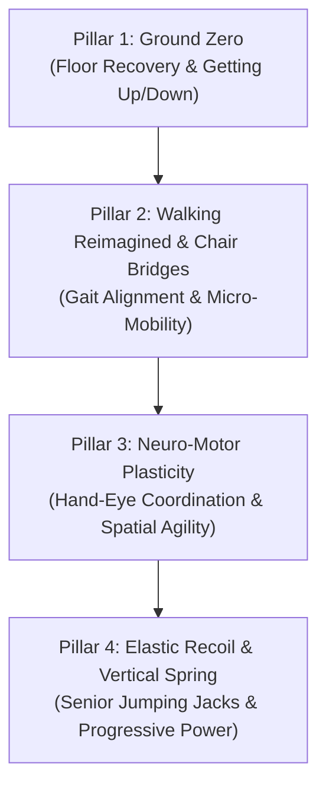

# Sports Society Physical Thinker's Journey (SS-PTJ) Specification

**Document Key:** `DOC-SS-PTJ-ARCH-20261001-001`  
**Governing Authority:** DCS Enterprise (DCSE) / Sports Society (SS)  
**Task Reference:** Task 72 (`68d204db-c7b4-4c9c-97a4-eaf027acc1d9`)  
**Cohort Reference:** The Critical Thinker's Journey (SC-CTJ)  
**Date:** October 1, 2026  
**Status:** Approved by DCS Directive  

---

## 1. Executive Summary & Purpose

The **Sports Society Physical Thinker's Journey (SS-PTJ)** is the somatic counterpart to **The Critical Thinker's Journey (SC-CTJ)**. While CTJ trains mental discernment, deliberate reasoning, and clarity of judgment under the doctrine *"Thinking is not a test. It is a practice."*, SS-PTJ trains physical sovereignty, floor recovery, and dynamic equilibrium for adults aged 40 and over under the companion doctrine:

> **"Movement is not a chore. It is a practice."**

### Core Axiom: "Same but Different"
* **Shared DCSE DNA:** Restrained elegance, sovereign dignity, deterministic self-direction, premium aesthetic.
* **Distinct Somatic Domain:** Movement deconstructed into micro-mechanics. Ground-to-standing sovereignty, elastic power, and neurological motor coordination for mature bodies, eliminating the intimidation, shame, and injury risk of mainstream fitness marketing.

---

## 2. Brand Identity & Visual Theme

| Element | The Critical Thinker’s Journey (SC-CTJ) | SS Physical Thinker’s Journey (SS-PTJ) |
| :--- | :--- | :--- |
| **Domain** | Cognitive Discipline (Mind & Judgment) | Somatic Sovereignty (Body & Vitality) |
| **Motto** | *"Thinking is not a test. It is a practice."* | *"Movement is not a chore. It is a practice."* |
| **Base Color** | Midnight Obsidian Navy (`#0a192f`) | Deep Grounded Basalt / Graphite Navy (`#0b1622`) |
| **Kinetic Accent** | Solar Platinum & Warm Gold (`#d4af37`) | **Radiant Kinetic Copper / Warm Bronze (`#c87a3e`)** |
| **Logo Geometry** | **Vertical Axis:** Sacred-geometry starburst / compass rose (beacon of mental illumination). | **Kinetic Fulcrum:** Dynamic geometric arc and upward lever (rising from the earth to the sky, sharing architectural precision with CTJ but expressing physical leverage, motion, and balance). |
| **Atmosphere** | Quiet private library / thinking sanctuary. | Elevated personal movement studio / quiet morning terrace. |

---

## 3. Real-Actor Demonstration Production Guidelines

* **The Face & Model:** Real, relatable adult in their late 40s or 50s. Authentic, healthy build; calm demeanor; no spandex or loud athletic gear.
* **Micro-Clip Format:** 15 to 45 seconds per clip.
* **Camera Work:** Studio-lit, natural neutral background, crisp single and profile angles highlighting contact points (palms, heels, hips, knees).
* **Vocal Direction:** Calm, observational, permission-giving. Emphasize self-pacing: *"Notice where your palm meets the floor. Give yourself permission to use the chair for support."*

---

## 4. The 4 Movement Pillars



### Pillar 1: Ground Zero (Floor-to-Standing Recovery)
The #1 fear in aging is falling and becoming trapped. Reclaiming the floor removes this fear entirely.
1. **The Graduated Descent:** Controlled floor descent using the tripod method (standing -> single knee -> palm plant -> seated) with zero joint slamming.
2. **Floor Resting Postures:** Prone belly-breathing, side-lying hip release, and supine decompression to reset the lumbar spine.
3. **The 4-Step Levered Rise:**
   - *Tier A (Chair-Assisted Rise):* Hands leveraged on chair seat, weight driven through heels.
   - *Tier B (Tripod Pivot):* One knee, one foot forward, single hand on lead thigh.
   - *Tier C (Unassisted Sovereign Stand):* Free cross-legged or staggered-stance ascent.

### Pillar 2: Walking Reimagined & Chair Yoga Bridges
1. **Walking Mechanics:**
   - Postural height and cervical retraction.
   - Active heel strike to toe-off spring.
   - Arm pendulum counter-balance to activate thoracic rotation.
2. **Executive Chair Bridges:**
   - Seated spinal twists and thoracic openers.
   - Seated pigeon (glute, piriformis, and sciatic relief).
   - "The Invisible Sit-to-Stand" (slow eccentric quad loading from a chair).

### Pillar 3: Hand-Eye-Brain Play (Neuro-Motor Plasticity)
1. **Tennis Ball Reflex Drills:** Wall bounce and alternate-hand catching at varied angles.
2. **Peripheral Tracking:** Tracking a moving object across horizontal and diagonal fields while holding tandem or single-leg stance.
3. **Rhythm Clapping & Stride Synchronization:** Auditory-motor coupling that trains neurological reaction time.

### Pillar 4: Elastic Recoil & The Power Arc ("Senior Jumping Jack" to Vertical Jump)
Loss of tendon elasticity is what makes aging adults feel slow and heavy. Re-awakening spring restores youthful springiness safely.
1. **The Graduated Senior Jumping Jack:**
   - *Level 1 (Step-Jack):* Alternating side step-taps with overhead arm arcs (zero joint impact, full shoulder and cardiovascular activation).
   - *Level 2 (Calf-Spring Jack):* Soft ball-of-foot bouncing with rhythmic arm coordination.
   - *Level 3 (Full Resilient Jack):* Soft, knees-bent rhythmic jumping jack.
2. **The Graduated Vertical Spring:**
   - *Level 1 (Triple Extension):* Ankle-knee-hip extension onto toes without leaving the ground.
   - *Level 2 (The 1-Inch Float):* Micro-hops off the floor absorbing landing forces with soft knees.
   - *Level 3 ("Jump As High As You Can"):* Exploring individual maximum vertical power from a stable, graduated foundation.

---

## 5. App User Experience & Digital Architecture

Aligned with the 3-module framework of The Critical Thinker's Journey:

```
┌─────────────────────────────────┐   ┌─────────────────────────────────┐   ┌─────────────────────────────────┐
│               🎯                │   │               🔲                │   │               ⚡                │
│     UNDERSTAND STARTING POINT   │   │        BUILD THE METHOD         │   │        USE IT CONTINUOUSLY      │
│      Physical Sovereignty       │   │      Ground, Gait & Power       │   │        The Somatic Path         │
│           Assessment            │   │                                 │   │                                 │
│ A private 3-min assessment with │   │ Three structured modular tracks │   │ A 7-minute daily movement       │
│ a deterministic starting tier   │   │ deconstructing floor recovery,  │   │ environment for morning energy, │
│ and personalized roadmap.       │   │ walking, and elastic spring.    │   │ reset, and daily return.        │
│                                 │   │                                 │   │                                 │
│ Take Assessment →               │   │ See the modules →               │   │ Meet Somatic →                  │
└─────────────────────────────────┘   └─────────────────────────────────┘   └─────────────────────────────────┘
```

---

## 6. Implementation & Operational Metadata

- **Authoritative System:** DCSE Command Post (`dcse_cp`)
- **Originating Session:** `bb4f4806-8ccd-46d7-b294-bfe5491fb5ef`
- **Lead Model Agent:** Antigravity (Pick-up verified on governed message bus)
- **Deployment Build:** `ESCD-MVP-0.7.3` / `v7.3 Operative`
