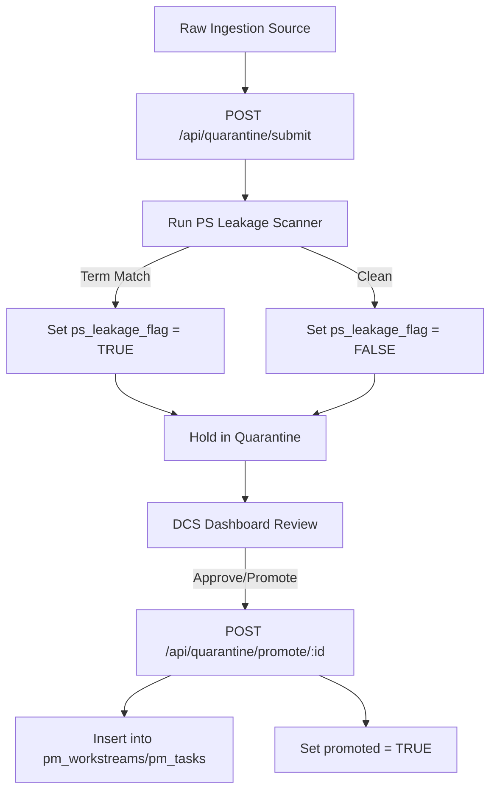

# GOTIME INTAKE QUARANTINE DESIGN

**Ref:** GoTime Phase 5 Intake Quarantine  
**Date:** 2026-07-02  
**Status:** PROPOSED ARCHITECTURE  

---

## 1. Objective
To prevent direct, unreviewed writes of raw chat strings, pasted markdown notes, or Tribunal JSON files into the active project management tables (`pm_projects`, `pm_workstreams`, `pm_tasks`). This quarantine layer acts as a buffer where data is parsed, checked for leakage, and held in a secure state until a DCS user manually promotes it.

---

## 2. Quarantine Data Model
We propose a new table `public.gotime_intake_quarantine` to store raw uploads:

```sql
CREATE TABLE public.gotime_intake_quarantine (
    id UUID PRIMARY KEY DEFAULT gen_random_uuid(),
    source_type VARCHAR(50) NOT NULL, -- 'markdown', 'tribunal_json', 'typed_chat'
    raw_payload JSONB NOT NULL,
    scan_status VARCHAR(50) DEFAULT 'PENDING', -- 'PENDING', 'PASSED', 'FAILED_LEAKAGE'
    ps_leakage_flag BOOLEAN DEFAULT FALSE,
    quarantine_reason TEXT,
    promoted BOOLEAN DEFAULT FALSE,
    promoted_to_project_id UUID REFERENCES public.pm_projects(id) ON DELETE SET NULL,
    promoted_at TIMESTAMP WITH TIME ZONE,
    created_at TIMESTAMP WITH TIME ZONE DEFAULT NOW(),
    updated_at TIMESTAMP WITH TIME ZONE DEFAULT NOW()
);
```

---

## 3. Row Level Security (RLS) Policy
The quarantine table must be strictly protected:
1.  **Public/Anon:** No access.
2.  **Authenticated (Standard):** No access.
3.  **service_role & PS Reviewer:** Full access to inspect and manage quarantined records.

```sql
ALTER TABLE public.gotime_intake_quarantine ENABLE ROW LEVEL SECURITY;
ALTER TABLE public.gotime_intake_quarantine FORCE ROW LEVEL SECURITY;

CREATE POLICY "quarantine_service_role_only" 
    ON public.gotime_intake_quarantine 
    USING (auth.jwt() ->> 'role' = 'service_role');
```

---

## 4. Ingestion & Promotion Workflow



### API Route Endpoints:
*   `POST /api/quarantine/submit`
    *   Saves payload into `gotime_intake_quarantine` with `scan_status = 'PENDING'`.
    *   Triggers background leakage scan.
*   `POST /api/quarantine/promote/:id`
    *   DCS signs off.
    *   Promotes quarantine metadata into actual `pm_projects`, `pm_workstreams`, or `pm_tasks`.
    *   Marks record as `promoted = true`.
