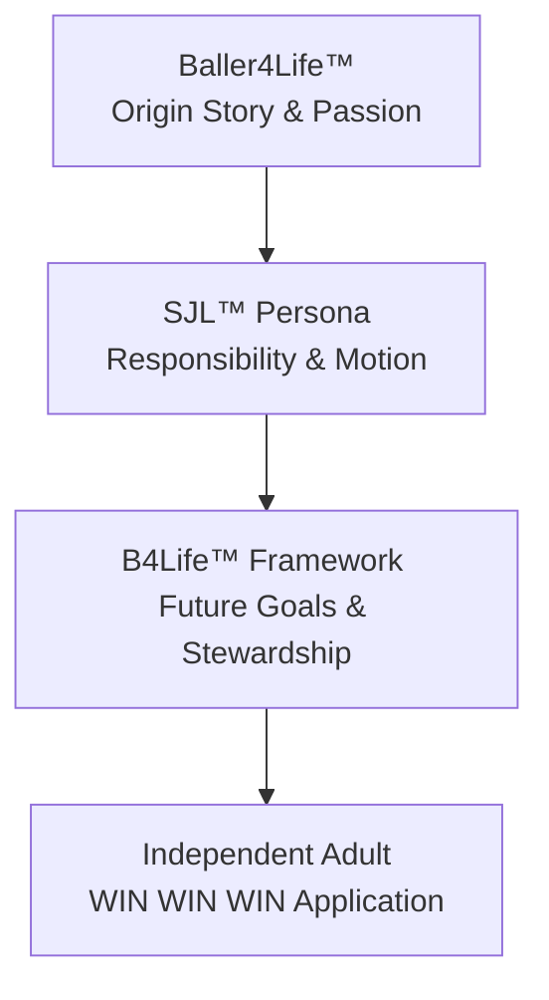

# SJL Persona & B4Life Framework Handoff Brief
**Co-Architects & Engineering Handoff to Codex & AG**
**Authority:** DCSE v6.7.1 + Active v6.8 Draft Direction  
**Lane:** SS-SJL (Lifestyle/Independence)  
**Confidentiality:** PS Firewall Active (No PS litigation or case data)

---

## 1. Executive Handoff & Codex Directive

This document serves as the final, authoritative construction brief for the **SJL Persona, B4Life™ Framework, and Persona Platform**. It transition the planning phase into immediate construction by Codex and AG.

### Core Philosophy
Driving is the catalyst for independence, but responsibility is the engine that sustains it. SJL is not just a driver education module; it is a young adult transition platform designed to develop character, discipline, and stewardship.



---

## 2. Prior Persona Lessons Learned: The Sis Dee Pattern

A repository-wide sweep of prior persona workflows (variants of `sis d`, `sisd`, `sister*`) revealed historical staging metadata for files such as:
- `Designing the Sister Dee Portal in Wix.pdf`
- `Sis Dee Go G Inventory Asset Workflow.pdf`
- `Dee Golf Mission_2023 - Thee Mission.pdf`

These documents outline a distinct operational pattern within the SS and CP lanes. Analyzing these workflows yields four critical architecture requirements for SJL:

### A. Process Over Product (The Mission Framework)
*   **The Lesson:** Personas fail when treated as static bio-sketches. Sister Dee succeeded because she was defined by active "Missions" (e.g., Golf Mission) and "Inventory Workflows."
*   **The Requirement:** SJL must be anchored to actionable workflows (Daily Driver checklists, Resume Builder, and Goal Trackers) rather than text-only lessons.

### B. Auto-Ingestion of Local Assets
*   **The Lesson:** Manual data entry and file mapping create major friction. The Sis Dee files were processed using a local-to-cloud staging utility (Supabase Staging assets payload).
*   **The Requirement:** The persona platform must dynamically read from the consolidated `personas_master.csv` and seed scripts without manual copy-paste.

### C. Wix-to-Custom Bridge Strategy
*   **The Lesson:** Wix-portal designs (e.g., "Sister Dee Portal in Wix") serve as excellent visual canvases but lack the deep relational integration needed for dynamic user state.
*   **The Requirement:** Maintain design styling consistent with high-end custom web design (vibrant dark glassmorphism, responsive navigation) while linking directly to a PostgreSQL/Supabase relational schema.

### D. Clear Lane Segregation
*   **The Lesson:** Sis Dee and EY materials remained strictly locked under the SS/CP lanes, isolated from litigation or restricted PS data.
*   **The Requirement:** Enforce a absolute database partition. No litigation-lane metadata may ever be merged into the unified `personas` or `persona_modules` tables.

---

## 3. The Wisdom & Character Bible Framework (Theological Backbone)

SJL does not teach dogma; it teaches development. Drawing inspiration from **Ephesians 3**, the platform addresses the spiritual, character, and psychological dimensions of young adulthood by focusing on inner strength, deep-rooted integrity, and the quest for wisdom.

### A. The DDNA Development Pillars
*   **Ephesians 3:16 Integration:** Strengthening the inner self, building roots and grounds, and realizing the fullness of one's potential.
*   **WIN WIN WIN™ Philosophy:**
    1.  **Knowledge:** Learning the facts (What).
    2.  **Understanding:** Comprehending the principles (Why).
    3.  **Application:** Gaining wisdom in motion (How).

### B. The Development DNA™ Mapping Matrix
Every module must map directly to one or more of these core developmental domains:
1.  **Character:** Rooted integrity, honesty, and consistency.
2.  **Stewardship:** Caring for assets (vehicles, money, time, relationships).
3.  **Responsibility:** Owning the consequences of one's actions.
4.  **Discernment:** Seeing risks before they materialize (Glance vs. Stare).
5.  **Discipline:** Sticking to routines (Daily Driver checklists).
6.  **Service:** Contributing positively to family and community.

---

## 4. Co-Architect Suggestions for Codex & AG (Simultaneous Build Playbook)

We reject the notion of building a theoretical "platform" before creating the persona. Doing so leads to over-engineered infrastructure that fails real-world tests. Instead, we mandate a **Simultaneous Build Model**.

```
                   SIMULTANEOUS BUILD LOOP
   +------------------------------------------------------+
   |                                                      |
   v                                                      |
[SJL Reference Implementation] --(Extract Reusable)--> [Persona Framework]
   ^                                                      |
   |                                                      |
   +------------------(Validate & Refine)-----------------+
```

### The 4-Phase Implementation Playbook
*   **Phase 1: Build the SJL Reference Implementation.** Construct the SJL-001 persona and its corresponding module tree as a custom, hardcoded template.
*   **Phase 2: Extract Reusable Patterns.** As the SJL UI and database queries stabilize, extract the data schema, filter bars, and modal forms into generic components.
*   **Phase 3: Refine the Framework.** Validate the generic components by feeding them the consolidated Wix-era and SC-era CSV data.
*   **Phase 4: Promote to the DCSE Persona Platform.** Deploy the final tables, RLS policies, and CRUD API endpoints to support future personas (e.g., CTJ coaches or SS mentors) with zero code additions.

---

## 5. Ask SJL™: Structured FAQ Layer

To provide in-depth support without requiring an expensive, open-ended AI model, each section features a dedicated **Ask SJL™ FAQ Layer** with five critical questions, answers, and reflection prompts.

### Section 1: GPS, Phones & Digital Driving (Module 3A)
*   **Q1: Why does driver education teach "don't text" but ignore GPS navigation?**
    *   *A:* Traditional programs focus on outright prohibitions rather than safe management. Looking at a map is still a visual distraction. SJL teaches the *3-Second Navigation Check*: verify the road is stable and traffic is predictable before glancing at your screen.
*   **Q2: What is the "90% Rule"?**
    *   *A:* The GPS should do 90% of the talking (audio guidance) and 10% of the distracting (brief glances). If you find yourself staring or zooming the map while the car is moving, you have breached the rule.
*   **Q3: How do I handle a missed turn safely?**
    *   *A:* "Missing a turn costs minutes. Unsafe corrections cost lives." Accept the mistake, continue straight, and let the GPS reroute. Never brake suddenly or cross multiple lanes.
*   **Q4: Who should handle navigation when a passenger is in the car?**
    *   *A:* The passenger. The driver’s cognitive load belongs to the environment. Delegate destination inputs and music adjustments entirely.
*   **Q5: What if my phone overheats or the signal drops?**
    *   *A:* Pull over to a safe area (like a parking lot) to reset. Do not attempt to fix or reboot your phone while driving.

### Section 2: Insurance, Liability & Who Pays
*   **Q1: Does auto insurance follow the car or the driver?**
    *   *A:* It follows the car first, but policy terms and driver permissions dictate the coverage. If a friend borrows your car with permission, your insurance is typically primary, meaning your rates will rise if they crash.
*   **Q2: What is a deductible, and how does it impact me?**
    *   *A:* The deductible is the out-of-pocket amount you pay before the insurance company pays a dime. If your deductible is $1,000 and repairs cost $1,200, you pay $1,000. Gaining experience helps you keep this cost low.
*   **Q3: What does "Liability Coverage" actually protect?**
    *   *A:* It protects *other* people and their property from damage you cause. It does not repair your car. It exists to prevent you from being sued and financially ruined for life.
*   **Q4: If a tree falls on my car while it's parked, who pays?**
    *   *A:* Comprehensive coverage (if you selected it) covers weather, tree damage, theft, and animal strikes. If you only have basic liability, you pay 100% out of pocket.
*   **Q5: Why are insurance rates so high for drivers under 20?**
    *   *A:* Actuarial data shows young drivers have higher accident frequencies due to lack of experience, night driving, and distraction. Building a verified "Experience Score" in SJL is your path to proving you are a low-risk driver.

### Section 3: First Job, Resumes & Reliability
*   **Q1: How do I build a resume if I have no formal work experience?**
    *   *A:* Highlight your *Transferable Stewardship*. Emphasize academic achievements, sports leadership (like Baller4Life), volunteer work, and household responsibilities. Reliability is a skill, regardless of where it was practiced.
*   **Q2: What is the difference between an application and a resume?**
    *   *A:* An application is a standardized questionnaire proving you meet minimum criteria. A resume is your personal brochure, showcasing your character, development, and value proposition.
*   **Q3: How do employers define "reliability"?**
    *   *A:* Being in your position, ready to work, 5 minutes before your shift starts. It means keeping your word, managing your transportation beforehand, and never "no-showing."
*   **Q4: What should I do if my car won't start on a work day?**
    *   *A:* Call your manager immediately—do not text or wait until your shift starts. Propose a solution: "My car won't start, but I am calling an Uber now and will be 15 minutes late."
*   **Q5: How does my driving record affect my job opportunities?**
    *   *A:* Many entry-level roles require a clean driving record or clean background check. Speeding tickets or reckless driving charges can disqualify you from delivery, service, or retail jobs.

---

## 6. The B4Life™ Framework & Archetype

The B4Life™ (Baller4Life) framework provides the narrative arc and progression system for the SJL user.

### A. The Origin Story: Baller4Life
*   **The Archetype:** A young teenager (12-14) passionate about basketball, filming games, editing YouTube shorts, and building a personal brand around athletic discipline.
*   **The Transition:** Transforming athletic discipline (practice, teamwork, coachability) into adult independence (responsible driving, workplace reliability, long-term wealth stewardship).

### B. The Progression System
The user advances through six distinct developmental tiers:

```
[Level 1: Passion (B4L)] -> [Level 2: Awareness (SJL Learn)] -> [Level 3: Experience (SJL Practice)] -> [Level 4: Stewardship (First Job)] -> [Level 5: Ambition (Future Goals)] -> [Level 6: Baller For Life (Stewardship in Full)]
```

---

## 7. Interactive Feature Specifications

Codex and AG shall construct responsive UI widgets for the following modules:

### A. GPS Decision Simulator™
*   **Layout:** Interactive chat bubble with choice buttons.
*   **Scenario Example:** "You are approaching a busy highway merge. Your GPS alerts you to exit in 200 feet, but there is a semi-truck in your blind spot."
*   **Choices:** 
    *   A. Force the lane change (Consequence: High-risk near miss, collision danger).
    *   B. Miss the exit and let GPS reroute (Consequence: Safe drive, +3 minutes travel time, +10 Experience points).

### B. Experience Tracker™
*   **Visuals:** Dual radial progress rings showing **Learning Score (Knowledge)** vs. **Experience Score (Judgment)**.
*   **Logging Interface:** Short form logging practice runs:
    *   *Road Type:* Neighborhood, City, Highway, Rural.
    *   *Conditions:* Daylight, Night, Rain, Snow.
    *   *Reflection:* (e.g., "Felt nervous merging, need more highway practice").

---

## 8. Supabase Database Schema

### A. The `personas` Table
```sql
CREATE TABLE IF NOT EXISTS personas (
  id UUID PRIMARY KEY DEFAULT gen_random_uuid(),
  persona_id VARCHAR(20) NOT NULL UNIQUE,       -- 'P-021'
  code VARCHAR(50) NOT NULL UNIQUE,             -- 'sjl'
  display_name VARCHAR(255) NOT NULL,           -- 'SJL'
  short_label VARCHAR(100),
  tagline VARCHAR(500),
  description TEXT,
  segment VARCHAR(255),
  primary_intent TEXT,
  audience_age_min INTEGER,
  audience_age_max INTEGER,
  ai_fluency VARCHAR(50),
  time_profile VARCHAR(255),
  primary_channels TEXT[],
  offers_fit TEXT,
  onboarding_path TEXT,
  entity_lane TEXT NOT NULL DEFAULT 'SS',
  status TEXT NOT NULL DEFAULT 'Draft',
  release_posture TEXT NOT NULL DEFAULT 'Internal',
  voice_profile JSONB DEFAULT '{}',
  metadata JSONB DEFAULT '{}',
  created_at TIMESTAMPTZ DEFAULT now(),
  updated_at TIMESTAMPTZ DEFAULT now()
);
```

### B. The `persona_modules` Table
```sql
CREATE TABLE IF NOT EXISTS persona_modules (
  id UUID PRIMARY KEY DEFAULT gen_random_uuid(),
  persona_id UUID NOT NULL REFERENCES personas(id) ON DELETE CASCADE,
  series_number INTEGER NOT NULL DEFAULT 1,
  part_number INTEGER NOT NULL DEFAULT 1,
  part_suffix VARCHAR(10),
  title VARCHAR(500) NOT NULL,
  subtitle VARCHAR(500),
  description TEXT,
  topics TEXT[] DEFAULT '{}',
  content JSONB DEFAULT '{}',                  -- Contains Ask SJL FAQs, checklists, simulators
  tier TEXT NOT NULL CHECK (tier IN ('Learn','Visualize','Observe','Practice','Experience')),
  sort_order INTEGER DEFAULT 0,
  status TEXT NOT NULL DEFAULT 'Draft',
  created_at TIMESTAMPTZ DEFAULT now(),
  updated_at TIMESTAMPTZ DEFAULT now(),
  UNIQUE(persona_id, series_number, part_number, COALESCE(part_suffix, ''))
);
```

---

## 9. Immediate Construction Steps

Codex and AG shall execute in the following sequence:
1.  **Deduplicate and Consolidate:** Consolidate all 4 CSV registries into `data/personas_master.csv`. Seed `personas` with SJL-001 added as `P-021`.
2.  **Schema Migration:** Execute SQL migrations on Supabase using `migrate-dev`.
3.  **Seed Modules:** Populate `persona_modules` using `sjl_module_seed.ts` including the complete "Ask SJL" FAQ data.
4.  **Staging HTML:** Generate the standalone `SJL_Module1_Before_You_Turn_The_Key.html` file in `DCSE_Staging_HTML`.
5.  **CRUD Interface:** Build the `/personas` Next.js frontend, ensuring the user can search, filter, and view the module tree with progress bars.

---
**Approved for Immediate Execution.**  
*DCSE Co-Architects & Engineering Tribunal*  
*Date: June 6, 2026*
