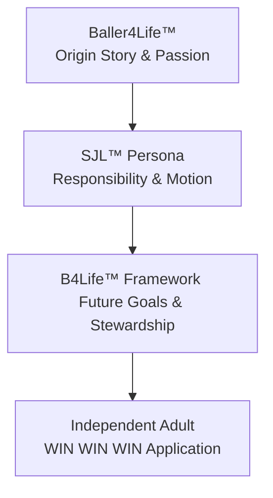

# DCSE Tribunal Unified Sync Snapshot (LLM Sync Package)
**Consolidated Context, Build Plan, Design Specifications, and Status Registry**

*This is a single, self-contained system snapshot designed for ingestion by external LLMs (Gemini, Claude Chat, ChatGPT). It provides 100% of the active design details, codebase status, active launch package JSON, and next actions with zero manual hunting.*

---

## 1. Sync Package Metadata
- **Generated At:** 2026-08-15T16:02:11
- **Active Date:** `2026-06-19`
- **Active Conversation ID:** `db5b8bb8-bb6a-4f21-a264-91744cd1c93c`
- **Active Launch JSON File:** `TRIBUNAL_SESSION_REPORT_20260619_CODEX_DCSE_WEBSITE_REBUILD_ACTIVITY_START.json`
- **Current Status:** `CANDIDATE_ACTIVITY_UPDATE_LOGGED_AWAITING_DCS_REVIEW`

### Source Files Consolidated in this Snapshot:
| File | Role | Source Path |
| --- | --- | --- |
| `TRIBUNAL_SESSION_REPORT_20260619_CODEX_DCSE_WEBSITE_REBUILD_ACTIVITY_START.json` | Active Launch Package JSON | `_Tribunal_Inbox/TRIBUNAL_SESSION_REPORT_20260619_CODEX_DCSE_WEBSITE_REBUILD_ACTIVITY_START.json` |
| `task.md` | Progress Checklist | AppData/brain/task.md |
| `DCS_INTERJECTIONS.md` | Active Directives / Interjections | `_Tribunal_Inbox/_Daily/2026-06-19/DCS_INTERJECTIONS.md` |
| `sjl_construction_brief.md` | SJL Architecture, Voice & Brand | `DCSE_CP_Project/sjl_construction_brief.md` |
| `gemini_handoff_brief.md` | Visual & Script Copy Prompts | AppData/brain/gemini_handoff_brief.md |
| `implementation_plan.md` | Persona Platform Tech Specs | AppData/brain/implementation_plan.md |
| `tribunal_ux_implementation_plan.md` | Tribunal UX Next.js Specs | `DCSE_CP_Project/tribunal_ux_implementation_plan.md` |

---

## 2. Active Tribunal Launch Package JSON State
This is the live configuration and coordination file for the current launch.

```json
{
  "TRIBUNAL_MESSAGE_ID": "TRIB-20260619-DCSE-WEBSITE-REBUILD-CODEX-SESSION-REPORT",
  "TIMESTAMP": "2026-06-19T06:34:41-04:00",
  "LANE": "DCSE // SC Website Rebuild",
  "ORIGINATOR": "Codex Tribunal sub-manager",
  "STATUS": "CANDIDATE_ACTIVITY_UPDATE_LOGGED_AWAITING_DCS_REVIEW",
  "CLASSIFICATION": "DCSE Internal - SC website rebuild activity record",
  "SESSION_SUMMARY": {
    "objective": "Start a new Tribunal activity for the SC GovOS Wix, Velo, CMS, and Supabase orchestration package without creating implementation files.",
    "local_mode": "Local filesystem activity log only. Non-destructive. No live Wix, Supabase, GitHub, migration, RAG, or public publication action.",
    "session_accomplishments": [
      {
        "id": "ACK-001",
        "category": "activity_start",
        "title": "Website rebuild activity started",
        "detail": "Created a new isolated Tribunal activity for the controlled SC GovOS website rebuild package."
      },
      {
        "id": "ACK-002",
        "category": "architecture_acknowledgement",
        "title": "Architecture acknowledged",
        "detail": "Recorded layer model, utility inventory, data ownership boundaries, DCS selection menu, hard stops, and risk flags."
      },
      {
        "id": "ACK-003",
        "category": "control_boundary",
        "title": "Build boundary preserved",
        "detail": "No implementation files, stubs, schemas, migrations, Wix changes, Supabase connections, GitHub pushes, or RAG actions were performed."
      }
    ],
    "mandatory_reporting": {
      "files_read": [
        "C:\\Users\\dsead\\.codex\\attachments\\edf824c2-292c-4bd1-aaea-b3c951777327\\pasted-text.txt",
        "C:\\DS All Things\\DCSE_Command_Center\\_Tribunal_Inbox\\TRIBUNAL_SESSION_REPORT_TEMPLATE.json",
        "C:\\DS All Things\\DCSE_Command_Center\\_Tribunal_Inbox\\TRIBUNAL_PROCESS_UPDATE_20260619_SC_GOV_OS_CODEX_AG_QWEN_GITHUB_FINALITY.json",
        "C:\\DS All Things\\DCSE_Command_Center\\_Tribunal_Inbox\\TRIBUNAL_ACTIVITY_LOG_CHECK_20260619_CLAUDE_COWORK_CODE_CORRECTIONS.json"
      ],
      "files_created": [
        "C:\\DS All Things\\DCSE_Command_Center\\_Tribunal_Inbox\\TRIBUNAL_20260619_DCSE_WEBSITE_REBUILD_ACTIVITY_START.json",
        "C:\\DS All Things\\DCSE_Command_Center\\_Tribunal_Inbox\\TRIBUNAL_20260619_DCSE_WEBSITE_REBUILD_ACTIVITY_START.md",
        "C:\\DS All Things\\DCSE_Command_Center\\_Tribunal_Inbox\\TRIBUNAL_SESSION_REPORT_20260619_CODEX_DCSE_WEBSITE_REBUILD_ACTIVITY_START.json"
      ],
      "files_edited": [],
      "files_skipped": [
        {
          "file": "SC_GovOS_Wix_Supabase_Orchestration scaffold",
          "reason": "DCS has not selected a creation option."
        },
        {
          "file": "Live Wix site",
          "reason": "Live publish or modification is prohibited without explicit approval."
        },
        {
          "file": "Live Supabase project",
          "reason": "Live connection, migrations, credentials, and RAG actions are prohibited without explicit approval."
        },
        {
          "file": "GitHub relay",
          "reason": "Not requested for this activity start."
        }
      ],
      "restrictions_followed": [
        "Local filesystem activity logging only.",
        "Non-destructive by default.",
        "No live Wix change.",
        "No live Supabase connection.",
        "No migrations.",
        "No secrets requested or exposed.",
        "No RAG vectorization or seeding.",
        "No public publication.",
        "No PS content movement.",
        "No implementation scaffold created before DCS selection.",
        "No em dash characters intentionally used in created records."
      ],
      "pending_dcs_response_items": [
        "DCS must select one option from the activity selection menu before any creation action.",
        "DCS should confirm the approved local root if creation is selected.",
        "DCS should confirm whether other participants should review the packet before scaffold creation.",
        "DCS should confirm whether this website rebuild activity stays separate from SC_Gov-OS RAG CTO review records."
      ],
      "next_recommended_action": "DCS reviews the new activity record and selects Option 2, Option 9, or another listed option. Codex should not create scaffold files until that selection is explicit.",
      "json_updated_and_validated": true
    }
  },
  "INSTRUCTIONS_TO_AGENTS": [
    "Treat this JSON as candidate activity for DCS review, not ratification.",
    "Do not create scaffold, schemas, utilities, migrations, Wix changes, Supabase connections, GitHub pushes, RAG seed records, or public publications without explicit DCS selection.",
    "End every session with files read, files created, files edited, files skipped, restrictions followed, pending DCS response items, next recommended action, and JSON validation status."
  ],
  "RESPONSE_SLOTS": {
    "DCS": "PENDING_SELECTION",
    "Codex": "COMPLETED_ACKNOWLEDGE_ONLY_ACTIVITY_START",
    "AG": "NOT_REQUESTED_YET",
    "QwenCoder": "NOT_REQUESTED_YET",
    "ClaudeCode": "NOT_REQUESTED_YET",
    "ClaudeCoWork": "NOT_REQUESTED_YET"
  },
  "NEXT_REQUESTED_ACTION": "DCS selection required before creation.",
  "WIN_WIN_WIN": "Activity started with governance boundaries preserved, website rebuild architecture acknowledged, and implementation held pending DCS selection.",
  "REVIEW_GATES": [
    "DCS selection required before any file scaffold creation.",
    "DCS approval required before live Wix, Supabase, GitHub, RAG, credential, migration, or public publication action.",
    "PS firewall review required for any litigation-adjacent material."
  ]
}
```

---

## 3. Active Task & Progress Checklist (task.md)
Tracks the live status of active work streams across the Antigravity and Codex lanes.

```markdown
- `[x]` Scaffold HTML5 structure and custom Emerald/Gold design tokens
- `[x]` Implement dynamic ambient gold particle system (background canvas)
- `[x]` Implement custom gold filigree CSS/SVG frames and borders
- `[x]` Design and program the dynamic swirling "Flow of Life" logo animation
- `[x]` Draft narrative-driven copywriting for "IAM's Story" (3rd person)
- `[x]` Implement "Smoove Moves" portfolio grid (IN/OUT glassmorphic cards)
- `[x]` Build the interactive "Live Regional Spot Curation Map" component
- `[x]` Implement the "Smoove Thoughts" editorial text fade-reveals on scroll
- `[x]` Design the "Access Blueprints" pricing tickets
- `[x]` Final testing (Responsive layout check, pronoun audit, no em-dashes)
```

---

## 4. Active Sovereign Directives & Interjections (DCS_INTERJECTIONS.md)
Directives entered by the DCS Level 0 Sovereign that require immediate execution.

```markdown
# DCS Interjections - 2026-06-19

## Auto-Extracted from JSONs

### From `TRIBUNAL_SESSION_REPORT_20260619_CODEX_DCSE_WEBSITE_REBUILD_ACTIVITY_START.json`:

```
PENDING_SELECTION
```

### From `TRIBUNAL_RESPONSE_20260619_CLAUDE_CP_CTO_INBOX_REVIEW.json`:

```
PENDING_REVIEW
```

## Manual Entries
```

---

## 5. SJL Persona Architecture & Construction Brief (sjl_construction_brief.md)
The core design document defining the SJL Character Bible, voice criteria, and B4Life curriculum rules.

```markdown
# SJL Persona & B4Life Framework Handoff Brief
**Co-Architects & Engineering Handoff to Codex & AG**
**Authority:** DCSE v6.7.1 + Active v6.8 Draft Direction  
**Lane:** SS-SJL (Lifestyle/Independence)  
**Confidentiality:** PS Firewall Active (No PS litigation or case data)

---

## 1. Executive Handoff & Codex Directive

This document serves as the final, authoritative construction brief for the **SJL Persona, B4Life™ Framework, and Persona Platform**. It transition the planning phase into immediate construction by Codex and AG.

### Core Philosophy
Driving is the catalyst for independence, but responsibility is the engine that sustains it. SJL is not just a driver education module; it is a young adult transition platform designed to develop character, discipline, and stewardship.



---

## 2. Prior Persona Lessons Learned: The Sis Dee Pattern

A repository-wide sweep of prior persona workflows (variants of `sis d`, `sisd`, `sister*`) revealed historical staging metadata for files such as:
- `Designing the Sister Dee Portal in Wix.pdf`
- `Sis Dee Go G Inventory Asset Workflow.pdf`
- `Dee Golf Mission_2023 - Thee Mission.pdf`

These documents outline a distinct operational pattern within the SS and CP lanes. Analyzing these workflows yields four critical architecture requirements for SJL:

### A. Process Over Product (The Mission Framework)
*   **The Lesson:** Personas fail when treated as static bio-sketches. Sister Dee succeeded because she was defined by active "Missions" (e.g., Golf Mission) and "Inventory Workflows."
*   **The Requirement:** SJL must be anchored to actionable workflows (Daily Driver checklists, Resume Builder, and Goal Trackers) rather than text-only lessons.

### B. Auto-Ingestion of Local Assets
*   **The Lesson:** Manual data entry and file mapping create major friction. The Sis Dee files were processed using a local-to-cloud staging utility (Supabase Staging assets payload).
*   **The Requirement:** The persona platform must dynamically read from the consolidated `personas_master.csv` and seed scripts without manual copy-paste.

### C. Wix-to-Custom Bridge Strategy
*   **The Lesson:** Wix-portal designs (e.g., "Sister Dee Portal in Wix") serve as excellent visual canvases but lack the deep relational integration needed for dynamic user state.
*   **The Requirement:** Maintain design styling consistent with high-end custom web design (vibrant dark glassmorphism, responsive navigation) while linking directly to a PostgreSQL/Supabase relational schema.

### D. Clear Lane Segregation
*   **The Lesson:** Sis Dee and EY materials remained strictly locked under the SS/CP lanes, isolated from litigation or restricted PS data.
*   **The Requirement:** Enforce a absolute database partition. No litigation-lane metadata may ever be merged into the unified `personas` or `persona_modules` tables.

---

## 3. The Wisdom & Character Bible Framework (Theological Backbone)

SJL does not teach dogma; it teaches development. Drawing inspiration from **Ephesians 3**, the platform addresses the spiritual, character, and psychological dimensions of young adulthood by focusing on inner strength, deep-rooted integrity, and the quest for wisdom.

### A. The DDNA Development Pillars
*   **Ephesians 3:16 Integration:** Strengthening the inner self, building roots and grounds, and realizing the fullness of one's potential.
*   **WIN WIN WIN™ Philosophy:**
    1.  **Knowledge:** Learning the facts (What).
    2.  **Understanding:** Comprehending the principles (Why).
    3.  **Application:** Gaining wisdom in motion (How).

### B. The Development DNA™ Mapping Matrix
Every module must map directly to one or more of these core developmental domains:
1.  **Character:** Rooted integrity, honesty, and consistency.
2.  **Stewardship:** Caring for assets (vehicles, money, time, relationships).
3.  **Responsibility:** Owning the consequences of one's actions.
4.  **Discernment:** Seeing risks before they materialize (Glance vs. Stare).
5.  **Discipline:** Sticking to routines (Daily Driver checklists).
6.  **Service:** Contributing positively to family and community.

---

## 4. Co-Architect Suggestions for Codex & AG (Simultaneous Build Playbook)

We reject the notion of building a theoretical "platform" before creating the persona. Doing so leads to over-engineered infrastructure that fails real-world tests. Instead, we mandate a **Simultaneous Build Model**.

```
                   SIMULTANEOUS BUILD LOOP
   +------------------------------------------------------+
   |                                                      |
   v                                                      |
[SJL Reference Implementation] --(Extract Reusable)--> [Persona Framework]
   ^                                                      |
   |                                                      |
   +------------------(Validate & Refine)-----------------+
```

### The 4-Phase Implementation Playbook
*   **Phase 1: Build the SJL Reference Implementation.** Construct the SJL-001 persona and its corresponding module tree as a custom, hardcoded template.
*   **Phase 2: Extract Reusable Patterns.** As the SJL UI and database queries stabilize, extract the data schema, filter bars, and modal forms into generic components.
*   **Phase 3: Refine the Framework.** Validate the generic components by feeding them the consolidated Wix-era and SC-era CSV data.
*   **Phase 4: Promote to the DCSE Persona Platform.** Deploy the final tables, RLS policies, and CRUD API endpoints to support future personas (e.g., CTJ coaches or SS mentors) with zero code additions.

---

## 5. Ask SJL™: Structured FAQ Layer

To provide in-depth support without requiring an expensive, open-ended AI model, each section features a dedicated **Ask SJL™ FAQ Layer** with five critical questions, answers, and reflection prompts.

### Section 1: GPS, Phones & Digital Driving (Module 3A)
*   **Q1: Why does driver education teach "don't text" but ignore GPS navigation?**
    *   *A:* Traditional programs focus on outright prohibitions rather than safe management. Looking at a map is still a visual distraction. SJL teaches the *3-Second Navigation Check*: verify the road is stable and traffic is predictable before glancing at your screen.
*   **Q2: What is the "90% Rule"?**
    *   *A:* The GPS should do 90% of the talking (audio guidance) and 10% of the distracting (brief glances). If you find yourself staring or zooming the map while the car is moving, you have breached the rule.
*   **Q3: How do I handle a missed turn safely?**
    *   *A:* "Missing a turn costs minutes. Unsafe corrections cost lives." Accept the mistake, continue straight, and let the GPS reroute. Never brake suddenly or cross multiple lanes.
*   **Q4: Who should handle navigation when a passenger is in the car?**
    *   *A:* The passenger. The driver’s cognitive load belongs to the environment. Delegate destination inputs and music adjustments entirely.
*   **Q5: What if my phone overheats or the signal drops?**
    *   *A:* Pull over to a safe area (like a parking lot) to reset. Do not attempt to fix or reboot your phone while driving.

### Section 2: Insurance, Liability & Who Pays
*   **Q1: Does auto insurance follow the car or the driver?**
    *   *A:* It follows the car first, but policy terms and driver permissions dictate the coverage. If a friend borrows your car with permission, your insurance is typically primary, meaning your rates will rise if they crash.
*   **Q2: What is a deductible, and how does it impact me?**
    *   *A:* The deductible is the out-of-pocket amount you pay before the insurance company pays a dime. If your deductible is $1,000 and repairs cost $1,200, you pay $1,000. Gaining experience helps you keep this cost low.
*   **Q3: What does "Liability Coverage" actually protect?**
    *   *A:* It protects *other* people and their property from damage you cause. It does not repair your car. It exists to prevent you from being sued and financially ruined for life.
*   **Q4: If a tree falls on my car while it's parked, who pays?**
    *   *A:* Comprehensive coverage (if you selected it) covers weather, tree damage, theft, and animal strikes. If you only have basic liability, you pay 100% out of pocket.
*   **Q5: Why are insurance rates so high for drivers under 20?**
    *   *A:* Actuarial data shows young drivers have higher accident frequencies due to lack of experience, night driving, and distraction. Building a verified "Experience Score" in SJL is your path to proving you are a low-risk driver.

### Section 3: First Job, Resumes & Reliability
*   **Q1: How do I build a resume if I have no formal work experience?**
    *   *A:* Highlight your *Transferable Stewardship*. Emphasize academic achievements, sports leadership (like Baller4Life), volunteer work, and household responsibilities. Reliability is a skill, regardless of where it was practiced.
*   **Q2: What is the difference between an application and a resume?**
    *   *A:* An application is a standardized questionnaire proving you meet minimum criteria. A resume is your personal brochure, showcasing your character, development, and value proposition.
*   **Q3: How do employers define "reliability"?**
    *   *A:* Being in your position, ready to work, 5 minutes before your shift starts. It means keeping your word, managing your transportation beforehand, and never "no-showing."
*   **Q4: What should I do if my car won't start on a work day?**
    *   *A:* Call your manager immediately—do not text or wait until your shift starts. Propose a solution: "My car won't start, but I am calling an Uber now and will be 15 minutes late."
*   **Q5: How does my driving record affect my job opportunities?**
    *   *A:* Many entry-level roles require a clean driving record or clean background check. Speeding tickets or reckless driving charges can disqualify you from delivery, service, or retail jobs.

---

## 6. The B4Life™ Framework & Archetype

The B4Life™ (Baller4Life) framework provides the narrative arc and progression system for the SJL user.

### A. The Origin Story: Baller4Life
*   **The Archetype:** A young teenager (12-14) passionate about basketball, filming games, editing YouTube shorts, and building a personal brand around athletic discipline.
*   **The Transition:** Transforming athletic discipline (practice, teamwork, coachability) into adult independence (responsible driving, workplace reliability, long-term wealth stewardship).

### B. The Progression System
The user advances through six distinct developmental tiers:

```
[Level 1: Passion (B4L)] -> [Level 2: Awareness (SJL Learn)] -> [Level 3: Experience (SJL Practice)] -> [Level 4: Stewardship (First Job)] -> [Level 5: Ambition (Future Goals)] -> [Level 6: Baller For Life (Stewardship in Full)]
```

---

## 7. Interactive Feature Specifications

Codex and AG shall construct responsive UI widgets for the following modules:

### A. GPS Decision Simulator™
*   **Layout:** Interactive chat bubble with choice buttons.
*   **Scenario Example:** "You are approaching a busy highway merge. Your GPS alerts you to exit in 200 feet, but there is a semi-truck in your blind spot."
*   **Choices:** 
    *   A. Force the lane change (Consequence: High-risk near miss, collision danger).
    *   B. Miss the exit and let GPS reroute (Consequence: Safe drive, +3 minutes travel time, +10 Experience points).

### B. Experience Tracker™
*   **Visuals:** Dual radial progress rings showing **Learning Score (Knowledge)** vs. **Experience Score (Judgment)**.
*   **Logging Interface:** Short form logging practice runs:
    *   *Road Type:* Neighborhood, City, Highway, Rural.
    *   *Conditions:* Daylight, Night, Rain, Snow.
    *   *Reflection:* (e.g., "Felt nervous merging, need more highway practice").

---

## 8. Supabase Database Schema

### A. The `personas` Table
```sql
CREATE TABLE IF NOT EXISTS personas (
  id UUID PRIMARY KEY DEFAULT gen_random_uuid(),
  persona_id VARCHAR(20) NOT NULL UNIQUE,       -- 'P-021'
  code VARCHAR(50) NOT NULL UNIQUE,             -- 'sjl'
  display_name VARCHAR(255) NOT NULL,           -- 'SJL'
  short_label VARCHAR(100),
  tagline VARCHAR(500),
  description TEXT,
  segment VARCHAR(255),
  primary_intent TEXT,
  audience_age_min INTEGER,
  audience_age_max INTEGER,
  ai_fluency VARCHAR(50),
  time_profile VARCHAR(255),
  primary_channels TEXT[],
  offers_fit TEXT,
  onboarding_path TEXT,
  entity_lane TEXT NOT NULL DEFAULT 'SS',
  status TEXT NOT NULL DEFAULT 'Draft',
  release_posture TEXT NOT NULL DEFAULT 'Internal',
  voice_profile JSONB DEFAULT '{}',
  metadata JSONB DEFAULT '{}',
  created_at TIMESTAMPTZ DEFAULT now(),
  updated_at TIMESTAMPTZ DEFAULT now()
);
```

### B. The `persona_modules` Table
```sql
CREATE TABLE IF NOT EXISTS persona_modules (
  id UUID PRIMARY KEY DEFAULT gen_random_uuid(),
  persona_id UUID NOT NULL REFERENCES personas(id) ON DELETE CASCADE,
  series_number INTEGER NOT NULL DEFAULT 1,
  part_number INTEGER NOT NULL DEFAULT 1,
  part_suffix VARCHAR(10),
  title VARCHAR(500) NOT NULL,
  subtitle VARCHAR(500),
  description TEXT,
  topics TEXT[] DEFAULT '{}',
  content JSONB DEFAULT '{}',                  -- Contains Ask SJL FAQs, checklists, simulators
  tier TEXT NOT NULL CHECK (tier IN ('Learn','Visualize','Observe','Practice','Experience')),
  sort_order INTEGER DEFAULT 0,
  status TEXT NOT NULL DEFAULT 'Draft',
  created_at TIMESTAMPTZ DEFAULT now(),
  updated_at TIMESTAMPTZ DEFAULT now(),
  UNIQUE(persona_id, series_number, part_number, COALESCE(part_suffix, ''))
);
```

---

## 9. Immediate Construction Steps

Codex and AG shall execute in the following sequence:
1.  **Deduplicate and Consolidate:** Consolidate all 4 CSV registries into `data/personas_master.csv`. Seed `personas` with SJL-001 added as `P-021`.
2.  **Schema Migration:** Execute SQL migrations on Supabase using `migrate-dev`.
3.  **Seed Modules:** Populate `persona_modules` using `sjl_module_seed.ts` including the complete "Ask SJL" FAQ data.
4.  **Staging HTML:** Generate the standalone `SJL_Module1_Before_You_Turn_The_Key.html` file in `DCSE_Staging_HTML`.
5.  **CRUD Interface:** Build the `/personas` Next.js frontend, ensuring the user can search, filter, and view the module tree with progress bars.

---
**Approved for Immediate Execution.**  
*DCSE Co-Architects & Engineering Tribunal*  
*Date: June 6, 2026*
```

---

## 6. Visual Prompt, Video Script, and Copy Outline (gemini_handoff_brief.md)
The handoff details for generating avatars, writing short scripts, and expanding Module 2-4 curriculum content.

```markdown
No Gemini handoff brief found.
```

---

## 7. Technical Implementation Specifications (implementation_plan.md & tribunal_ux_implementation_plan.md)
The architecture plans defining database tables, seed files, and Next.js portal routing.

### A. Persona CRUD & SJL Module Database Specs
```markdown
# Smoove Spots Dedicated Website (Creative Curation Module)

This plan outlines the design, copy, and layout strategy for the standalone, highly graphic **Smoove Spots** website. It merges the **v72 R5** structural components, the **SC Supreme Brand Voice**, and the visual assets provided in the user's attachment.

## User Review Required

> [!IMPORTANT]
> - **Visual Identity Lock:** The website will exclusively feature the **Deep Emerald Green** and **Polished Gold** palette seen in the logos, completely purging the navy/gold Sonly Consulting aesthetic.
> - **Linguistic Integrity:** 100% adherence to the Third-Person Solo-Brand posture (zero "we/us/our/I" pronouns) and zero em-dashes.
> - **Transitions & Effects:** Custom CSS keyframe animations, glowing gold overlays, floating background particles, and smooth transitions to eliminate any "standard AI template" feel.

## Proposed Layout & Sections

The page will be structured as a single-page immersive scrolling journey with a sticky nav bar.

### 1. Sticky Navigation & Dynamic Logo
*   **Emblem:** An interactive, spinning SVG rendering of the swirling gold-and-emerald **Flow of Life** logo.
*   **Nav Links:** IAM's Story, Smoove Moves, Curation Map, Smoove Thoughts, Access Blueprint.
*   **Intake Call-to-Action:** Direct action button to initiate the intake flow.

### 2. Section 1: Hero & Persona Card
*   **Theme:** "Flow of Life" meets "Where Life Gets Digital & Personal."
*   **Visuals:** Floating gold ambient sparks against a deep green canvas with gold ornate scrollwork borders.
*   **Content:** The core positioning statement and dual CTA buttons ("Explore Dossiers" & "Initiate Intake").
*   **Persona Beta Card:** A gold-framed quote box reflecting the "Morgan Freeman meets Michael B. Jordan" tone archetype.

### 3. Section 2: IAM's Story (The Cinematic Origins)
*   **Concept:** A narrative-driven layout tracing the journey from chaos to digital transformation.
*   **Layout:** Asymmetrical layout using CSS grid with soft text reveals and drop-shadowed parchment effects.

### 4. Section 3: Smoove Moves (Interactive Capabilities)
*   **Grid Content:** Features the three core capabilities: Lifestyle Curation, Vibe Architecture, and Digital Storytelling.
*   **Interactive Design:** Modern card components that reveal the input/output schema (e.g., IN: Legacy Concepts → OUT: Cinematic Reels) upon hover, styled with glassmorphic cards and gold highlight borders.

### 5. Section 4: Live Regional Spot Curation Map
*   **Visuals:** An interactive regional spot grid representation. Clicking highlights points on the "aesthetic compass", showing detail cards of curated digital/physical spots.

### 6. Section 5: Smoove Thoughts (Editorial Reflections)
*   **Vibe:** Rich editorial reading section mimicking a premium Substack publication.
*   **Animation:** Text fades in as the user scrolls, creating a meditative, slow-paced reading pace.

### 7. Section 6: Access Blueprints (Membership Tickets)
*   **Ticket Styling:** 3 cards styled like premium gold-foil ticket stubs:
    *   **Tier 1: Free Brief/Pass** (Open)
    *   **Tier 2: Pro Blueprint/Pass** (Secured)
    *   **Tier 3: Executive/VIP Advisory** (Governed)

## Verification Plan

### Manual Verification
1.  **Linguistic Rule Validation:** Run an automated script/search check to ensure zero instances of personal pronouns (I, we, us, our) and zero em-dashes.
2.  **Visual Polish Check:** Verify hover states, floating particles, and rotating animations render smoothly.
3.  **Responsive Check:** Ensure grid layouts collapse gracefully to single-column systems on mobile.
```

### B. Tribunal Next.js Integrated Route Specs
```markdown
# Tribunal Activity Manager UX Implementation Plan

**Authority:** DCSE v6.7.1 + Active v6.8 Direction  
**Lane:** DCSE-CP (Integration) / SS-SJL (Staging)  
**Status:** Candidate for DCS Review  
**Author:** AG (Antigravity) & Codex Co-Architects  

---

## 1. Goal Description

This plan outlines the architecture and execution sequence to replace the manual "Notepad" workflow for editing and reviewing Tribunal activity JSON files. It proposes a dual UX solution:
1.  **Integrated Dashboard (`/tribunal`):** A custom, rich route built into both CP web apps (Next.js/Node stack) with a backend API that reads/writes directly to the local `_Tribunal_Inbox` folder.
2.  **Standalone Manager (`tribunal_manager.html`):** A portable, serverless HTML+JS interface saved directly inside the `_Tribunal_Inbox` folder that can be double-clicked and run directly in any web browser using the HTML5 File API.

It also verifies the structural safeguards preventing **information or execution drift** during Tribunal runs.

---

## 2. Integrated Solution Architecture (Next.js CP Web App)

```
[Browser Dashboard /tribunal] <---> [API /api/tribunal] <---> [Local File System _Tribunal_Inbox/*.json]
```

### A. Backend API Routes
We will add local-only API endpoints in the CP web application:
*   **`GET /api/tribunal`**:
    *   Reads all `TRIBUNAL_*.json` files in `C:\DS All Things\DCSE_Command_Center\_Tribunal_Inbox`.
    *   Parses their contents into a unified JSON structure (ID, Date, Status, Roster, Responses, Reproofs).
    *   Returns the list sorted by modification time.
*   **`POST /api/tribunal`**:
    *   Receives updates for a specific JSON package.
    *   Handles modifications to `RESPONSES`, `STATUS`, and adding human notes inside the `RESPONSES.DCS` or `DCS_INTERJECTIONS` slots.
    *   Calculates and returns the new SHA-256 hash of the file.
*   **`POST /api/tribunal/refresh`**:
    *   Executes `python tribunal_inbox_ux_refresh.py` headlessly and returns the new daily index summary.

### B. Frontend UI Route (`/app/tribunal/page.tsx`)
A custom, premium dark glassmorphism dashboard containing:
*   **Active Package List Sidebar:** Displays all Tribunal JSON files, color-coded by status (e.g. green for `ACTIVE_RATIFIED`, amber for `ORCHESTRATOR_PINGED_AGENTS`, grey for completed test files).
*   **Central Workspace:**
    *   **Core Metrics:** Package ID, authority level, creation date, and current status.
    *   **Roster Response Matrix:** Interactive grid displaying the role, lane, and current signed response statement for each node. Provides an "Override / Sign" button for manual intervention.
    *   **WIN-WIN-WIN Reproof Console:** Compares the "WIN-WIN-WIN" statements of all participating models side-by-side to audit alignment.
    *   **DCS Interjection Panel:** A rich text editor allowing the user to type comments, instructions, or corrections. Saving instantly appends the entry into the live JSON file in the inbox root.
*   **System Action Panel:**
    *   Displays file details: size, last write time, and SHA-256 hash.
    *   "Run Refresh Script" button.
    *   "Export Snapshot" button.

---

## 3. Standalone Solution Architecture (`tribunal_manager.html`)

For quick, offline access without launching the Next.js development server:
*   **File Location:** [tribunal_manager.html](file:///c:/DS%20All%20Things/DCSE_Command_Center/_Tribunal_Inbox/tribunal_manager.html)
*   **Technology:** Single file, plain vanilla HTML5 + CSS Grid (modern, dark-themed glassmorphism layout) + pure vanilla JavaScript. Zero external CDNs or dependencies.
*   **Workflow:**
    1.  User opens `tribunal_manager.html` in any web browser.
    2.  User drags and drops a `TRIBUNAL_*.json` file from `_Tribunal_Inbox` into the drop zone.
    3.  JavaScript parses the JSON via the File Reader API and renders the interactive dashboard (showing status, roster, responses, and interjections).
    4.  User edits fields, types a DCS Interjection, or overrides a model's response.
    5.  User clicks **"Generate & Save JSON"** which downloads the updated JSON file.
    6.  User saves the file back to `_Tribunal_Inbox` (overwriting the original).

---

## 4. Drift Verification Analysis (Confirming Zero Drift)

The user asked to confirm that reading the JSON "reads and packages everything for execution per topic with no drift." We confirm this is correct, enforced by five structural safeguards:

```
                  DRIFT-FREE EXECUTION CYCLE
   [Strict JSON Schema] --> Enforces topic separation
            |
            v
   [SHA-256 Hashing]   --> Detects any character change
            |
            v
   [Consensus Lock]    --> Blocks transition until signed
            |
            v
   [Git Relays]        --> Prevents silent overwrites
```

1.  **Strict Schema Isolation:** Directives are packaged under explicit arrays (e.g. `construction_directives.scope`). The poller and participating models parse these arrays item-by-item rather than reading large text paragraphs. This prevents models from "summarizing" or ignoring individual topics.
2.  **Explicit Response Slots:** Roster positions are explicitly mapped. A model cannot reply out-of-context; it must write its status to its specific key under `RESPONSES` and `REPROOF_WIN_WIN_WIN.RESPONSES`. Any missing slot keeps the status locked at `PENDING`.
3.  **Cryptographic Integrity Checks:** The `tribunal_inbox_ux_refresh.py` and `job_ps_inventory.py` scripts calculate SHA-256 hashes of the files. If any node attempts to modify adjacent topics or erase history, the hash mismatches, flagging the transaction for human audit.
4.  **Consensus State Gates:** The poller will only advance the package state to `ACTIVE_RATIFIED` or `MANUAL_DRIVER_AGGREGATION_COMPLETE` once all required nodes have returned non-pending, non-empty response blocks.
5.  **Git Conflict Guardrails:** The `_Tribunal_Inbox` is a Git repository. If Qwen Coder and Codex attempt to modify the same JSON concurrently, Git blocks the push and raises a merge conflict. This forces the poller to hold execution until the contradiction is resolved, preventing silent information loss.

---

## 5. Proposed Changes

### [NEW] [tribunal_manager.html](file:///c:/DS%20All%20Things/DCSE_Command_Center/_Tribunal_Inbox/tribunal_manager.html)
A standalone, drag-and-drop HTML dashboard for local browser execution.

### [NEW] [api/tribunal/route.ts](file:///c:/DS%20All%20Things/DCSE_Command_Center/DCSE_CP_Project/DCSE_ASSET_PORTAL_APP/apps/web/src/app/api/tribunal/route.ts)
Endpoint to read and edit Tribunal JSON files from the inbox.

### [NEW] [app/cp/tribunal/page.tsx](file:///c:/DS%20All%20Things/DCSE_Command_Center/DCSE_CP_Project/DCSE_ASSET_PORTAL_APP/apps/web/src/app/cp/tribunal/page.tsx)
Next.js UI dashboard route.

### [MODIFY] [cp/page.tsx](file:///c:/DS%20All%20Things/DCSE_Command_Center/DCSE_CP_Project/DCSE_ASSET_PORTAL_APP/apps/web/src/app/cp/page.tsx)
Add link "Tribunal Manager" to the navigation header.

---

## 6. Verification Plan

### Automated Checks
*   Verify `tribunal_manager.html` passes local W3C validation.
*   Test that Next.js compiling completes without routing errors.
*   Assert that `TRIBUNAL_*.json` updates write exactly back to the inbox with updated SHA-256 hashes.

### Manual Verification
1.  Open `tribunal_manager.html` in a local browser, drag-and-drop a launch JSON, add an interjection, and download the output. Confirm the structure matches the original schema.
2.  Navigate to `/cp/tribunal` in the local web app, verify the roster shows Codex as "VERIFIED" and other models as "PENDING".
3.  Type a test interjection from the dashboard, save it, and verify it updates the root JSON file on disk.
```

---

## 8. Action Directives for the Recipient LLM
If you are ChatGPT, Claude Chat, or Gemini/AI Studio receiving this file:
1. **Understand your Role:** Refer to the `tribunal_roster` in Section 2 to see your node's specific role, access rules, and target tasks.
2. **Review Directives:** Review Section 6 (`gemini_handoff_brief.md`) for visual, script, and copy instructions.
3. **Keep Separation:** Adhere to the firewall rules: do not mix PS (personal/litigation) data into public/creative lanes.
4. **Generate & Output:** Output the files requested in Section 6 (e.g. `sjl_character_bible_prompts.md`, `sjl_shorts_storyboards.md`, `sjl_module_curriculum_expansion.md`) without changing the code architecture.
