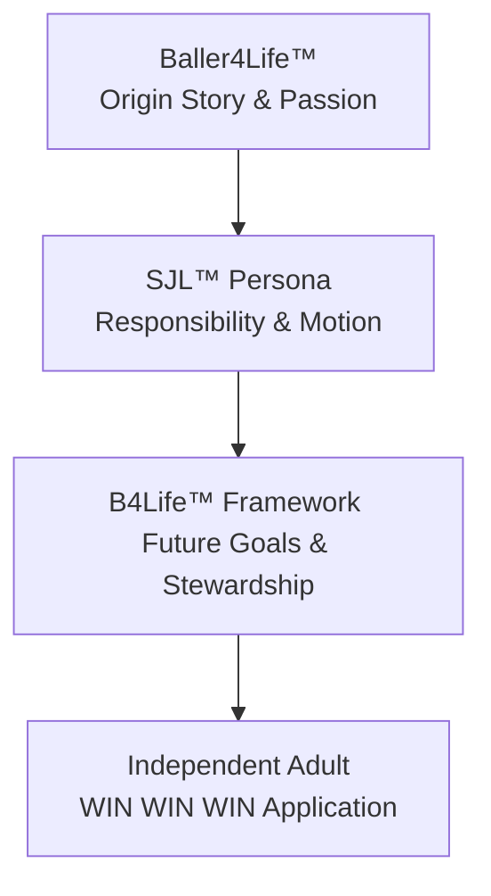
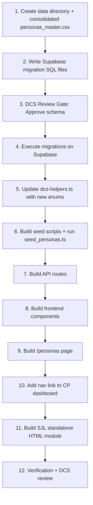

# DCSE Tribunal Unified Sync Snapshot (LLM Sync Package)
**Consolidated Context, Build Plan, Design Specifications, and Status Registry**

*This is a single, self-contained system snapshot designed for ingestion by external LLMs (Gemini, Claude Chat, ChatGPT). It provides 100% of the active design details, codebase status, active launch package JSON, and next actions with zero manual hunting.*

---

## 1. Sync Package Metadata
- **Generated At:** 2026-06-07T02:38:39
- **Active Date:** `2026-06-06`
- **Active Conversation ID:** `a16f92ad-d40d-482e-99fb-f1bc092f454d`
- **Active Launch JSON File:** `TRIBUNAL_20260606_DART_PS_GOVERNANCE_EVAL_KIT_LAUNCH.json`
- **Current Status:** `ORCHESTRATOR_PINGED_AGENTS`

### Source Files Consolidated in this Snapshot:
| File | Role | Source Path |
| --- | --- | --- |
| `TRIBUNAL_20260606_DART_PS_GOVERNANCE_EVAL_KIT_LAUNCH.json` | Active Launch Package JSON | `_Tribunal_Inbox/TRIBUNAL_20260606_DART_PS_GOVERNANCE_EVAL_KIT_LAUNCH.json` |
| `task.md` | Progress Checklist | AppData/brain/task.md |
| `DCS_INTERJECTIONS.md` | Active Directives / Interjections | `_Tribunal_Inbox/_Daily/2026-06-06/DCS_INTERJECTIONS.md` |
| `sjl_construction_brief.md` | SJL Architecture, Voice & Brand | `DCSE_CP_Project/sjl_construction_brief.md` |
| `gemini_handoff_brief.md` | Visual & Script Copy Prompts | AppData/brain/gemini_handoff_brief.md |
| `implementation_plan.md` | Persona Platform Tech Specs | AppData/brain/implementation_plan.md |
| `tribunal_ux_implementation_plan.md` | Tribunal UX Next.js Specs | `DCSE_CP_Project/tribunal_ux_implementation_plan.md` |

---

## 2. Active Tribunal Launch Package JSON State
This is the live configuration and coordination file for the current launch.

```json
{
  "tribunal_package": {
    "package_id": "DCSE-CP/TRIBUNAL/DART-PS-GOV-EVAL-KIT/LAUNCH/v1.0/20260606",
    "issued_by": "Codex",
    "authority": "DCS Level 0 Sovereign",
    "issued_date": "2026-06-06",
    "classification": "DCSE Internal -- PS Lane // DART Governance Evaluation",
    "governance_baseline": "DCSE Master Governance Doctrine v6.7-X/v6.8 candidate controls + Global Agent Operating Instructions v6+",
    "status": "BUILD_READINESS_GATE"
  },
  "STATUS": "ORCHESTRATOR_PINGED_AGENTS",
  "separation_notice": {
    "separate_from": "DCSE-CP/TRIBUNAL/SJL/LAUNCH/v1.0/20260606",
    "instruction": "This is a separate Tribunal thread from the B4L/SJL build phase. Do not append DART PS governance evaluation work into the SJL construction package."
  },
  "build_intent": {
    "target_package": "DART_PS_Governance_Evaluation_Kit_v1",
    "posture": "candidate-only, review-bound, Markdown-first",
    "purpose": "Prepare a reproducible DART PS evolution, degradation, proof, QA, confidence, attorney handoff, and promotion-evaluation kit for human and multi-model review before any DART promotion.",
    "primary_execution_rule": "Inventory before interpretation. Build instructions and source manifest before synthesis."
  },
  "required_build_items_before_generation": [
    "Source manifest of every DART version and governance/support artifact used",
    "Human reviewer instructions",
    "Build-agent instructions",
    "Model-evaluation prompt master",
    "Agent skill-file requirements or references",
    "DART version chronology and lineage map",
    "Evolution matrix",
    "Degradation matrix",
    "Rule group registry",
    "Proof Engine specification",
    "Independent QA Engine specification",
    "Confidence Engine specification",
    "Reproducibility standard",
    "Attorney handoff standard",
    "Bench trial readiness standard",
    "Scoring rubric",
    "Open gaps registry",
    "Promotion recommendation framework",
    "Manifest authority record"
  ],
  "known_source_locations": {
    "ps_dart_sot": "C:\\DS All Things\\DCSE_Command_Center\\DCSE_PS_CP_Project\\PS_Dart_SOT Folder",
    "dcse_governance_root": "C:\\DS All Things\\DCSE_Command_Center",
    "skill_registry": "C:\\DS All Things\\DCSE_Command_Center\\03_SKILL_REGISTRY.md",
    "agent_operating_instructions": "C:\\DS All Things\\DCSE_Command_Center\\DCSE_Global_Agent_Operating_Instructions.md",
    "ps_dart_skill": "C:\\DS All Things\\DCSE_Command_Center\\DCSE_CP_Project\\.ai\\skills\\ps-dart-governance\\SKILL.md",
    "tribunal_inbox": "C:\\DS All Things\\DCSE_Command_Center\\_Tribunal_Inbox"
  },
  "source_candidates_observed": [
    "dart_v7.py",
    "dart_v52_unified.py",
    "dart_v42_unified.py",
    "dart_v4_1_unified.py",
    "Qwen_DART_Unified_v41.py",
    "DART_Module_v01_(20251114_020429).txt",
    "PS DART v4.1 Instructions 11182025.pdf",
    "PS Gem DART Rules v1.pdf",
    "_PS Combined DART Logic Framework and Rules v1.pdf",
    "DART_Ruleset_Generation_Prompt_DCSE_v2.txt",
    "DCSE_PS_Model_Instructions_v6+.md",
    "PS SJO DART v7 Prompt 11282025.md",
    "DART Update Qwen 11202025.pdf"
  ],
  "candidate_governance_controls_to_validate": [
    "G-01 Source Manifest Rule",
    "G-02 Candidate Before Authority Rule",
    "G-03 Copy Before Promotion Rule",
    "G-04 Human Review Gate",
    "G-05 Active Voice Rule",
    "G-06 Citation Verification Rule",
    "G-07 Positive Potential Rule",
    "G-08 Threshold Rule",
    "G-09 PS Firewall Rule",
    "G-10 Architecture Rewrite Rule",
    "G-11 Reproducibility Rule",
    "G-12 Proof Requirement Rule",
    "G-13 Independent QA Rule",
    "G-14 Trial Traceability Rule",
    "G-15 Promotion Audit Rule"
  ],
  "required_distribution_kit_markdown_files": [
    "00_README.md",
    "01_DCSE_v68_Governance_Authority.md",
    "02_DART_Evolution_Audit_Methodology.md",
    "03_DART_Evolution_Matrix.md",
    "04_DART_Degradation_Matrix.md",
    "05_DART_Rule_Group_Registry.md",
    "06_DART_Proof_Engine_Specification.md",
    "07_DART_QA_Engine_Specification.md",
    "08_DART_Confidence_Engine_Specification.md",
    "09_DART_Reproducibility_Standard.md",
    "10_Attorney_Handoff_Standard.md",
    "11_Bench_Trial_Readiness_Standard.md",
    "12_Model_Evaluation_Prompt_Master.md",
    "13_Model_Scoring_Rubric.md",
    "14_Promotion_Recommendation_Framework.md",
    "15_Open_Gaps_Registry.md",
    "16_Source_Manifest.md"
  ],
  "participant_request": "All participants should confirm what additional instructions, source files, skill files, human review gates, build-agent gates, or QA controls are required before Codex begins the DART_PS_Governance_Evaluation_Kit_v1 build. Responses should identify missing prerequisites, risks, and whether the package can proceed to candidate generation.",
  "RESPONSES": {
    "Codex": "Instructions Read. Protocols Adopted. -- Codex, 2026-06-06. Build architect posture confirmed. Codex will keep this as a separate DART PS Tribunal thread, inventory sources before interpretation, require human and build-agent instructions before synthesis, and preserve candidate-only PS firewall governance until DCS authorizes generation.",
    "AG": "Instructions Read. Protocols Adopted. \u2014 Anti-Gravity (AG) v6+ Coordinator, 2026-06-06T20:25:16.066470.",
    "Claude_Code": "PENDING",
    "Coder_Qwen": "PENDING",
    "CoWork_Gemini": "PENDING",
    "Claude_Chat": "PENDING",
    "ChatGPT_v5_5": "PENDING",
    "DCS": "PENDING"
  }
}
```

---

## 3. Active Task & Progress Checklist (task.md)
Tracks the live status of active work streams across the Antigravity and Codex lanes.

```markdown
# Task List: SJL Persona & B4Life™ Platform Implementation

Track progress of the SJL Persona rollout, database seeding, Next.js integrated UX, and content sync.

## 1. SJL & B4Life Reference & Staging
- `[x]` Consolidate existing CSV inventories into `data/personas_master.csv` (adding P-021 SJL and P-022 EY)
- `[x]` Build standalone `SJL_Module1_Before_You_Turn_The_Key.html` in staging folder
- `[x]` Build standalone `B4Life_Dashboard.html` premium dashboard with doctrine worksheet and media showcases
- `[x]` Update Module 1 HTML to integrate B4Life branding and link back-and-forth with the Main Dashboard
- `[x]` Implement DCS Trademark Explainer modal (™ vs ℠ vs ®) triggered by "Baller For Life™" header link
- `[x]` Unlock Modules 2 ("2. The Vehicle") and 3 ("3. The Road") with custom staging placeholder pages
- `[x]` Build standalone `B4Life_Admin_Profile.html` profile page and Feedback/Info Center between SJL and DCS
- `[x]` Transform Feedback Center in `B4Life_Admin_Profile.html` into a dynamic JSON-based drag-and-drop / export exchange console (similar to our inbox)
- `[x]` Normalize navigation headers across all 5 staging HTML files with active tab rendering
- `[x]` User review and approval of standalone modules and Dashboard HTML in browser
- `[x]` Generate `gemini_handoff_brief.md` containing image prompts, script outlines, and copywriting tasks

## 2. Database Integration (Antigravity Actions - Chief DBA)
- `[x]` Correct Codex and Claude Code/CoWork roles in the roster definitions of launch and sync JSON files
- `[x]` Execute Supabase migrations for the `personas` and `persona_modules` SQL tables (supporting DCSE & CTJ lanes)
- `[x]` Execute persona master seeds (`seed_personas.ts`) - 37 unique records loaded
- `[x]` Execute module seeds (`sjl_module_seed.ts`) - 7 SJL modules loaded with 'Review' status

## 3. Command Post App & Tribunal Dashboard (Codex Actions - Chief Developer)
- `[ ]` Build the Next.js integrated `/personas` dashboard route, grid, and detail panels
- `[ ]` Build the Next.js integrated `/cp/tribunal` real-time dashboard matching UX plan
- `[ ]` Validate all routes with local production build and end-to-end check

## 4. Content Sync & External LLM Workflow
- `[x]` Design a unified project manifest compiler (`job_llm_sync_package.py`) to pack files for external LLMs (Gemini/ChatGPT/Claude)
- `[/]` Execute content, avatar, and video scripts generation using the sync snapshot in external LLMs
- `[ ]` Import generated assets (`sjl_character_bible_prompts.md`, `sjl_shorts_storyboards.md`, `sjl_module_curriculum_expansion.md`) back into the workspace
```

---

## 4. Active Sovereign Directives & Interjections (DCS_INTERJECTIONS.md)
Directives entered by the DCS Level 0 Sovereign that require immediate execution.

```markdown
# DCS Interjections - 2026-06-06

## Auto-Extracted from JSONs

### From `TRIBUNAL_20260606_SJL_CONSTRUCTION_LAUNCH.json`:

```
[5:53:09 PM] Sovereign Directive: ### 1. How to Prompt Me to Check the Inbox

To check the inbox, you can simply type:
*   `inbox`
*   `check inbox`
*   `refresh tribunal status`

Whenever you ask me to do this, I will:
1.  Automatically run the [tribunal_inbox_ux_refresh.py](file:///c:/DS%20All%20Things/DCSE_Command_Center/_Tribunal_Inbox/tribunal_inbox_ux_refresh.py) script behind the scenes to compile any recent edits.
2.  Inspect the local `_Tribunal_Inbox` folder on disk.
3.  Output a live, updated status index showing the exact state of all packages and node responses.

---

### 2. Can the Standalone `tribunal_manager.html` Present in Real-Time?

**Currently, no (due to browser security constraints):**
*   Because `tribunal_manager.html` is opened locally as a file (`file:///c:/...`), standard web browsers enforce strict sandbox rules (CORS) that prevent JavaScript from reading or watching files on your hard drive in real-time without explicit user interaction.
*   This is why it requires you to drag-and-drop or select the JSON file whenever you want to load or update its contents.

**How We Get Real-Time Updates (The Integrated Route):**
*   In the [tribunal_ux_implementation_plan.md](file:///c:/DS%20All%20Things/DCSE_Command_Center/DCSE_CP_Project/tribunal_ux_implementation_plan.md) we just staged, we defined the Next.js integrated route at `/cp/tribunal` backed by `/api/tribunal`.
*   Because this runs through the local web server (`http://localhost:3000`), it **bypasses the browser security block**. 
*   Once Codex constructs this page, it will automatically pull the file list in real-time, allowing you to view, interject, and sign node responses directly in your browser with zero manual copy-paste or drag-and-drop.
[5:54:05 PM] Sovereign Directive: hERE IS another find DCS add timestamp start and stop
[7:09:54 PM] Sovereign Directive: SJL
/ Youth Independence / Series 1 - change SJL to B4Life. This should look feel and navigate like a webpage.  A link for B4L must open a page describing usi ng the definitions given regarding \Baller4Life is not merely a slogan.
Baller4Life is the developmental framework. Definition: A Baller is a person who consistently develops...' . This should be SJL private premieum page, it should be the actuall dashboard that allows nav to and from the *turn the key.html"

His main page dashboard provides links to all topic areas defined. We will have our featured videos, images, etc. SJL should be able to up/download all file types. Dashboard must have be build for an executive in learning,

The page is structurally  sound although the sjl core doctrine so be a webpage (Main Dashboard with a doctrine that serves a s a readme along with a type of worksheet (pdf/save print option).

We need at the minimum in this phase the current and dashboard pages built with a header that has allow SJL/B4L modules, and the footer will start with  in our footer standard: "Powered By Sonly Consulting" with a link to the B3L home page in Wix: : www.sonlyconsulting.com/b4l (no access control yet for build reasons). Speaking of Wix, we now need to leverage Wic MCP in Claude Code/Cowork to make real changes in the website.
```

## Manual Entries
```

---

## 5. SJL Persona Architecture & Construction Brief (sjl_construction_brief.md)
The core design document defining the SJL Character Bible, voice criteria, and B4Life curriculum rules.

```markdown
# SJL Persona & B4Life Framework Handoff Brief
**Co-Architects & Engineering Handoff to Codex & AG**
**Authority:** DCSE v6.7.1 + Active v6.8 Draft Direction  
**Lane:** SS-SJL (Lifestyle/Independence)  
**Confidentiality:** PS Firewall Active (No PS litigation or case data)

---

## 1. Executive Handoff & Codex Directive

This document serves as the final, authoritative construction brief for the **SJL Persona, B4Life™ Framework, and Persona Platform**. It transition the planning phase into immediate construction by Codex and AG.

### Core Philosophy
Driving is the catalyst for independence, but responsibility is the engine that sustains it. SJL is not just a driver education module; it is a young adult transition platform designed to develop character, discipline, and stewardship.



---

## 2. Prior Persona Lessons Learned: The Sis Dee Pattern

A repository-wide sweep of prior persona workflows (variants of `sis d`, `sisd`, `sister*`) revealed historical staging metadata for files such as:
- `Designing the Sister Dee Portal in Wix.pdf`
- `Sis Dee Go G Inventory Asset Workflow.pdf`
- `Dee Golf Mission_2023 - Thee Mission.pdf`

These documents outline a distinct operational pattern within the SS and CP lanes. Analyzing these workflows yields four critical architecture requirements for SJL:

### A. Process Over Product (The Mission Framework)
*   **The Lesson:** Personas fail when treated as static bio-sketches. Sister Dee succeeded because she was defined by active "Missions" (e.g., Golf Mission) and "Inventory Workflows."
*   **The Requirement:** SJL must be anchored to actionable workflows (Daily Driver checklists, Resume Builder, and Goal Trackers) rather than text-only lessons.

### B. Auto-Ingestion of Local Assets
*   **The Lesson:** Manual data entry and file mapping create major friction. The Sis Dee files were processed using a local-to-cloud staging utility (Supabase Staging assets payload).
*   **The Requirement:** The persona platform must dynamically read from the consolidated `personas_master.csv` and seed scripts without manual copy-paste.

### C. Wix-to-Custom Bridge Strategy
*   **The Lesson:** Wix-portal designs (e.g., "Sister Dee Portal in Wix") serve as excellent visual canvases but lack the deep relational integration needed for dynamic user state.
*   **The Requirement:** Maintain design styling consistent with high-end custom web design (vibrant dark glassmorphism, responsive navigation) while linking directly to a PostgreSQL/Supabase relational schema.

### D. Clear Lane Segregation
*   **The Lesson:** Sis Dee and EY materials remained strictly locked under the SS/CP lanes, isolated from litigation or restricted PS data.
*   **The Requirement:** Enforce a absolute database partition. No litigation-lane metadata may ever be merged into the unified `personas` or `persona_modules` tables.

---

## 3. The Wisdom & Character Bible Framework (Theological Backbone)

SJL does not teach dogma; it teaches development. Drawing inspiration from **Ephesians 3**, the platform addresses the spiritual, character, and psychological dimensions of young adulthood by focusing on inner strength, deep-rooted integrity, and the quest for wisdom.

### A. The DDNA Development Pillars
*   **Ephesians 3:16 Integration:** Strengthening the inner self, building roots and grounds, and realizing the fullness of one's potential.
*   **WIN WIN WIN™ Philosophy:**
    1.  **Knowledge:** Learning the facts (What).
    2.  **Understanding:** Comprehending the principles (Why).
    3.  **Application:** Gaining wisdom in motion (How).

### B. The Development DNA™ Mapping Matrix
Every module must map directly to one or more of these core developmental domains:
1.  **Character:** Rooted integrity, honesty, and consistency.
2.  **Stewardship:** Caring for assets (vehicles, money, time, relationships).
3.  **Responsibility:** Owning the consequences of one's actions.
4.  **Discernment:** Seeing risks before they materialize (Glance vs. Stare).
5.  **Discipline:** Sticking to routines (Daily Driver checklists).
6.  **Service:** Contributing positively to family and community.

---

## 4. Co-Architect Suggestions for Codex & AG (Simultaneous Build Playbook)

We reject the notion of building a theoretical "platform" before creating the persona. Doing so leads to over-engineered infrastructure that fails real-world tests. Instead, we mandate a **Simultaneous Build Model**.

```
                   SIMULTANEOUS BUILD LOOP
   +------------------------------------------------------+
   |                                                      |
   v                                                      |
[SJL Reference Implementation] --(Extract Reusable)--> [Persona Framework]
   ^                                                      |
   |                                                      |
   +------------------(Validate & Refine)-----------------+
```

### The 4-Phase Implementation Playbook
*   **Phase 1: Build the SJL Reference Implementation.** Construct the SJL-001 persona and its corresponding module tree as a custom, hardcoded template.
*   **Phase 2: Extract Reusable Patterns.** As the SJL UI and database queries stabilize, extract the data schema, filter bars, and modal forms into generic components.
*   **Phase 3: Refine the Framework.** Validate the generic components by feeding them the consolidated Wix-era and SC-era CSV data.
*   **Phase 4: Promote to the DCSE Persona Platform.** Deploy the final tables, RLS policies, and CRUD API endpoints to support future personas (e.g., CTJ coaches or SS mentors) with zero code additions.

---

## 5. Ask SJL™: Structured FAQ Layer

To provide in-depth support without requiring an expensive, open-ended AI model, each section features a dedicated **Ask SJL™ FAQ Layer** with five critical questions, answers, and reflection prompts.

### Section 1: GPS, Phones & Digital Driving (Module 3A)
*   **Q1: Why does driver education teach "don't text" but ignore GPS navigation?**
    *   *A:* Traditional programs focus on outright prohibitions rather than safe management. Looking at a map is still a visual distraction. SJL teaches the *3-Second Navigation Check*: verify the road is stable and traffic is predictable before glancing at your screen.
*   **Q2: What is the "90% Rule"?**
    *   *A:* The GPS should do 90% of the talking (audio guidance) and 10% of the distracting (brief glances). If you find yourself staring or zooming the map while the car is moving, you have breached the rule.
*   **Q3: How do I handle a missed turn safely?**
    *   *A:* "Missing a turn costs minutes. Unsafe corrections cost lives." Accept the mistake, continue straight, and let the GPS reroute. Never brake suddenly or cross multiple lanes.
*   **Q4: Who should handle navigation when a passenger is in the car?**
    *   *A:* The passenger. The driver’s cognitive load belongs to the environment. Delegate destination inputs and music adjustments entirely.
*   **Q5: What if my phone overheats or the signal drops?**
    *   *A:* Pull over to a safe area (like a parking lot) to reset. Do not attempt to fix or reboot your phone while driving.

### Section 2: Insurance, Liability & Who Pays
*   **Q1: Does auto insurance follow the car or the driver?**
    *   *A:* It follows the car first, but policy terms and driver permissions dictate the coverage. If a friend borrows your car with permission, your insurance is typically primary, meaning your rates will rise if they crash.
*   **Q2: What is a deductible, and how does it impact me?**
    *   *A:* The deductible is the out-of-pocket amount you pay before the insurance company pays a dime. If your deductible is $1,000 and repairs cost $1,200, you pay $1,000. Gaining experience helps you keep this cost low.
*   **Q3: What does "Liability Coverage" actually protect?**
    *   *A:* It protects *other* people and their property from damage you cause. It does not repair your car. It exists to prevent you from being sued and financially ruined for life.
*   **Q4: If a tree falls on my car while it's parked, who pays?**
    *   *A:* Comprehensive coverage (if you selected it) covers weather, tree damage, theft, and animal strikes. If you only have basic liability, you pay 100% out of pocket.
*   **Q5: Why are insurance rates so high for drivers under 20?**
    *   *A:* Actuarial data shows young drivers have higher accident frequencies due to lack of experience, night driving, and distraction. Building a verified "Experience Score" in SJL is your path to proving you are a low-risk driver.

### Section 3: First Job, Resumes & Reliability
*   **Q1: How do I build a resume if I have no formal work experience?**
    *   *A:* Highlight your *Transferable Stewardship*. Emphasize academic achievements, sports leadership (like Baller4Life), volunteer work, and household responsibilities. Reliability is a skill, regardless of where it was practiced.
*   **Q2: What is the difference between an application and a resume?**
    *   *A:* An application is a standardized questionnaire proving you meet minimum criteria. A resume is your personal brochure, showcasing your character, development, and value proposition.
*   **Q3: How do employers define "reliability"?**
    *   *A:* Being in your position, ready to work, 5 minutes before your shift starts. It means keeping your word, managing your transportation beforehand, and never "no-showing."
*   **Q4: What should I do if my car won't start on a work day?**
    *   *A:* Call your manager immediately—do not text or wait until your shift starts. Propose a solution: "My car won't start, but I am calling an Uber now and will be 15 minutes late."
*   **Q5: How does my driving record affect my job opportunities?**
    *   *A:* Many entry-level roles require a clean driving record or clean background check. Speeding tickets or reckless driving charges can disqualify you from delivery, service, or retail jobs.

---

## 6. The B4Life™ Framework & Archetype

The B4Life™ (Baller4Life) framework provides the narrative arc and progression system for the SJL user.

### A. The Origin Story: Baller4Life
*   **The Archetype:** A young teenager (12-14) passionate about basketball, filming games, editing YouTube shorts, and building a personal brand around athletic discipline.
*   **The Transition:** Transforming athletic discipline (practice, teamwork, coachability) into adult independence (responsible driving, workplace reliability, long-term wealth stewardship).

### B. The Progression System
The user advances through six distinct developmental tiers:

```
[Level 1: Passion (B4L)] -> [Level 2: Awareness (SJL Learn)] -> [Level 3: Experience (SJL Practice)] -> [Level 4: Stewardship (First Job)] -> [Level 5: Ambition (Future Goals)] -> [Level 6: Baller For Life (Stewardship in Full)]
```

---

## 7. Interactive Feature Specifications

Codex and AG shall construct responsive UI widgets for the following modules:

### A. GPS Decision Simulator™
*   **Layout:** Interactive chat bubble with choice buttons.
*   **Scenario Example:** "You are approaching a busy highway merge. Your GPS alerts you to exit in 200 feet, but there is a semi-truck in your blind spot."
*   **Choices:** 
    *   A. Force the lane change (Consequence: High-risk near miss, collision danger).
    *   B. Miss the exit and let GPS reroute (Consequence: Safe drive, +3 minutes travel time, +10 Experience points).

### B. Experience Tracker™
*   **Visuals:** Dual radial progress rings showing **Learning Score (Knowledge)** vs. **Experience Score (Judgment)**.
*   **Logging Interface:** Short form logging practice runs:
    *   *Road Type:* Neighborhood, City, Highway, Rural.
    *   *Conditions:* Daylight, Night, Rain, Snow.
    *   *Reflection:* (e.g., "Felt nervous merging, need more highway practice").

---

## 8. Supabase Database Schema

### A. The `personas` Table
```sql
CREATE TABLE IF NOT EXISTS personas (
  id UUID PRIMARY KEY DEFAULT gen_random_uuid(),
  persona_id VARCHAR(20) NOT NULL UNIQUE,       -- 'P-021'
  code VARCHAR(50) NOT NULL UNIQUE,             -- 'sjl'
  display_name VARCHAR(255) NOT NULL,           -- 'SJL'
  short_label VARCHAR(100),
  tagline VARCHAR(500),
  description TEXT,
  segment VARCHAR(255),
  primary_intent TEXT,
  audience_age_min INTEGER,
  audience_age_max INTEGER,
  ai_fluency VARCHAR(50),
  time_profile VARCHAR(255),
  primary_channels TEXT[],
  offers_fit TEXT,
  onboarding_path TEXT,
  entity_lane TEXT NOT NULL DEFAULT 'SS',
  status TEXT NOT NULL DEFAULT 'Draft',
  release_posture TEXT NOT NULL DEFAULT 'Internal',
  voice_profile JSONB DEFAULT '{}',
  metadata JSONB DEFAULT '{}',
  created_at TIMESTAMPTZ DEFAULT now(),
  updated_at TIMESTAMPTZ DEFAULT now()
);
```

### B. The `persona_modules` Table
```sql
CREATE TABLE IF NOT EXISTS persona_modules (
  id UUID PRIMARY KEY DEFAULT gen_random_uuid(),
  persona_id UUID NOT NULL REFERENCES personas(id) ON DELETE CASCADE,
  series_number INTEGER NOT NULL DEFAULT 1,
  part_number INTEGER NOT NULL DEFAULT 1,
  part_suffix VARCHAR(10),
  title VARCHAR(500) NOT NULL,
  subtitle VARCHAR(500),
  description TEXT,
  topics TEXT[] DEFAULT '{}',
  content JSONB DEFAULT '{}',                  -- Contains Ask SJL FAQs, checklists, simulators
  tier TEXT NOT NULL CHECK (tier IN ('Learn','Visualize','Observe','Practice','Experience')),
  sort_order INTEGER DEFAULT 0,
  status TEXT NOT NULL DEFAULT 'Draft',
  created_at TIMESTAMPTZ DEFAULT now(),
  updated_at TIMESTAMPTZ DEFAULT now(),
  UNIQUE(persona_id, series_number, part_number, COALESCE(part_suffix, ''))
);
```

---

## 9. Immediate Construction Steps

Codex and AG shall execute in the following sequence:
1.  **Deduplicate and Consolidate:** Consolidate all 4 CSV registries into `data/personas_master.csv`. Seed `personas` with SJL-001 added as `P-021`.
2.  **Schema Migration:** Execute SQL migrations on Supabase using `migrate-dev`.
3.  **Seed Modules:** Populate `persona_modules` using `sjl_module_seed.ts` including the complete "Ask SJL" FAQ data.
4.  **Staging HTML:** Generate the standalone `SJL_Module1_Before_You_Turn_The_Key.html` file in `DCSE_Staging_HTML`.
5.  **CRUD Interface:** Build the `/personas` Next.js frontend, ensuring the user can search, filter, and view the module tree with progress bars.

---
**Approved for Immediate Execution.**  
*DCSE Co-Architects & Engineering Tribunal*  
*Date: June 6, 2026*
```

---

## 6. Visual Prompt, Video Script, and Copy Outline (gemini_handoff_brief.md)
The handoff details for generating avatars, writing short scripts, and expanding Module 2-4 curriculum content.

```markdown
# DCSE Tribunal Handoff: Gemini Content Generation Brief
**Multi-Node Sync Package for Gemini, ChatGPT, and Claude Chat**
**Authority:** DCSE v6.7.1 + Active v6.8 Direction  
**Lane:** SS-SJL / DCSE-CP  
**Handoff Date:** June 6, 2026  
**Status:** Approved for Generation & Copywriting Execution  

---

## 1. Executive Context (For Gemini Node)

This brief consolidates the technical design, active state, and visual language of the **SJL Persona & B4Life™ Youth Independence Platform**. 

Gemini operates as the **CTO / Google Product Suite Specialist (Recipient/User/Tester)** in the Tribunal Roster. Since Gemini is run via web interfaces (NotebookLM / AI Studio) and is not natively hooked to the local file system watcher, **this single document contains the complete context, build status, and styling system** needed for you to execute your copywriting, image rendering, and video outlining tasks with zero drift.

```
       CONSOLIDATED HANDOFF DATA FLOW
   +---------------------------------------------+
   |  TRIBUNAL_20260606_SJL_LAUNCH.json (State)  |
   |  sjl_construction_brief.md (Architecture)   |
   |  SJL_Module1_Before_You_Turn_The_Key.html   |
   +---------------------+-----------------------+
                         |
                         v
            [GEMINI_HANDOFF_BRIEF.md]
                         |
                         v
       [Gemini / ChatGPT / Claude Chat Nodes]
```

---

## 2. Live Tribunal State & Workspace Registry

*   **Launch Package ID:** `DCSE-CP/TRIBUNAL/SJL/LAUNCH/v1.0/20260606`
*   **STATUS:** `ORCHESTRATOR_PINGED_AGENTS`
*   **Active Directory:** `C:\DS All Things\DCSE_Command_Center\DCSE_CP_Project\SJL-B4Life\`
*   **Active Staging HTML:** [SJL_Module1_Before_You_Turn_The_Key.html](file:///c:/DS%20All%20Things/DCSE_Command_Center/DCSE_CP_Project/DCSE_Staging_HTML/SJL_Module1_Before_You_Turn_The_Key.html)
*   **Co-Architects Acknowledgment:**
    *   **AG (Antigravity):** SQL migrations drafted, CSV registry deduplicated, reference brief compiled.
    *   **Codex:** Scaffold constructed under `SJL-B4Life/`, Next.js `/personas` CRUD page built, and staging HTML completed.

---

## 3. Product Voice & Design System

### A. SJL Voice Profile
*   **Register:** Conversational, respectful, smart, and culturally aware.
*   **Tone Prohibitions:** Never use a "corporate," "parental," or "classroom" tone. Do not talk down to young adults.
*   **Empowerment Principle:** Assume young adults are capable of making excellent decisions when they understand the mechanics of how the system actually works.
*   **Narrative Journey:** The character is not an expert; he is a learner growing from basketball passion (**Baller4Life**) to driving responsibility (**SJL**) to long-term independence (**B4Life**).

### B. Visual Design Tokens
*   **Theme:** Dark premium glassmorphism.
*   **Color Palette:** Charcoal base, vibrant teal (`#0ea5e9` to `#14b8a6`) and electric blue (`#3b82f6` to `#6366f1`) gradients. Soft ambers (`#f59e0b`) and greens (`#10b981`) for states.
*   **Typography:** Display headers: **Outfit** (clean, geometric sans-serif). Body text: **Plus Jakarta Sans** (friendly, readable).
*   **Core Quote:** *"Knowledge builds awareness. Experience builds judgment."*

---

## 4. The Wisdom & DDNA Framework

All generated content, images, and videos must map back to the **Wisdom Framework** (Ephesians 3 & WIN WIN WIN) and the **Development DNA™** pillars:

### A. WIN WIN WIN™ Hierarchy
*   **Knowledge:** Facts and rules (e.g., speed limits, deductible values).
*   **Understanding:** Principles and mechanics (e.g., why visual distraction kills, how claims affect premiums).
*   **Application:** Discernment in motion (e.g., merging safely, ignoring phone notifications, planning transportation).

### B. Development DNA™ Domains
1.  **Character:** Rooted integrity, accountability, and reliability.
2.  **Stewardship:** Caring for physical assets (vehicles, cash flow, time).
3.  **Responsibility:** Owning the outcomes of actions.
4.  **Discernment:** Seeing hazards before they appear.
5.  **Discipline:** Sticking to checklists and routines.
6.  **Service:** Contributing positively to family and community.

---

## 5. Active Generation Directives for Gemini

Gemini is directed to generate the following assets based on the parameters below.

### Task A: Character Visual Rendering (Image Prompts)
Generate candidate images representing the **SJL-001 Archetype** (SJL / Baller4Life). *Rule: Images are fictional representations; never replicate a real person.*

#### 1. SJL-001 Guide Avatar (The Mature Driver)
*   **Subject:** Teen male (17-18 years old), intelligent, reflective, confident look, short athletic haircut, clean modern casual wear (e.g. dark windbreaker).
*   **Setting:** Rainy night, standing near a crosswalk in an urban/suburban transition environment. Wet asphalt reflecting vibrant teal and electric blue streetlights.
*   **Style:** Cinematic, shallow depth of field, high-fidelity rendering, mood of reflection and transition.

#### 2. Baller4Life Origin Banner
*   **Subject:** Same young character as a pre-teen (13-14 years old), active, focused, basketball under arm.
*   **Setting:** Outdoor concrete basketball court at dusk. Warm golden hour light reflecting off the court, with a smartphone mounted on a fence post showing he is recording a video for YouTube.
*   **Style:** Energetic, warm tone, athletic discipline.

#### 3. B4Life Aspirational Guide (The Independent Adult)
*   **Subject:** Same character in early adulthood (19-20 years old), standing next to a clean, well-maintained compact vehicle. Wearing smart casual work attire (e.g., collared shirt, clean sneakers).
*   **Setting:** Modern suburban business park or college campus, morning sun breaking through clouds (Futuristic Confidence Transformation theme).
*   **Style:** Bright, clean, optimistic tone, showcasing stability, independence, and long-term stewardship.

---

### Task B: Explainer Video Outlines & Scripts
Gemini is to outline three short (60-second) YouTube Shorts / TikTok style explainer videos:

#### Video 1: "The 90% Rule of Navigation"
*   **Hook:** "Did your driver ed teach you how to use GPS safely? Probably not."
*   **Body:** Explain the Glance vs. Stare concept. The GPS should do 90% of the talking (audio) and 10% of the distracting (brief 1-second glances). Define the *3-Second Navigation Check*.
*   **Call to Action:** "Eyes on the road, mind on the environment, GPS in a supporting role."

#### Video 2: "Who Actually Pays in a Borrowed Crash?"
*   **Hook:** "Your friend borrows your car and crashes it. Who pays? Hint: It's not who you think."
*   **Body:** Explain how auto insurance follows the vehicle first. Your policy must cover the collision, your deductible must be paid out of pocket, and your premiums will increase.
*   **Call to Action:** "Permission carries liability. Choose who drives your car wisely."

#### Video 3: "The 2-Minute Reset: Vehicle Stewardship"
*   **Hook:** "stewardship doesn't stop when you park the car."
*   **Body:** Introduce the Post-Drive 2-Minute Reset. Lock windows, check fuel for tomorrow, clear trash, verify handbrake. Building small habits leads to future success.
*   **Call to Action:** "Prepare the vehicle today so you are ready to move tomorrow."

---

### Task C: Copywriting & Content Expansion
Gemini is to write the detailed curriculum copy for the next three modules in the series, ensuring the tone remains fully aligned with the SJL Voice Profile:

#### 1. Module 2: The Vehicle (curriculum + checklist)
*   *Topics:* Tire pressure checks (coin test, warning lights), oil levels, dashboard indicator definitions (engine light, oil can, battery), fuel stewardship (never let it drop below 1/4 tank).
*   *DDNA Focus:* Stewardship & Discipline.

#### 2. Module 3: The Road (defensive driving)
*   *Topics:* Managing tailgaters safely, highway merge rules (zipper merge, blind-spot verification), managing aggressive drivers, night driving glare.
*   *DDNA Focus:* Discernment & Responsibility.

#### 3. Module 4: The Money & Consequences
*   *Topics:* Liability vs. Collision coverage, what happens during your first insurance claim, how tickets affect premiums for 3 years, cost of sudden braking vs. safe driving.
*   *DDNA Focus:* Character & Stewardship.

---

## 6. Execution Instruction (How to Respond)

Gemini (and other chat nodes) are to read this brief and provide their generated output. If generating content, present it as distinct markdown files representing:
- `sjl_character_bible_prompts.md` (for the image prompts)
- `sjl_shorts_storyboards.md` (for the video scripts)
- `sjl_module_curriculum_expansion.md` (for the copywriting)

*No drift, no manual copy-paste of local repositories. Pure, direct product execution.*
```

---

## 7. Technical Implementation Specifications (implementation_plan.md & tribunal_ux_implementation_plan.md)
The architecture plans defining database tables, seed files, and Next.js portal routing.

### A. Persona CRUD & SJL Module Database Specs
```markdown
# Persona CRUD System + SJL Module Implementation Plan

**Authority:** DCS Enterprise (DCSE v6.7.1)
**Lane:** SS (SJL primary) / DCSE (architecture)
**Status:** Candidate for DCS Review
**Updated:** 2026-06-06 (v2: incorporates existing persona CSV discovery)

---

## Background

### What Exists Today

The DCSE ecosystem already has a **fragmented persona inventory** spread across 4+ CSV files with different schemas:

| Source File | Record Count | Schema | Entity Scope |
|---|---|---|---|
| [persona.csv](file:///c:/DS%20All%20Things/DCSE_Command_Center/DCSE%20Tech%20Only/DCSE%20All%20CSV%20files/persona.csv) | 11 | Wix export (Title, key, name, summary, tags, UUID IDs) | SC/SS (Ivan, JJR, BMP, NPO, X5O, etc.) |
| [SC Personas.csv](file:///c:/DS%20All%20Things/DCSE_Command_Center/DCSE%20Tech%20Only/DCSE%20All%20CSV%20files/SC%20Personas.csv) | 18 | Detailed (persona_key, segment, primary_intent, ai_fluency, time_profile, channels, offers_fit, onboarding_path) | SC/SS/TI (tas, podcast_buddies, cam_les, shy_crs, jjr, bmp, npo, x5o, ic, gn_group, etc.) |
| [dcse_persona_inventory_seed.csv](file:///c:/DS%20All%20Things/DCSE_Command_Center/DCSE%20Tech%20Only/DCSE%20All%20CSV%20files/dcse_persona_inventory_seed.csv) | 5 | Governance (PersonaID, EntityDefault, Description, Usage) | SC/DCSE (IC, General, G$N, Beauty, Ivan C) |
| [dcse_persona_inventory_expanded_20.csv](file:///c:/DS%20All%20Things/DCSE_Command_Center/DCSE%20Tech%20Only/DCSE%20All%20CSV%20files/dcse_persona_inventory_expanded_20.csv) | 20 | Governance (PersonaID, EntityDefault, Description, Usage) | All lanes (P-001 to P-020 including CTJ/SS/TI buyers) |

**Key findings:**
- **No persona table exists** in Supabase yet (only `dcse_plan_inbox`)
- **No SJL, EY, or B4Life** references exist anywhere in the codebase
- **CTJ** exists as a product lane with 2 persona entries (P-017, P-018), series data (S-004, S-009), and 20 blog topics
- **SS** has 2 persona entries (P-013 SS Reflective Creative, P-014 SS Reset Seeker) plus the Restoration Series (S-007)
- **9 series** are defined in [dcse_series_inventory_seed.csv](file:///c:/DS%20All%20Things/DCSE_Command_Center/DCSE%20Tech%20Only/DCSE%20All%20CSV%20files/dcse_series_inventory_seed.csv) covering SC, CTJ, DCSE, SS, TI
- **29 modules** registered in [dcse_modules_registry.csv](file:///c:/DS%20All%20Things/DCSE_Command_Center/DCSE%20Tech%20Only/DCSE%20All%20CSV%20files/dcse_modules_registry.csv)

### What This Plan Builds

1. **Unified `personas` table** in Supabase that absorbs all 4 CSV sources + new SJL persona
2. **`persona_modules` table** for structured module content (SJL first, extensible to all personas)
3. **Master `personas.csv`** that consolidates all sources into one canonical file
4. **Persona CRUD dashboard** at `/personas` in the CP web app
5. **SJL "The New Driver's Journey" Series 1** (all 6 parts + supplements)
6. **SJL standalone HTML module** (the "receive" item)

---

## User Review Required

> [!IMPORTANT]
> **Supabase Migration:** This plan adds `personas` and `persona_modules` tables to the existing Supabase project (`uutpzaiqymyufljdgdaa.supabase.co`). Requires DCS Level 0 authorization per [master_config.json](file:///c:/DS%20All%20Things/DCSE_Command_Center/DCSE_CP_Project/master_config.json) authority matrix.

> [!WARNING]
> **Persona Consolidation:** The 4 existing CSV files have overlapping but inconsistent records (e.g., `jjr` appears in persona.csv, SC Personas.csv, and dcse_persona_inventory_expanded_20.csv with different detail levels). The unified table uses the richest schema (SC Personas.csv) as the base, with governance fields from the expanded inventory layered on top.

> [!IMPORTANT]
> **SJL Voice Profile:** Subset of Smoove Spots: conversational, respectful, smart, culturally aware. Never talks down to young people. Core assumption: "Young adults are capable of making excellent decisions when they understand how the system actually works." Confirm this voice profile is final before content generation.

> [!CAUTION]
> **PS Firewall:** The persona search results confirmed PS material references "persona" in litigation context. This plan enforces complete PS isolation: no PS persona data enters the unified personas table. The `ps_restricted` flag will be available but no PS-lane personas are created.

---

## Open Questions

> [!IMPORTANT]
> 1. **Persona Deduplication Strategy:** Overlapping records exist across CSVs (jjr, bmp, npo, x5o, ic all appear in multiple files). Should we: (A) merge by `persona_key` taking the richest record, or (B) keep both as separate persona versions (Wix-era vs DCSE-era)?
> 2. **EY Status:** EY was mentioned as a "case study" for this pursuit. Is EY a real persona to create in the table, or purely a reference for the SJL build pattern?
> 3. **B4Life Relationship:** Is "B4L(ife)" a sub-brand of SJL, a tagline, or a separate product lane? This affects whether it gets its own persona entry or is metadata on SJL.
> 4. **SJL Initial Posture:** Should SJL Module 1 be `Draft` (internal development) or `Review` (ready for DCS review)?
> 5. **Interactive Elements Rendering:** The SJL module references GPS Decision Simulator, Experience Tracker, Learning/Experience Scores. Build as (A) functional HTML modules in staging, (B) structured JSONB data in `persona_modules.content` for future app rendering, or (C) both?

---

## Proposed Changes

### Component 1: Supabase Schema

#### [NEW] [migrations_003_personas.sql](file:///c:/DS%20All%20Things/DCSE_Command_Center/DCSE_CP_Project/DCSE_ASSET_PORTAL_APP/infrastructure/supabase-cp/migrations_003_personas.sql)

```sql
CREATE TABLE IF NOT EXISTS personas (
  id UUID PRIMARY KEY DEFAULT gen_random_uuid(),
  persona_id VARCHAR(20),                    -- P-001, P-021, etc. (DCSE inventory ID)
  code VARCHAR(50) NOT NULL UNIQUE,          -- 'sjl', 'jjr', 'ic', 'ctj_foundations_buyer'
  display_name VARCHAR(255) NOT NULL,        -- 'SJL: Drive Smart. Move Different.'
  short_label VARCHAR(100),                  -- 'SJL'
  tagline VARCHAR(500),                      -- 'Independence Has Instructions.'
  description TEXT,
  
  -- Audience & Segmentation
  segment VARCHAR(255),                      -- 'Lifestyle / Independence / Youth'
  primary_intent TEXT,                       -- 'Life transition guide for new drivers + first job'
  audience_age_min INTEGER,
  audience_age_max INTEGER,
  ai_fluency VARCHAR(50),                   -- 'Low', 'Medium', 'High'
  time_profile VARCHAR(255),                -- 'Moderate time'
  primary_channels TEXT[],                   -- '{Mobile, Instagram, TikTok}'
  content_needs TEXT,
  offers_fit TEXT,                           -- 'SS (lifestyle) + SC (structure)'
  onboarding_path TEXT,
  
  -- Governance
  entity_lane TEXT NOT NULL CHECK (entity_lane IN ('SC','SS','PS','TI','INFRA','TECH','DCSE','CTJ')),
  parent_persona VARCHAR(50),                -- FK to personas.code
  status TEXT NOT NULL DEFAULT 'Draft' CHECK (status IN ('Draft','Active','Review','Archived','Exploratory')),
  release_posture TEXT NOT NULL DEFAULT 'Internal' CHECK (release_posture IN ('Internal','Review','Public','Protected')),
  ps_restricted BOOLEAN DEFAULT FALSE,
  
  -- Voice Profile
  voice_profile JSONB DEFAULT '{}',
  
  -- Origin tracking
  source_csv VARCHAR(255),                   -- which CSV this was imported from
  wix_id UUID,                               -- original Wix UUID if applicable
  tags TEXT[] DEFAULT '{}',
  metadata JSONB DEFAULT '{}',
  
  created_at TIMESTAMPTZ DEFAULT now(),
  updated_at TIMESTAMPTZ DEFAULT now()
);

CREATE TABLE IF NOT EXISTS persona_modules (
  id UUID PRIMARY KEY DEFAULT gen_random_uuid(),
  persona_id UUID NOT NULL REFERENCES personas(id) ON DELETE CASCADE,
  series_number INTEGER NOT NULL DEFAULT 1,
  part_number INTEGER NOT NULL DEFAULT 1,
  part_suffix VARCHAR(10),                   -- '3A' for submodules
  title VARCHAR(500) NOT NULL,
  subtitle VARCHAR(500),
  description TEXT,
  topics TEXT[] DEFAULT '{}',
  content JSONB DEFAULT '{}',                -- structured lessons, checklists, scenarios
  tier TEXT CHECK (tier IN ('Learn','Visualize','Observe','Practice','Experience')),
  sort_order INTEGER DEFAULT 0,
  status TEXT NOT NULL DEFAULT 'Draft' CHECK (status IN ('Draft','Active','Review','Archived')),
  created_at TIMESTAMPTZ DEFAULT now(),
  updated_at TIMESTAMPTZ DEFAULT now(),
  UNIQUE(persona_id, series_number, part_number, COALESCE(part_suffix, ''))
);

-- Indexes
CREATE INDEX idx_personas_code ON personas(code);
CREATE INDEX idx_personas_entity_lane ON personas(entity_lane);
CREATE INDEX idx_personas_status ON personas(status);
CREATE INDEX idx_personas_persona_id ON personas(persona_id);
CREATE INDEX idx_persona_modules_persona ON persona_modules(persona_id);
CREATE INDEX idx_persona_modules_series ON persona_modules(series_number, part_number);

-- Auto-update timestamps
CREATE TRIGGER trigger_personas_updated_at
  BEFORE UPDATE ON personas FOR EACH ROW
  EXECUTE FUNCTION update_items_timestamp();

CREATE TRIGGER trigger_persona_modules_updated_at
  BEFORE UPDATE ON persona_modules FOR EACH ROW
  EXECUTE FUNCTION update_items_timestamp();
```

#### [NEW] [migrations_004_personas_rls.sql](file:///c:/DS%20All%20Things/DCSE_Command_Center/DCSE_CP_Project/DCSE_ASSET_PORTAL_APP/infrastructure/supabase-cp/migrations_004_personas_rls.sql)

RLS policies: service_role full access. Read-only for anon key on non-PS-restricted personas. Write requires service_role.

---

### Component 2: Consolidated Master Persona CSV

#### [NEW] [data/personas_master.csv](file:///c:/DS%20All%20Things/DCSE_Command_Center/DCSE_CP_Project/data/personas_master.csv)

Merges all 4 source CSVs into one canonical file using the richest schema. Adds SJL as P-021.

**Consolidation map:**

| Source | Records | Merge Strategy |
|--------|---------|----------------|
| persona.csv (Wix) | 11 | Import `key` as `code`, `name` as `display_name`, `summary` as `description`, `tags`, preserve `wix_id` |
| SC Personas.csv | 18 | Import full schema (segment, primary_intent, ai_fluency, channels, offers_fit, onboarding_path) |
| dcse_persona_inventory_expanded_20.csv | 20 | Import `PersonaID` as `persona_id`, `EntityDefault` as `entity_lane`, `Usage`, `Status` |
| **NEW: SJL** | 1 | P-021, code='sjl', entity_lane='SS', full voice profile |

**Dedup by `code`:** When the same persona appears in multiple CSVs, take SC Personas.csv detail + expanded_20.csv governance fields + persona.csv Wix ID.

**Final count:** ~25-28 unique personas (after dedup of overlapping jjr, bmp, npo, x5o, ic, etc.)

---

### Component 3: SJL Persona Definition

#### SJL Record

```json
{
  "persona_id": "P-021",
  "code": "sjl",
  "display_name": "SJL: Drive Smart. Move Different.",
  "short_label": "SJL",
  "tagline": "Independence Has Instructions.",
  "description": "Life-transition guide for young adults entering independence. CTJ teaches thinking. SJL teaches responsibility in motion.",
  "segment": "Youth / Independence / Life Transition",
  "primary_intent": "Driver education, insurance literacy, first-job readiness, independence habits",
  "audience_age_min": 15,
  "audience_age_max": 20,
  "ai_fluency": "Medium",
  "time_profile": "Variable (school + first job)",
  "primary_channels": ["Mobile", "Instagram", "TikTok", "YouTube Shorts"],
  "content_needs": "Interactive checklists, real-world scenarios, habit-building systems, insurance explainers",
  "offers_fit": "SS (lifestyle + independence) + SC (structure + systems)",
  "onboarding_path": "Baseline → Module 1 (Before You Turn The Key) → Daily Driver System → Experience Tracker",
  "entity_lane": "SS",
  "parent_persona": "ss",
  "status": "Draft",
  "release_posture": "Internal",
  "voice_profile": {
    "register": "Conversational, respectful, smart, culturally aware",
    "parent_voice": "Smoove Spots",
    "prohibitions": ["corporate tone", "parental tone", "classroom tone", "talking down", "generic driver ed"],
    "core_assumption": "Young adults are capable of making excellent decisions when they understand how the system actually works.",
    "cultural_layer": "Relatable scenarios: leaving school, heading to practice, first date, first job interview, late-night food run, road trip with friends",
    "positioning": "Driving is not about operating a vehicle. Driving is about managing responsibility.",
    "relationship_to_ctj": "CTJ teaches how to think. SJL teaches how to move through the world responsibly."
  },
  "tags": ["youth", "driving", "independence", "insurance", "first-job", "responsibility", "ss-subset"]
}
```

---

### Component 4: SJL Module Content Seed

#### [NEW] [sjl_module_seed.ts](file:///c:/DS%20All%20Things/DCSE_Command_Center/DCSE_CP_Project/DCSE_ASSET_PORTAL_APP/apps/web/sjl_module_seed.ts)

Seeds The New Driver's Journey (Series 1) + supplemental systems:

**Series 1: The New Driver's Journey**

| Part | Title | Topics | Tier |
|------|-------|--------|------|
| 1 | Before You Turn The Key | Mindset, Responsibility, Situational awareness, Understanding risk, Cost of mistakes, Building trust with parents, Why driving is a privilege | Learn |
| 2 | The Vehicle | Dashboard indicators, Tire pressure, Oil changes, Maintenance schedules, Fuel management, Winter driving, Emergency kits, Vehicle inspections | Learn |
| 3 | The Road | Defensive driving, Weather conditions, Night driving, Highway driving, Parking lots, Road rage awareness, Distraction management | Learn |
| 3A | GPS, Phones & Digital Driving | Pre-drive tech setup, The 90% Rule, Glance vs Stare, Navigation mistakes, Passenger navigation, Music/Calls/Notifications hierarchy, Weather and GPS, 3-Second Navigation Check | Learn |
| 4 | The Money | Auto insurance, Deductibles, Liability, Collision coverage, Comprehensive coverage, Premiums, Financing, Registration, Taxes, Tickets | Learn |
| 5 | The Consequences | Accidents, Claims, Lawsuits, Social media mistakes, Criminal vs civil liability, Employment impacts, Credit impacts | Learn |
| 6 | The Professional Driver | Driving to work, Reliability, Time management, Vehicle readiness, Employer expectations, Building adult habits | Learn |

**Supplemental Modules:**

| Module | Type | Content Structure |
|--------|------|-------------------|
| Daily Driver System: 5 Minute Check | Practice | Pre-drive checklist (License, Fuel, Tires, Dashboard, Destination) + 4 questions |
| Daily Driver System: 2 Minute Reset | Practice | Post-drive routine (Remove trash, Check fuel, Lock vehicle, Record maintenance, Prepare for tomorrow) |
| Insurance: "Who Is Actually Insured?" | Learn | 5 levels (What insurance does → What happens after accident → How claims work → Why premiums increase → How one bad decision costs thousands) |
| Insurance: "Who Pays?" Interactive | Visualize | Scenario-based (parking lot accident, friend borrows car, tree falls, teen causes injury) |
| Career Integration: First Job. First Reputation. | Learn | Showing up on time, Vehicle reliability, Transportation planning, Professional communication, Managing paychecks, Budgeting fuel |
| Experience Tracker | Practice | Track actual practice across Parking (3 types), Road Types (4 types), Conditions (4 types), Vehicle Familiarity (4 skills). Outputs Learning Score vs Experience Score |
| Ride Along Review | Practice | Post-drive reflection: What went well? What felt uncomfortable? What was learned? What should be practiced next? |
| SJL Foundational Doctrine | Learn | "Knowledge builds awareness. Experience builds judgment." Five tiers: Learn → Visualize → Observe → Practice → Experience |

---

### Component 5: Seed Scripts

#### [NEW] [seed_personas.ts](file:///c:/DS%20All%20Things/DCSE_Command_Center/DCSE_CP_Project/DCSE_ASSET_PORTAL_APP/apps/web/seed_personas.ts)

- Reads consolidated `data/personas_master.csv`
- Upserts all personas into Supabase `personas` table (using `code` as unique key)
- Handles dedup: if code exists, updates with richer data
- Tags each record with `source_csv` for audit trail
- Preserves Wix UUIDs from original persona.csv

#### [NEW] [sjl_module_seed.ts](file:///c:/DS%20All%20Things/DCSE_Command_Center/DCSE_CP_Project/DCSE_ASSET_PORTAL_APP/apps/web/sjl_module_seed.ts)

- Seeds all SJL modules (Series 1 parts + supplements) into `persona_modules`
- Content stored as structured JSONB (lessons, checklists, scenarios, questions)
- Links to SJL persona by `code`

---

### Component 6: Frontend (Persona CRUD Dashboard)

#### [NEW] [personas/page.tsx](file:///c:/DS%20All%20Things/DCSE_Command_Center/DCSE_CP_Project/DCSE_ASSET_PORTAL_APP/apps/web/src/app/personas/page.tsx)

Luxury dark glass theme matching existing CP dashboard:
- **Persona grid** with cards showing code, display_name, tagline, lane badge, status, module count
- **Filter bar:** by entity_lane, status, segment
- **Persona detail panel:** voice profile, audience, channels, offers_fit, onboarding_path
- **Module tree view:** Series > Parts > Topics with tier badges
- **Actions:** Add, Edit, Delete persona; Seed from CSV; Add module

#### [NEW] [components/AddPersonaModal.tsx](file:///c:/DS%20All%20Things/DCSE_Command_Center/DCSE_CP_Project/DCSE_ASSET_PORTAL_APP/apps/web/src/components/AddPersonaModal.tsx)

- Full persona form (all fields from unified schema)
- Voice profile JSON editor
- Lane/status/posture selectors
- Audience age range inputs
- Channel multi-select
- Tags input

#### [NEW] [components/PersonaModuleTree.tsx](file:///c:/DS%20All%20Things/DCSE_Command_Center/DCSE_CP_Project/DCSE_ASSET_PORTAL_APP/apps/web/src/components/PersonaModuleTree.tsx)

- Collapsible tree: Series > Parts (with suffix) > Topics
- Tier badges with color coding (Learn=blue, Visualize=purple, Observe=amber, Practice=green, Experience=gold)
- SJL-specific: Learning Score vs Experience Score progress bars
- Add/edit module inline

#### [MODIFY] [cp/page.tsx](file:///c:/DS%20All%20Things/DCSE_Command_Center/DCSE_CP_Project/DCSE_ASSET_PORTAL_APP/apps/web/src/app/cp/page.tsx)

- Add "Personas" navigation link in header (next to Refresh button)
- Add persona count to Global Summary Bar

---

### Component 7: API Routes

#### [NEW] [api/personas/route.ts](file:///c:/DS%20All%20Things/DCSE_Command_Center/DCSE_CP_Project/DCSE_ASSET_PORTAL_APP/apps/web/src/app/api/personas/route.ts)

GET (list with module counts), POST (create), PUT (update), DELETE (cascade)

#### [NEW] [api/personas/seed/route.ts](file:///c:/DS%20All%20Things/DCSE_Command_Center/DCSE_CP_Project/DCSE_ASSET_PORTAL_APP/apps/web/src/app/api/personas/seed/route.ts)

POST: Read personas_master.csv, upsert all, return summary

#### [NEW] [api/persona-modules/route.ts](file:///c:/DS%20All%20Things/DCSE_Command_Center/DCSE_CP_Project/DCSE_ASSET_PORTAL_APP/apps/web/src/app/api/persona-modules/route.ts)

GET (list by persona), POST (create), PUT (update), DELETE

---

### Component 8: Governance Helpers Update

#### [MODIFY] [dcs-helpers.ts](file:///c:/DS%20All%20Things/DCSE_Command_Center/DCSE_CP_Project/DCSE_ASSET_PORTAL_APP/apps/web/src/lib/dcs-helpers.ts)

Add to existing Lane enum: `DCSE` and `CTJ` values (currently missing from the Lane enum but present in persona data).

Add new exports:
- `ModuleTier` enum (Learn, Visualize, Observe, Practice, Experience)
- `tierColors` and `tierLabels` maps
- `validateSJLVoice(content: string)` utility
- `getPersonaLaneColor(lane: string)` utility

---

### Component 9: SJL Standalone HTML Module

#### [NEW] [SJL_Module1_Before_You_Turn_The_Key.html](file:///c:/DS%20All%20Things/DCSE_Command_Center/DCSE_CP_Project/DCSE_Staging_HTML/SJL_Module1_Before_You_Turn_The_Key.html)

The "receive" item. Standalone HTML module following DCSE v6.9 HTML governance:

**Design:**
- Dark premium theme with SJL branding (distinct from DCSE gold: uses a teal/charcoal palette with electric blue accents)
- SJL logo treatment: "SJL" in bold with tagline "Drive Smart. Move Different."
- Mobile-first responsive layout
- SJL voice tone throughout all copy

**Interactive Features:**
- Pre-Drive 5 Minute Check (interactive checklist with state persistence)
- Post-Drive 2 Minute Reset (completion tracker)
- "Who Pays?" insurance scenario picker (4 scenarios with reveal answers)
- GPS Decision Simulator (branching choice scenarios with consequence explanations)
- Learning Score vs Experience Score visualization (progress bars)
- Module navigation (Parts 1-6 overview with current position)

**Content Sections:**
- Part 1: Before You Turn The Key (full lesson content)
- Daily Driver System preview
- Insurance Module preview ("Who Is Actually Insured?")
- Experience Tracker overview
- SJL Foundational Doctrine: "Knowledge builds awareness. Experience builds judgment."

**Technical:**
- Zero external dependencies (no frameworks, no CDN)
- Local Storage for checklist state and score persistence
- Print-friendly CSS
- WCAG 2.2 AA accessibility target

---

## Execution Order



---

## Verification Plan

### Automated Tests
```bash
# Verify new tables exist in Supabase
node query-cols.js  # (updated to check personas + persona_modules)

# Verify persona seed
npx tsx seed_personas.ts

# Verify SJL module seed
npx tsx sjl_module_seed.ts

# Verify Next.js builds clean
cd apps/web && npm run build
```

### Manual Verification
1. Run `npm run dev`, navigate to `/personas`
2. Verify all ~25-28 personas display with correct lane badges
3. Expand SJL persona, confirm voice profile and module tree
4. Create a new persona via modal, verify Supabase insert
5. Edit SJL, confirm update propagates
6. Test "Seed from CSV" button
7. Open `SJL_Module1_Before_You_Turn_The_Key.html` in browser
8. Test all interactive elements (checklists, scenarios, scores)
9. Verify mobile responsiveness
10. Confirm PS firewall: no PS-restricted content accessible

### DCS Review Gates
- [ ] Schema migration SQL reviewed before execution
- [ ] Persona consolidation strategy approved (dedup approach)
- [ ] SJL voice profile confirmed final
- [ ] SJL Module 1 HTML content reviewed
- [ ] Master CSV canonical file approved

---

## B4Life Admin Profile & Feedback Center Update (DCS Request)

### 1. Codex Role Alignment
We will correct the roster definitions inside:
- [TRIBUNAL_20260606_SJL_CONSTRUCTION_LAUNCH.json](file:///c:/DS%20All%20Things/DCSE_Command_Center/_Tribunal_Inbox/TRIBUNAL_20260606_SJL_CONSTRUCTION_LAUNCH.json)
- [TRIBUNAL_SYNC_v1.0.json](file:///c:/DS%20All%20Things/DCSE_Command_Center/_Tribunal_Inbox/TRIBUNAL_SYNC_v1.0.json)

Codex's function will be updated from:
`"Chief DBA, Security Engineer, Coding Engineer (OpenAI/Claude Lane)"`
To:
`"Chief Developer, Next.js / Wix Velo Specialist (OpenAI/Claude Lane)"`
Ensuring that Antigravity (AG) remains the sole Chief DBA and Security Node in the roster.

### 2. JSON-Based Private Exchange Center
To make the Feedback/Info Center "similar to our inbox" (the Tribunal Activity Manager), we will:
- **Create a Seed JSON file** at [B4L_PRIVATE_EXCHANGE.json](file:///c:/DS%20All%20Things/DCSE_Command_Center/_Tribunal_Inbox/B4L_PRIVATE_EXCHANGE.json) containing the array of private exchange messages between SJL and DCS.
- **Add drag-and-drop / file input zone** to [B4Life_Admin_Profile.html](file:///c:/DS%20All%20Things/DCSE_Command_Center/DCSE_CP_Project/DCSE_Staging_HTML/B4Life_Admin_Profile.html) to allow loading the private exchange JSON.
- **Implement dynamic JS rendering** of message bubbles. If a JSON is loaded, the page will display those messages. If no JSON is loaded, it will show a prompt to load the JSON file or display the default seed messages.
- **Implement "Export Exchange JSON" button** that exports the updated message array (including any newly posted messages with date-time stamps) as a downloadable JSON file.
- **Implement Quick Action buttons** to append standardized updates (e.g. session markers or status changes) directly to the JSON structure.

### 3. Verification
- Verify that `TRIBUNAL_20260606_SJL_CONSTRUCTION_LAUNCH.json` and `TRIBUNAL_SYNC_v1.0.json` no longer assign DBA tasks to Codex.
- Verify `B4Life_Admin_Profile.html` in the browser: load `B4L_PRIVATE_EXCHANGE.json`, post a message, export the JSON, and confirm the new message is captured in the exported file.
```

### B. Tribunal Next.js Integrated Route Specs
```markdown
# Tribunal Activity Manager UX Implementation Plan

**Authority:** DCSE v6.7.1 + Active v6.8 Direction  
**Lane:** DCSE-CP (Integration) / SS-SJL (Staging)  
**Status:** Candidate for DCS Review  
**Author:** AG (Antigravity) & Codex Co-Architects  

---

## 1. Goal Description

This plan outlines the architecture and execution sequence to replace the manual "Notepad" workflow for editing and reviewing Tribunal activity JSON files. It proposes a dual UX solution:
1.  **Integrated Dashboard (`/tribunal`):** A custom, rich route built into both CP web apps (Next.js/Node stack) with a backend API that reads/writes directly to the local `_Tribunal_Inbox` folder.
2.  **Standalone Manager (`tribunal_manager.html`):** A portable, serverless HTML+JS interface saved directly inside the `_Tribunal_Inbox` folder that can be double-clicked and run directly in any web browser using the HTML5 File API.

It also verifies the structural safeguards preventing **information or execution drift** during Tribunal runs.

---

## 2. Integrated Solution Architecture (Next.js CP Web App)

```
[Browser Dashboard /tribunal] <---> [API /api/tribunal] <---> [Local File System _Tribunal_Inbox/*.json]
```

### A. Backend API Routes
We will add local-only API endpoints in the CP web application:
*   **`GET /api/tribunal`**:
    *   Reads all `TRIBUNAL_*.json` files in `C:\DS All Things\DCSE_Command_Center\_Tribunal_Inbox`.
    *   Parses their contents into a unified JSON structure (ID, Date, Status, Roster, Responses, Reproofs).
    *   Returns the list sorted by modification time.
*   **`POST /api/tribunal`**:
    *   Receives updates for a specific JSON package.
    *   Handles modifications to `RESPONSES`, `STATUS`, and adding human notes inside the `RESPONSES.DCS` or `DCS_INTERJECTIONS` slots.
    *   Calculates and returns the new SHA-256 hash of the file.
*   **`POST /api/tribunal/refresh`**:
    *   Executes `python tribunal_inbox_ux_refresh.py` headlessly and returns the new daily index summary.

### B. Frontend UI Route (`/app/tribunal/page.tsx`)
A custom, premium dark glassmorphism dashboard containing:
*   **Active Package List Sidebar:** Displays all Tribunal JSON files, color-coded by status (e.g. green for `ACTIVE_RATIFIED`, amber for `ORCHESTRATOR_PINGED_AGENTS`, grey for completed test files).
*   **Central Workspace:**
    *   **Core Metrics:** Package ID, authority level, creation date, and current status.
    *   **Roster Response Matrix:** Interactive grid displaying the role, lane, and current signed response statement for each node. Provides an "Override / Sign" button for manual intervention.
    *   **WIN-WIN-WIN Reproof Console:** Compares the "WIN-WIN-WIN" statements of all participating models side-by-side to audit alignment.
    *   **DCS Interjection Panel:** A rich text editor allowing the user to type comments, instructions, or corrections. Saving instantly appends the entry into the live JSON file in the inbox root.
*   **System Action Panel:**
    *   Displays file details: size, last write time, and SHA-256 hash.
    *   "Run Refresh Script" button.
    *   "Export Snapshot" button.

---

## 3. Standalone Solution Architecture (`tribunal_manager.html`)

For quick, offline access without launching the Next.js development server:
*   **File Location:** [tribunal_manager.html](file:///c:/DS%20All%20Things/DCSE_Command_Center/_Tribunal_Inbox/tribunal_manager.html)
*   **Technology:** Single file, plain vanilla HTML5 + CSS Grid (modern, dark-themed glassmorphism layout) + pure vanilla JavaScript. Zero external CDNs or dependencies.
*   **Workflow:**
    1.  User opens `tribunal_manager.html` in any web browser.
    2.  User drags and drops a `TRIBUNAL_*.json` file from `_Tribunal_Inbox` into the drop zone.
    3.  JavaScript parses the JSON via the File Reader API and renders the interactive dashboard (showing status, roster, responses, and interjections).
    4.  User edits fields, types a DCS Interjection, or overrides a model's response.
    5.  User clicks **"Generate & Save JSON"** which downloads the updated JSON file.
    6.  User saves the file back to `_Tribunal_Inbox` (overwriting the original).

---

## 4. Drift Verification Analysis (Confirming Zero Drift)

The user asked to confirm that reading the JSON "reads and packages everything for execution per topic with no drift." We confirm this is correct, enforced by five structural safeguards:

```
                  DRIFT-FREE EXECUTION CYCLE
   [Strict JSON Schema] --> Enforces topic separation
            |
            v
   [SHA-256 Hashing]   --> Detects any character change
            |
            v
   [Consensus Lock]    --> Blocks transition until signed
            |
            v
   [Git Relays]        --> Prevents silent overwrites
```

1.  **Strict Schema Isolation:** Directives are packaged under explicit arrays (e.g. `construction_directives.scope`). The poller and participating models parse these arrays item-by-item rather than reading large text paragraphs. This prevents models from "summarizing" or ignoring individual topics.
2.  **Explicit Response Slots:** Roster positions are explicitly mapped. A model cannot reply out-of-context; it must write its status to its specific key under `RESPONSES` and `REPROOF_WIN_WIN_WIN.RESPONSES`. Any missing slot keeps the status locked at `PENDING`.
3.  **Cryptographic Integrity Checks:** The `tribunal_inbox_ux_refresh.py` and `job_ps_inventory.py` scripts calculate SHA-256 hashes of the files. If any node attempts to modify adjacent topics or erase history, the hash mismatches, flagging the transaction for human audit.
4.  **Consensus State Gates:** The poller will only advance the package state to `ACTIVE_RATIFIED` or `MANUAL_DRIVER_AGGREGATION_COMPLETE` once all required nodes have returned non-pending, non-empty response blocks.
5.  **Git Conflict Guardrails:** The `_Tribunal_Inbox` is a Git repository. If Qwen Coder and Codex attempt to modify the same JSON concurrently, Git blocks the push and raises a merge conflict. This forces the poller to hold execution until the contradiction is resolved, preventing silent information loss.

---

## 5. Proposed Changes

### [NEW] [tribunal_manager.html](file:///c:/DS%20All%20Things/DCSE_Command_Center/_Tribunal_Inbox/tribunal_manager.html)
A standalone, drag-and-drop HTML dashboard for local browser execution.

### [NEW] [api/tribunal/route.ts](file:///c:/DS%20All%20Things/DCSE_Command_Center/DCSE_CP_Project/DCSE_ASSET_PORTAL_APP/apps/web/src/app/api/tribunal/route.ts)
Endpoint to read and edit Tribunal JSON files from the inbox.

### [NEW] [app/cp/tribunal/page.tsx](file:///c:/DS%20All%20Things/DCSE_Command_Center/DCSE_CP_Project/DCSE_ASSET_PORTAL_APP/apps/web/src/app/cp/tribunal/page.tsx)
Next.js UI dashboard route.

### [MODIFY] [cp/page.tsx](file:///c:/DS%20All%20Things/DCSE_Command_Center/DCSE_CP_Project/DCSE_ASSET_PORTAL_APP/apps/web/src/app/cp/page.tsx)
Add link "Tribunal Manager" to the navigation header.

---

## 6. Verification Plan

### Automated Checks
*   Verify `tribunal_manager.html` passes local W3C validation.
*   Test that Next.js compiling completes without routing errors.
*   Assert that `TRIBUNAL_*.json` updates write exactly back to the inbox with updated SHA-256 hashes.

### Manual Verification
1.  Open `tribunal_manager.html` in a local browser, drag-and-drop a launch JSON, add an interjection, and download the output. Confirm the structure matches the original schema.
2.  Navigate to `/cp/tribunal` in the local web app, verify the roster shows Codex as "VERIFIED" and other models as "PENDING".
3.  Type a test interjection from the dashboard, save it, and verify it updates the root JSON file on disk.
```

---

## 8. Action Directives for the Recipient LLM
If you are ChatGPT, Claude Chat, or Gemini/AI Studio receiving this file:
1. **Understand your Role:** Refer to the `tribunal_roster` in Section 2 to see your node's specific role, access rules, and target tasks.
2. **Review Directives:** Review Section 6 (`gemini_handoff_brief.md`) for visual, script, and copy instructions.
3. **Keep Separation:** Adhere to the firewall rules: do not mix PS (personal/litigation) data into public/creative lanes.
4. **Generate & Output:** Output the files requested in Section 6 (e.g. `sjl_character_bible_prompts.md`, `sjl_shorts_storyboards.md`, `sjl_module_curriculum_expansion.md`) without changing the code architecture.
