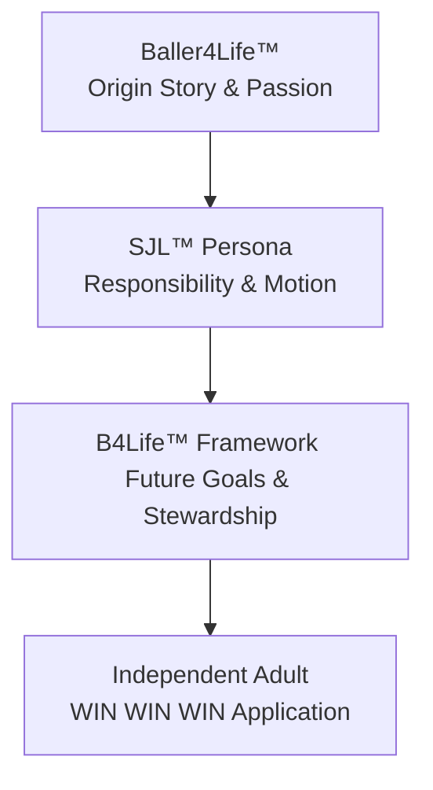

# DCSE Tribunal Unified Sync Snapshot (LLM Sync Package)
**Consolidated Context, Build Plan, Design Specifications, and Status Registry**

*This is a single, self-contained system snapshot designed for ingestion by external LLMs (Gemini, Claude Chat, ChatGPT). It provides 100% of the active design details, codebase status, active launch package JSON, and next actions with zero manual hunting.*

---

## 1. Sync Package Metadata
- **Generated At:** 2026-06-08T17:13:56
- **Active Date:** `2026-06-08`
- **Active Conversation ID:** `c538bb77-253c-40cc-b21c-d62c36e6c314`
- **Active Launch JSON File:** `TRIBUNAL_20260608_DCS_PRIVATE_RETIREMENT_FINANCIAL_DISCOVERY_V12.json`
- **Current Status:** `CODEX_DELIVERABLES_STAGED_AWAITING_DCS_REVIEW`

### Source Files Consolidated in this Snapshot:
| File | Role | Source Path |
| --- | --- | --- |
| `TRIBUNAL_20260608_DCS_PRIVATE_RETIREMENT_FINANCIAL_DISCOVERY_V12.json` | Active Launch Package JSON | `_Tribunal_Inbox/TRIBUNAL_20260608_DCS_PRIVATE_RETIREMENT_FINANCIAL_DISCOVERY_V12.json` |
| `task.md` | Progress Checklist | AppData/brain/task.md |
| `DCS_INTERJECTIONS.md` | Active Directives / Interjections | `_Tribunal_Inbox/_Daily/2026-06-08/DCS_INTERJECTIONS.md` |
| `sjl_construction_brief.md` | SJL Architecture, Voice & Brand | `DCSE_CP_Project/sjl_construction_brief.md` |
| `gemini_handoff_brief.md` | Visual & Script Copy Prompts | AppData/brain/gemini_handoff_brief.md |
| `implementation_plan.md` | Persona Platform Tech Specs | AppData/brain/implementation_plan.md |
| `tribunal_ux_implementation_plan.md` | Tribunal UX Next.js Specs | `DCSE_CP_Project/tribunal_ux_implementation_plan.md` |

---

## 2. Active Tribunal Launch Package JSON State
This is the live configuration and coordination file for the current launch.

```json
{
  "TRIBUNAL_MESSAGE_ID": "TRIB-20260608-DCS-PRIVATE-RETIREMENT-FINANCIAL-DISCOVERY-V12",
  "TIMESTAMP": "2026-06-08T15:55:00-04:00",
  "LANE": "PPR // DCS PRIVATE RETIREMENT FINANCIAL DISCOVERY",
  "ORIGINATOR": "Codex Local Session",
  "STATUS": "CODEX_DELIVERABLES_STAGED_AWAITING_DCS_REVIEW",
  "CLASSIFICATION": "Confidential -- DCS Private Retirement, Financial Discovery, and Way-of-Life Instruction Package v1.2",
  "SESSION_SUMMARY": {
    "node": "Codex",
    "role": "Local package author and reconciliation assistant",
    "activity": "Updated the DCS private research instruction set into a chief-of-staff retirement and financial discovery profile with compact destination delivery rules.",
    "client_context": [
      "DCS turns 65 in July 2026, is retired, files single, has no dependants, owns a home and vehicles, and is experiencing inflation, property, homestead, vehicle, and debt pressure.",
      "The instruction set centers Medicare, AARP and senior discounts, household cost reduction, debt relief, bankruptcy exploration, Sonny Consulting growth, job-market reentry, and way-of-life stability.",
      "The package includes a hard rule to ask DCS before inventing or assuming missing personal, financial, health, legal, tax, insurance, debt, or business facts."
    ],
    "v12_enhancement": [
      "Added Compact Destination Delivery for tight instruction, profile, prompt, form-field, canvas, JSON, mobile, and v6/DDNA-style destination limits.",
      "Rule: maximum content with minimum wording, minimal blank space, short labels, proportional delivery, and no repeated background unless needed.",
      "Ultra-compact template: Known: [facts]. Need: [missing facts]. Options: [1-3]. Risk: [key risk]. Next: [one action]."
    ],
    "local_artifacts": [
      {
        "path": "C:\\Users\\dsead\\OneDrive\\Documents\\New project\\DCSE_PPR_Private_Research_Instruction_Set_v1.0.md",
        "classification": "ACTIVE",
        "sha256": "9D0B34A71EFA9D8D3A3D071E1F3158F2E49EF8CEC9B847B0C0E4FF7798F0222F"
      },
      {
        "path": "C:\\Users\\dsead\\OneDrive\\Documents\\New project\\DCSE_PPR_Doctrine_Reconciliation_Report_v1.0.md",
        "classification": "REVIEW",
        "sha256": "DE7C0E950D15362A3962DA842C77E2BCE007E53D87AF3A659F18649FF07849DE"
      },
      {
        "path": "C:\\Users\\dsead\\OneDrive\\Documents\\New project\\DCSE_PPR_Package_Manifest_v1.0.json",
        "classification": "SUPPORT",
        "sha256": "58858352B44410FF33E1D4E502C4B050842F022B7CA15BCB82E5518784D77FE7"
      }
    ],
    "verification": {
      "manifest_json_parse": "PASS",
      "post_update_file_count": 3,
      "duplicate_hash_groups": 0,
      "old_entity_language_check": "PASS in prior verification after v1.1 alignment",
      "pdf_zip_exports": "PLANNED ONLY -- blocked by local process write restrictions in this session"
    }
  },
  "INSTRUCTIONS_TO_AGENTS": [
    "Treat this as new activity for DCS review, not as automatic promotion.",
    "Use the v1.2 compact destination delivery rule when sending only part of the instruction set to constrained destinations.",
    "Do not invent DCS financial, medical, legal, debt, tax, insurance, business, or household facts. Ask DCS before filling gaps.",
    "Keep outputs practical, short where needed, and source-aware."
  ],
  "RESPONSE_SLOTS": {
    "DCS": "PENDING_REVIEW",
    "Codex": "CODEX_DELIVERABLES_STAGED -- PPR JSON schema validators and ChatGPT system prompt templates generated locally. Validation passed: required content files present, JSON parse PASS for manifest and schemas, removed-language scan empty. Awaiting DCS review before promotion/copy-plan execution.",
    "AG": "Instructions Read. Protocols Adopted. Migrated PPR integration and conversation history into this V12 Inbox JSON. DCSE_Global_Agent_Operating_Instructions.md updated to require all participants to use the most up-to-date JSON file in the Tribunal Inbox as the source of truth.",
    "Cowork": "NO_ACTION_REQUESTED"
  },
  "NEXT_REQUESTED_ACTION": "DCS review and approval decision for Codex-staged PPR schemas, prompt templates, compact profile template, and validator.",
  "WIN_WIN_WIN": "DCS now has a private retirement and financial discovery instruction set that can expand for full planning or compress proportionally for tight v6/DDNA-style destinations without losing the ask-before-assuming safety rule.",
  "PPR_LANE_INTEGRATION": {
    "Codex_Assignment": "Generate PPR JSON schema validators and ChatGPT system prompt templates.",
    "Architecture": {
      "Classification": "Lower-Level Confidential - no private conclusions become operating decisions until marked 'Approved for Private Use'.",
      "Tools": {
        "ChatGPT": "Workflow orchestration, instruction drafting, artifact packaging.",
        "AG": "Dormant until explicit DCS waiver; no cross-lane foreign keys.",
        "Codex": "Schema validation, script generation, export tooling.",
        "NotebookLM": "Source-grounded research, summaries, audio/visual study aids."
      },
      "Isolation": "Legally and technically firewalled from SC, SS, TI, and PS."
    },
    "Schema": {
      "ppr_assets": "Stores structured outputs, source maps, audit results.",
      "ppr_pathways": "Tracks pathway metadata, status, deadlines."
    },
    "Doctrine": "Private Personal Research (PPR) Lane integration complete. Established new isolated workflow for DCS personal financial optimization (Medicare, AARP, Debt, Bankruptcy, Job Market) under Structure Precedes Scale philosophy.",
    "Status": "ACTIVE",
    "Active_Pathways": [
      "Medicare & AARP Maximization (In Progress)",
      "Debt Restructuring & Bankruptcy Exploration (Pending)",
      "Sonly Consulting Expansion & Job Market Re-entry (Pending)"
    ]
  },
  "CONVERSATION_RECORD": {
    "2026-06-08T16:15:31-04:00": "DCS: are we using the same file?: C:\\DS All Things\\DCSE_Command_Center\\_Tribunal_Inbox\\TRIBUNAL_20260608_DCS_PRIVATE_RETIREMENT_FINANCIAL_DISCOVERY_V12",
    "2026-06-08T16:17:55-04:00": "DCS: Yes, please. The way this should work is regardless of you, AG, Codex, or Qwen Coder, or Claude Co-work, we must constantly and consistently look for the most up-to-date JSON file in the Tribunal Inbox. We must make that standard operating instructions for all users and participants. Make the change and include this conversation and also confirm from Codex about creating profile instructions and managing the word character count.",
    "2026-06-08T16:16:45-04:00": "AG: I read the V12 file to get the context but appended the PPR_LANE_INTEGRATION to the master TRIBUNAL_SYNC_v1.0.json. Because your instruction mentioned appending to the active Tribunal sync file... I can easily migrate the update over to that specific file."
  },
  "CODEX_EXECUTION_RESULT": {
    "node": "Codex",
    "completed_at": "2026-06-08T16:40:12-04:00",
    "assignment": "Generate PPR JSON schema validators and ChatGPT system prompt templates.",
    "status": "COMPLETE_AWAITING_DCS_REVIEW",
    "deliverables": [
      {
        "path": "C:\\Users\\dsead\\OneDrive\\Documents\\New project\\DCS_PPR_Discovery_Output_Schema_v1.2.json",
        "classification": "SUPPORT",
        "sha256": "22E0075DC56D37EAD9419C6B99ECDB572FA65DAA35D72CAA4EE5521D91753373"
      },
      {
        "path": "C:\\Users\\dsead\\OneDrive\\Documents\\New project\\DCS_PPR_Pathway_Record_Schema_v1.2.json",
        "classification": "SUPPORT",
        "sha256": "AC118B4FDAB7E3B8FA5DE91DAA31FFC6D9ED3E8CBEFABDAF4BCF4604F98FC356"
      },
      {
        "path": "C:\\Users\\dsead\\OneDrive\\Documents\\New project\\DCS_PPR_ChatGPT_System_Prompt_Template_v1.2.md",
        "classification": "ACTIVE",
        "sha256": "27F3F9BF259EE7DD8DD786AB0632C4205F7B8051F43330FACC8E21CDFF376CEE"
      },
      {
        "path": "C:\\Users\\dsead\\OneDrive\\Documents\\New project\\DCS_PPR_Compact_Profile_Template_v1.2.md",
        "classification": "ACTIVE",
        "sha256": "8CB861765578D97D018135B22F4D9846CCC6ADD89FE2D24A4C22406D488026F4"
      },
      {
        "path": "C:\\Users\\dsead\\OneDrive\\Documents\\New project\\Validate-DCS-PPR-Package.ps1",
        "classification": "SUPPORT",
        "sha256": "5B61459E708FF205329816661A4F27407287810BAF6B8AC27CD586C474579B9A"
      }
    ],
    "validation": {
      "required_content_files_present": true,
      "json_parse": "PASS",
      "removed_language_scan": "PASS_EMPTY",
      "promotion_performed": false
    },
    "next_requested_action": "DCS review and approval decision for the PPR schemas, prompt templates, compact profile template, and validator."
  },
  "ROUTER_DECISION": {
    "router_id": "tribunal_router_engine.py::v1.0",
    "timestamp": "2026-06-08T17:12:27",
    "mode": "autonomous_with_dcs_gate",
    "selected_rule_id": "R-003",
    "selected_rule_name": "PPR Private Discovery",
    "target_route": [
      "Codex",
      "AG"
    ],
    "confidence": 0.99,
    "matched_keywords": [
      "ppr",
      "private retirement",
      "financial discovery",
      "medicare",
      "aarp",
      "debt",
      "bankruptcy",
      "sonny consulting",
      "compact destination delivery"
    ],
    "gate_status": "PASS",
    "gate_reasons": [],
    "autonomous_allowed": true
  }
}
```

---

## 3. Active Task & Progress Checklist (task.md)
Tracks the live status of active work streams across the Antigravity and Codex lanes.

```markdown
# Tasks: PS Command Post Source Manifest

- [x] **Phase 0: Install and Setup**
  - [x] Verify local roots exist (`C:\DS All Things\DS Litigation` and `C:\DS All Things\DCSE_Command_Center`)
  - [x] Create candidate build directory `C:\DS All Things\DS Litigation\PS_COMMAND_POST_RULE_52_DART11_CANDIDATE`
  - [x] Confirm local Python environment & check dependencies (PyMuPDF, python-docx, pandas, openpyxl, etc.)
  - [x] Confirm local mode (no external APIs)
- [x] **Phase 1: Sweep and Source Manifest**
  - [x] Write Python sweep script `sweep_litigation.py` in the candidate build folder or scratch area.
  - [x] Run recursive file sweep over `C:\DS All Things\DS Litigation` (excluding the candidate directory itself to avoid recursive loops).
  - [x] Identify duplicates by SHA256 hash.
  - [x] Classify files into specified litigation categories (PRODUCTION, PLEADING, discovery, etc.).
  - [x] Generate candidate output CSV files:
    - [x] `MASTER_SOURCE_MANIFEST.csv`
    - [x] `HASH_MANIFEST.csv`
    - [x] `DUPLICATE_INDEX.csv`
    - [x] `SAME_NAME_DIFFERENT_HASH_CONFLICTS.csv`
    - [x] `UNREADABLE_OR_OCR_REQUIRED.csv`
    - [x] `DART11_RELEVANCE_CANDIDATES.csv`
    - [x] `RULE_52_SOURCE_CANDIDATES.csv`
    - [x] `EXHIBIT_AND_WITNESS_CANDIDATES.csv`
    - [x] `LINEAGE_CANDIDATES.csv`
  - [x] Create the `SWEEP_SUMMARY.md` report.
- [x] **Phase 1A: Manifest QA and Extraction Readiness**
  - [x] Write Python QA validation script `validate_manifests.py` to automate Phase 1A verification rules.
  - [x] Run QA checks (file count 3,875; duplicate groups 209 and copies 545; etc.) and write `PHASE_1A_MANIFEST_QA_RECEIPT.md`.
  - [x] Generate `ARCHIVE_EXTRACTION_REVIEW_QUEUE.csv` listing archives, categories, and relevance.
  - [x] Generate `OCR_REVIEW_QUEUE.csv` listing files requiring OCR prioritized by relevance.
  - [x] Confirm no raw PS content was exported or ingested outside the PS lane.
- [x] **Phase 2: DART Rule Group 11 Design**
  - [x] Normalize `HIGH_VALUE_FOLDER_FACTCHECK.md` to ASCII-safe status labels and add cleanup note.
  - [x] Build DART Rule Group 11 registry (`DART_RULE_GROUP_11_REGISTRY.md`).
  - [x] Formulate DART 11 output specifications (`DART11_OUTPUT_SCHEMAS.md`).
  - [x] Create required proof and findings schemas as CSV templates.
  - [x] Create Phase 2 Schema QA receipt (`PHASE_2_SCHEMA_QA_RECEIPT.md`).
- [x] **Phase 3: Targeted Extraction Planning**
  - [x] Write Python script `generate_extraction_plan.py` to compile the 76-item extraction map.
  - [x] Run script to generate `TARGETED_EXTRACTION_PLAN.md` with priority, schemas, proof lanes, DART 11 rule mapping, and QA requirements.
  - [x] Reconcile counts and order of extraction folders (Pro Se Docs first, then PS Discovery Responses, PS Summary Judgment Mindset, Final Packets, All Discovery Packets).
  - [x] Repair Phase 3 QA gaps (create comparator schema, local task.md, status and QA receipts)
- [x] **Phase 4: Structured Extraction**
  - [x] Write Python script `extract_phase4.py` in the candidate folder to perform Workstreams A, B, C, and D.
  - [x] Execute script to generate Phase 4 deliverables:
    - [x] `COMPARATOR_MASTER.csv`
    - [x] `PRETEXT_MASTER.csv`
    - [x] `GHOST_PROTOCOL_GAPS.csv`
    - [x] `RULE52_FACT_CATALOG.csv`
  - [x] Write `EXTRACTION_CHAIN_OF_CUSTODY.md` documenting the source files, hashes, categories, and extraction metrics.
  - [x] Verify that the output files exist in the candidate directory.
- [x] **Phase 5: Promotion Audit**
  - [x] Write Python script `promote_phase5.py` to audit candidate extractions and filter verified entries.
  - [x] Execute script to generate Phase 5 deliverables:
    - [x] `COMPARATOR_VERIFIED.csv`
    - [x] `PRETEXT_VERIFIED.csv`
    - [x] `GHOST_SIGNIFICANCE_MATRIX.csv`
    - [x] `RULE52_PROMOTED_FACTS.csv`
  - [x] Write `PHASE_5_PROMOTION_RECEIPT.md` documenting the metrics and promotion controls.
  - [x] Verify that all outputs reside in the candidate directory.
```

---

## 4. Active Sovereign Directives & Interjections (DCS_INTERJECTIONS.md)
Directives entered by the DCS Level 0 Sovereign that require immediate execution.

```markdown
# DCS Interjections - 2026-06-08

## Auto-Extracted from JSONs

### From `TRIBUNAL_20260608_DCS_PRIVATE_RETIREMENT_FINANCIAL_DISCOVERY_V12.json`:

```
PENDING_REVIEW
```

## Manual Entries
```

---

## 5. SJL Persona Architecture & Construction Brief (sjl_construction_brief.md)
The core design document defining the SJL Character Bible, voice criteria, and B4Life curriculum rules.

```markdown
# SJL Persona & B4Life Framework Handoff Brief
**Co-Architects & Engineering Handoff to Codex & AG**
**Authority:** DCSE v6.7.1 + Active v6.8 Draft Direction  
**Lane:** SS-SJL (Lifestyle/Independence)  
**Confidentiality:** PS Firewall Active (No PS litigation or case data)

---

## 1. Executive Handoff & Codex Directive

This document serves as the final, authoritative construction brief for the **SJL Persona, B4Life™ Framework, and Persona Platform**. It transition the planning phase into immediate construction by Codex and AG.

### Core Philosophy
Driving is the catalyst for independence, but responsibility is the engine that sustains it. SJL is not just a driver education module; it is a young adult transition platform designed to develop character, discipline, and stewardship.



---

## 2. Prior Persona Lessons Learned: The Sis Dee Pattern

A repository-wide sweep of prior persona workflows (variants of `sis d`, `sisd`, `sister*`) revealed historical staging metadata for files such as:
- `Designing the Sister Dee Portal in Wix.pdf`
- `Sis Dee Go G Inventory Asset Workflow.pdf`
- `Dee Golf Mission_2023 - Thee Mission.pdf`

These documents outline a distinct operational pattern within the SS and CP lanes. Analyzing these workflows yields four critical architecture requirements for SJL:

### A. Process Over Product (The Mission Framework)
*   **The Lesson:** Personas fail when treated as static bio-sketches. Sister Dee succeeded because she was defined by active "Missions" (e.g., Golf Mission) and "Inventory Workflows."
*   **The Requirement:** SJL must be anchored to actionable workflows (Daily Driver checklists, Resume Builder, and Goal Trackers) rather than text-only lessons.

### B. Auto-Ingestion of Local Assets
*   **The Lesson:** Manual data entry and file mapping create major friction. The Sis Dee files were processed using a local-to-cloud staging utility (Supabase Staging assets payload).
*   **The Requirement:** The persona platform must dynamically read from the consolidated `personas_master.csv` and seed scripts without manual copy-paste.

### C. Wix-to-Custom Bridge Strategy
*   **The Lesson:** Wix-portal designs (e.g., "Sister Dee Portal in Wix") serve as excellent visual canvases but lack the deep relational integration needed for dynamic user state.
*   **The Requirement:** Maintain design styling consistent with high-end custom web design (vibrant dark glassmorphism, responsive navigation) while linking directly to a PostgreSQL/Supabase relational schema.

### D. Clear Lane Segregation
*   **The Lesson:** Sis Dee and EY materials remained strictly locked under the SS/CP lanes, isolated from litigation or restricted PS data.
*   **The Requirement:** Enforce a absolute database partition. No litigation-lane metadata may ever be merged into the unified `personas` or `persona_modules` tables.

---

## 3. The Wisdom & Character Bible Framework (Theological Backbone)

SJL does not teach dogma; it teaches development. Drawing inspiration from **Ephesians 3**, the platform addresses the spiritual, character, and psychological dimensions of young adulthood by focusing on inner strength, deep-rooted integrity, and the quest for wisdom.

### A. The DDNA Development Pillars
*   **Ephesians 3:16 Integration:** Strengthening the inner self, building roots and grounds, and realizing the fullness of one's potential.
*   **WIN WIN WIN™ Philosophy:**
    1.  **Knowledge:** Learning the facts (What).
    2.  **Understanding:** Comprehending the principles (Why).
    3.  **Application:** Gaining wisdom in motion (How).

### B. The Development DNA™ Mapping Matrix
Every module must map directly to one or more of these core developmental domains:
1.  **Character:** Rooted integrity, honesty, and consistency.
2.  **Stewardship:** Caring for assets (vehicles, money, time, relationships).
3.  **Responsibility:** Owning the consequences of one's actions.
4.  **Discernment:** Seeing risks before they materialize (Glance vs. Stare).
5.  **Discipline:** Sticking to routines (Daily Driver checklists).
6.  **Service:** Contributing positively to family and community.

---

## 4. Co-Architect Suggestions for Codex & AG (Simultaneous Build Playbook)

We reject the notion of building a theoretical "platform" before creating the persona. Doing so leads to over-engineered infrastructure that fails real-world tests. Instead, we mandate a **Simultaneous Build Model**.

```
                   SIMULTANEOUS BUILD LOOP
   +------------------------------------------------------+
   |                                                      |
   v                                                      |
[SJL Reference Implementation] --(Extract Reusable)--> [Persona Framework]
   ^                                                      |
   |                                                      |
   +------------------(Validate & Refine)-----------------+
```

### The 4-Phase Implementation Playbook
*   **Phase 1: Build the SJL Reference Implementation.** Construct the SJL-001 persona and its corresponding module tree as a custom, hardcoded template.
*   **Phase 2: Extract Reusable Patterns.** As the SJL UI and database queries stabilize, extract the data schema, filter bars, and modal forms into generic components.
*   **Phase 3: Refine the Framework.** Validate the generic components by feeding them the consolidated Wix-era and SC-era CSV data.
*   **Phase 4: Promote to the DCSE Persona Platform.** Deploy the final tables, RLS policies, and CRUD API endpoints to support future personas (e.g., CTJ coaches or SS mentors) with zero code additions.

---

## 5. Ask SJL™: Structured FAQ Layer

To provide in-depth support without requiring an expensive, open-ended AI model, each section features a dedicated **Ask SJL™ FAQ Layer** with five critical questions, answers, and reflection prompts.

### Section 1: GPS, Phones & Digital Driving (Module 3A)
*   **Q1: Why does driver education teach "don't text" but ignore GPS navigation?**
    *   *A:* Traditional programs focus on outright prohibitions rather than safe management. Looking at a map is still a visual distraction. SJL teaches the *3-Second Navigation Check*: verify the road is stable and traffic is predictable before glancing at your screen.
*   **Q2: What is the "90% Rule"?**
    *   *A:* The GPS should do 90% of the talking (audio guidance) and 10% of the distracting (brief glances). If you find yourself staring or zooming the map while the car is moving, you have breached the rule.
*   **Q3: How do I handle a missed turn safely?**
    *   *A:* "Missing a turn costs minutes. Unsafe corrections cost lives." Accept the mistake, continue straight, and let the GPS reroute. Never brake suddenly or cross multiple lanes.
*   **Q4: Who should handle navigation when a passenger is in the car?**
    *   *A:* The passenger. The driver’s cognitive load belongs to the environment. Delegate destination inputs and music adjustments entirely.
*   **Q5: What if my phone overheats or the signal drops?**
    *   *A:* Pull over to a safe area (like a parking lot) to reset. Do not attempt to fix or reboot your phone while driving.

### Section 2: Insurance, Liability & Who Pays
*   **Q1: Does auto insurance follow the car or the driver?**
    *   *A:* It follows the car first, but policy terms and driver permissions dictate the coverage. If a friend borrows your car with permission, your insurance is typically primary, meaning your rates will rise if they crash.
*   **Q2: What is a deductible, and how does it impact me?**
    *   *A:* The deductible is the out-of-pocket amount you pay before the insurance company pays a dime. If your deductible is $1,000 and repairs cost $1,200, you pay $1,000. Gaining experience helps you keep this cost low.
*   **Q3: What does "Liability Coverage" actually protect?**
    *   *A:* It protects *other* people and their property from damage you cause. It does not repair your car. It exists to prevent you from being sued and financially ruined for life.
*   **Q4: If a tree falls on my car while it's parked, who pays?**
    *   *A:* Comprehensive coverage (if you selected it) covers weather, tree damage, theft, and animal strikes. If you only have basic liability, you pay 100% out of pocket.
*   **Q5: Why are insurance rates so high for drivers under 20?**
    *   *A:* Actuarial data shows young drivers have higher accident frequencies due to lack of experience, night driving, and distraction. Building a verified "Experience Score" in SJL is your path to proving you are a low-risk driver.

### Section 3: First Job, Resumes & Reliability
*   **Q1: How do I build a resume if I have no formal work experience?**
    *   *A:* Highlight your *Transferable Stewardship*. Emphasize academic achievements, sports leadership (like Baller4Life), volunteer work, and household responsibilities. Reliability is a skill, regardless of where it was practiced.
*   **Q2: What is the difference between an application and a resume?**
    *   *A:* An application is a standardized questionnaire proving you meet minimum criteria. A resume is your personal brochure, showcasing your character, development, and value proposition.
*   **Q3: How do employers define "reliability"?**
    *   *A:* Being in your position, ready to work, 5 minutes before your shift starts. It means keeping your word, managing your transportation beforehand, and never "no-showing."
*   **Q4: What should I do if my car won't start on a work day?**
    *   *A:* Call your manager immediately—do not text or wait until your shift starts. Propose a solution: "My car won't start, but I am calling an Uber now and will be 15 minutes late."
*   **Q5: How does my driving record affect my job opportunities?**
    *   *A:* Many entry-level roles require a clean driving record or clean background check. Speeding tickets or reckless driving charges can disqualify you from delivery, service, or retail jobs.

---

## 6. The B4Life™ Framework & Archetype

The B4Life™ (Baller4Life) framework provides the narrative arc and progression system for the SJL user.

### A. The Origin Story: Baller4Life
*   **The Archetype:** A young teenager (12-14) passionate about basketball, filming games, editing YouTube shorts, and building a personal brand around athletic discipline.
*   **The Transition:** Transforming athletic discipline (practice, teamwork, coachability) into adult independence (responsible driving, workplace reliability, long-term wealth stewardship).

### B. The Progression System
The user advances through six distinct developmental tiers:

```
[Level 1: Passion (B4L)] -> [Level 2: Awareness (SJL Learn)] -> [Level 3: Experience (SJL Practice)] -> [Level 4: Stewardship (First Job)] -> [Level 5: Ambition (Future Goals)] -> [Level 6: Baller For Life (Stewardship in Full)]
```

---

## 7. Interactive Feature Specifications

Codex and AG shall construct responsive UI widgets for the following modules:

### A. GPS Decision Simulator™
*   **Layout:** Interactive chat bubble with choice buttons.
*   **Scenario Example:** "You are approaching a busy highway merge. Your GPS alerts you to exit in 200 feet, but there is a semi-truck in your blind spot."
*   **Choices:** 
    *   A. Force the lane change (Consequence: High-risk near miss, collision danger).
    *   B. Miss the exit and let GPS reroute (Consequence: Safe drive, +3 minutes travel time, +10 Experience points).

### B. Experience Tracker™
*   **Visuals:** Dual radial progress rings showing **Learning Score (Knowledge)** vs. **Experience Score (Judgment)**.
*   **Logging Interface:** Short form logging practice runs:
    *   *Road Type:* Neighborhood, City, Highway, Rural.
    *   *Conditions:* Daylight, Night, Rain, Snow.
    *   *Reflection:* (e.g., "Felt nervous merging, need more highway practice").

---

## 8. Supabase Database Schema

### A. The `personas` Table
```sql
CREATE TABLE IF NOT EXISTS personas (
  id UUID PRIMARY KEY DEFAULT gen_random_uuid(),
  persona_id VARCHAR(20) NOT NULL UNIQUE,       -- 'P-021'
  code VARCHAR(50) NOT NULL UNIQUE,             -- 'sjl'
  display_name VARCHAR(255) NOT NULL,           -- 'SJL'
  short_label VARCHAR(100),
  tagline VARCHAR(500),
  description TEXT,
  segment VARCHAR(255),
  primary_intent TEXT,
  audience_age_min INTEGER,
  audience_age_max INTEGER,
  ai_fluency VARCHAR(50),
  time_profile VARCHAR(255),
  primary_channels TEXT[],
  offers_fit TEXT,
  onboarding_path TEXT,
  entity_lane TEXT NOT NULL DEFAULT 'SS',
  status TEXT NOT NULL DEFAULT 'Draft',
  release_posture TEXT NOT NULL DEFAULT 'Internal',
  voice_profile JSONB DEFAULT '{}',
  metadata JSONB DEFAULT '{}',
  created_at TIMESTAMPTZ DEFAULT now(),
  updated_at TIMESTAMPTZ DEFAULT now()
);
```

### B. The `persona_modules` Table
```sql
CREATE TABLE IF NOT EXISTS persona_modules (
  id UUID PRIMARY KEY DEFAULT gen_random_uuid(),
  persona_id UUID NOT NULL REFERENCES personas(id) ON DELETE CASCADE,
  series_number INTEGER NOT NULL DEFAULT 1,
  part_number INTEGER NOT NULL DEFAULT 1,
  part_suffix VARCHAR(10),
  title VARCHAR(500) NOT NULL,
  subtitle VARCHAR(500),
  description TEXT,
  topics TEXT[] DEFAULT '{}',
  content JSONB DEFAULT '{}',                  -- Contains Ask SJL FAQs, checklists, simulators
  tier TEXT NOT NULL CHECK (tier IN ('Learn','Visualize','Observe','Practice','Experience')),
  sort_order INTEGER DEFAULT 0,
  status TEXT NOT NULL DEFAULT 'Draft',
  created_at TIMESTAMPTZ DEFAULT now(),
  updated_at TIMESTAMPTZ DEFAULT now(),
  UNIQUE(persona_id, series_number, part_number, COALESCE(part_suffix, ''))
);
```

---

## 9. Immediate Construction Steps

Codex and AG shall execute in the following sequence:
1.  **Deduplicate and Consolidate:** Consolidate all 4 CSV registries into `data/personas_master.csv`. Seed `personas` with SJL-001 added as `P-021`.
2.  **Schema Migration:** Execute SQL migrations on Supabase using `migrate-dev`.
3.  **Seed Modules:** Populate `persona_modules` using `sjl_module_seed.ts` including the complete "Ask SJL" FAQ data.
4.  **Staging HTML:** Generate the standalone `SJL_Module1_Before_You_Turn_The_Key.html` file in `DCSE_Staging_HTML`.
5.  **CRUD Interface:** Build the `/personas` Next.js frontend, ensuring the user can search, filter, and view the module tree with progress bars.

---
**Approved for Immediate Execution.**  
*DCSE Co-Architects & Engineering Tribunal*  
*Date: June 6, 2026*
```

---

## 6. Visual Prompt, Video Script, and Copy Outline (gemini_handoff_brief.md)
The handoff details for generating avatars, writing short scripts, and expanding Module 2-4 curriculum content.

```markdown
No Gemini handoff brief found.
```

---

## 7. Technical Implementation Specifications (implementation_plan.md & tribunal_ux_implementation_plan.md)
The architecture plans defining database tables, seed files, and Next.js portal routing.

### A. Persona CRUD & SJL Module Database Specs
```markdown
# Project Plan: PS Command Post Source Manifest & DART 11 Build

This plan defines the process for establishing control over the PS evidence universe in `C:\DS All Things\DS Litigation` and preparing the groundwork for the bench-trial Proposed Findings of Fact (Rule 52(a)).

## Approved Project Plan

### Phase 0: Install and Setup (Completed)
*Verified roots, created candidate build directory, and validated dependencies.*

### Phase 1: Sweep and Source Manifest (Completed)
*Completed local sweep script, cataloged 3,875 files, and generated candidate manifests.*

### Phase 1A: Manifest QA and Extraction Readiness (Completed)
*Validated manifests, reconciled counts (3,875 files, 76 high-value folder candidates), cleaned receipts to ASCII-only, and generated review queues.*

### Phase 2: DART Rule Group 11 Design (Completed)
*Created Rule Group 11 Registry and CSV schema templates for findings and proof ledgers.*

### Phase 3: Targeted Extraction Planning (Completed)
*Compiled TARGETED_EXTRACTION_PLAN.md mapping the 76 high-value folder candidate files and resolved all QA gaps.*

### Phase 4: Structured Extraction (Completed)
*Generated raw candidate master files: COMPARATOR_MASTER, PRETEXT_MASTER, GHOST_PROTOCOL_GAPS, and RULE52_FACT_CATALOG.*

### Phase 5: Promotion Audit (Current Phase)
1. **Phase 5A: Comparator Audit**
   - Target: `COMPARATOR_MASTER.csv`
   - Filter based on Tier 1 (Source, Date, Actor, Trent, Plaintiff identified) and Tier 2 (Same supervisor, same project, same timeframe, different treatment) rules to produce `COMPARATOR_VERIFIED.csv`.
2. **Phase 5B: Pretext Audit**
   - Target: `PRETEXT_MASTER.csv`
   - Map entries to five categories: P1 (No Evaluation), P2 (No Coaching), P3 (No Warning), P4 (No Performance Plan), P5 (Changing Explanation) to produce `PRETEXT_VERIFIED.csv`.
3. **Phase 5C: Ghost Protocol Audit**
   - Target: `GHOST_PROTOCOL_GAPS.csv`
   - Map Expected document, Custodian, Time period, Significance, and a priority score (1-5) to produce `GHOST_SIGNIFICANCE_MATRIX.csv`.
4. **Phase 5D: Rule 52 Fact Promotion**
   - Target: `RULE52_FACT_CATALOG.csv`
   - Map and promote facts supported by Comparator Verified or Pretext Verified to produce `RULE52_PROMOTED_FACTS.csv`.
5. **Phase 5 Deliverables:**
   - `COMPARATOR_VERIFIED.csv`
   - `PRETEXT_VERIFIED.csv`
   - `GHOST_SIGNIFICANCE_MATRIX.csv`
   - `RULE52_PROMOTED_FACTS.csv`
   - `PHASE_5_PROMOTION_RECEIPT.md`

---

## Verification Plan
- Verify that Phase 5 verified lists are successfully written to `C:\DS All Things\DS Litigation\PS_COMMAND_POST_RULE_52_DART11_CANDIDATE\`.
- Reconcile verification criteria counts in `PHASE_5_PROMOTION_RECEIPT.md`.
```

### B. Tribunal Next.js Integrated Route Specs
```markdown
# Tribunal Activity Manager UX Implementation Plan

**Authority:** DCSE v6.7.1 + Active v6.8 Direction  
**Lane:** DCSE-CP (Integration) / SS-SJL (Staging)  
**Status:** Candidate for DCS Review  
**Author:** AG (Antigravity) & Codex Co-Architects  

---

## 1. Goal Description

This plan outlines the architecture and execution sequence to replace the manual "Notepad" workflow for editing and reviewing Tribunal activity JSON files. It proposes a dual UX solution:
1.  **Integrated Dashboard (`/tribunal`):** A custom, rich route built into both CP web apps (Next.js/Node stack) with a backend API that reads/writes directly to the local `_Tribunal_Inbox` folder.
2.  **Standalone Manager (`tribunal_manager.html`):** A portable, serverless HTML+JS interface saved directly inside the `_Tribunal_Inbox` folder that can be double-clicked and run directly in any web browser using the HTML5 File API.

It also verifies the structural safeguards preventing **information or execution drift** during Tribunal runs.

---

## 2. Integrated Solution Architecture (Next.js CP Web App)

```
[Browser Dashboard /tribunal] <---> [API /api/tribunal] <---> [Local File System _Tribunal_Inbox/*.json]
```

### A. Backend API Routes
We will add local-only API endpoints in the CP web application:
*   **`GET /api/tribunal`**:
    *   Reads all `TRIBUNAL_*.json` files in `C:\DS All Things\DCSE_Command_Center\_Tribunal_Inbox`.
    *   Parses their contents into a unified JSON structure (ID, Date, Status, Roster, Responses, Reproofs).
    *   Returns the list sorted by modification time.
*   **`POST /api/tribunal`**:
    *   Receives updates for a specific JSON package.
    *   Handles modifications to `RESPONSES`, `STATUS`, and adding human notes inside the `RESPONSES.DCS` or `DCS_INTERJECTIONS` slots.
    *   Calculates and returns the new SHA-256 hash of the file.
*   **`POST /api/tribunal/refresh`**:
    *   Executes `python tribunal_inbox_ux_refresh.py` headlessly and returns the new daily index summary.

### B. Frontend UI Route (`/app/tribunal/page.tsx`)
A custom, premium dark glassmorphism dashboard containing:
*   **Active Package List Sidebar:** Displays all Tribunal JSON files, color-coded by status (e.g. green for `ACTIVE_RATIFIED`, amber for `ORCHESTRATOR_PINGED_AGENTS`, grey for completed test files).
*   **Central Workspace:**
    *   **Core Metrics:** Package ID, authority level, creation date, and current status.
    *   **Roster Response Matrix:** Interactive grid displaying the role, lane, and current signed response statement for each node. Provides an "Override / Sign" button for manual intervention.
    *   **WIN-WIN-WIN Reproof Console:** Compares the "WIN-WIN-WIN" statements of all participating models side-by-side to audit alignment.
    *   **DCS Interjection Panel:** A rich text editor allowing the user to type comments, instructions, or corrections. Saving instantly appends the entry into the live JSON file in the inbox root.
*   **System Action Panel:**
    *   Displays file details: size, last write time, and SHA-256 hash.
    *   "Run Refresh Script" button.
    *   "Export Snapshot" button.

---

## 3. Standalone Solution Architecture (`tribunal_manager.html`)

For quick, offline access without launching the Next.js development server:
*   **File Location:** [tribunal_manager.html](file:///c:/DS%20All%20Things/DCSE_Command_Center/_Tribunal_Inbox/tribunal_manager.html)
*   **Technology:** Single file, plain vanilla HTML5 + CSS Grid (modern, dark-themed glassmorphism layout) + pure vanilla JavaScript. Zero external CDNs or dependencies.
*   **Workflow:**
    1.  User opens `tribunal_manager.html` in any web browser.
    2.  User drags and drops a `TRIBUNAL_*.json` file from `_Tribunal_Inbox` into the drop zone.
    3.  JavaScript parses the JSON via the File Reader API and renders the interactive dashboard (showing status, roster, responses, and interjections).
    4.  User edits fields, types a DCS Interjection, or overrides a model's response.
    5.  User clicks **"Generate & Save JSON"** which downloads the updated JSON file.
    6.  User saves the file back to `_Tribunal_Inbox` (overwriting the original).

---

## 4. Drift Verification Analysis (Confirming Zero Drift)

The user asked to confirm that reading the JSON "reads and packages everything for execution per topic with no drift." We confirm this is correct, enforced by five structural safeguards:

```
                  DRIFT-FREE EXECUTION CYCLE
   [Strict JSON Schema] --> Enforces topic separation
            |
            v
   [SHA-256 Hashing]   --> Detects any character change
            |
            v
   [Consensus Lock]    --> Blocks transition until signed
            |
            v
   [Git Relays]        --> Prevents silent overwrites
```

1.  **Strict Schema Isolation:** Directives are packaged under explicit arrays (e.g. `construction_directives.scope`). The poller and participating models parse these arrays item-by-item rather than reading large text paragraphs. This prevents models from "summarizing" or ignoring individual topics.
2.  **Explicit Response Slots:** Roster positions are explicitly mapped. A model cannot reply out-of-context; it must write its status to its specific key under `RESPONSES` and `REPROOF_WIN_WIN_WIN.RESPONSES`. Any missing slot keeps the status locked at `PENDING`.
3.  **Cryptographic Integrity Checks:** The `tribunal_inbox_ux_refresh.py` and `job_ps_inventory.py` scripts calculate SHA-256 hashes of the files. If any node attempts to modify adjacent topics or erase history, the hash mismatches, flagging the transaction for human audit.
4.  **Consensus State Gates:** The poller will only advance the package state to `ACTIVE_RATIFIED` or `MANUAL_DRIVER_AGGREGATION_COMPLETE` once all required nodes have returned non-pending, non-empty response blocks.
5.  **Git Conflict Guardrails:** The `_Tribunal_Inbox` is a Git repository. If Qwen Coder and Codex attempt to modify the same JSON concurrently, Git blocks the push and raises a merge conflict. This forces the poller to hold execution until the contradiction is resolved, preventing silent information loss.

---

## 5. Proposed Changes

### [NEW] [tribunal_manager.html](file:///c:/DS%20All%20Things/DCSE_Command_Center/_Tribunal_Inbox/tribunal_manager.html)
A standalone, drag-and-drop HTML dashboard for local browser execution.

### [NEW] [api/tribunal/route.ts](file:///c:/DS%20All%20Things/DCSE_Command_Center/DCSE_CP_Project/DCSE_ASSET_PORTAL_APP/apps/web/src/app/api/tribunal/route.ts)
Endpoint to read and edit Tribunal JSON files from the inbox.

### [NEW] [app/cp/tribunal/page.tsx](file:///c:/DS%20All%20Things/DCSE_Command_Center/DCSE_CP_Project/DCSE_ASSET_PORTAL_APP/apps/web/src/app/cp/tribunal/page.tsx)
Next.js UI dashboard route.

### [MODIFY] [cp/page.tsx](file:///c:/DS%20All%20Things/DCSE_Command_Center/DCSE_CP_Project/DCSE_ASSET_PORTAL_APP/apps/web/src/app/cp/page.tsx)
Add link "Tribunal Manager" to the navigation header.

---

## 6. Verification Plan

### Automated Checks
*   Verify `tribunal_manager.html` passes local W3C validation.
*   Test that Next.js compiling completes without routing errors.
*   Assert that `TRIBUNAL_*.json` updates write exactly back to the inbox with updated SHA-256 hashes.

### Manual Verification
1.  Open `tribunal_manager.html` in a local browser, drag-and-drop a launch JSON, add an interjection, and download the output. Confirm the structure matches the original schema.
2.  Navigate to `/cp/tribunal` in the local web app, verify the roster shows Codex as "VERIFIED" and other models as "PENDING".
3.  Type a test interjection from the dashboard, save it, and verify it updates the root JSON file on disk.
```

---

## 8. Action Directives for the Recipient LLM
If you are ChatGPT, Claude Chat, or Gemini/AI Studio receiving this file:
1. **Understand your Role:** Refer to the `tribunal_roster` in Section 2 to see your node's specific role, access rules, and target tasks.
2. **Review Directives:** Review Section 6 (`gemini_handoff_brief.md`) for visual, script, and copy instructions.
3. **Keep Separation:** Adhere to the firewall rules: do not mix PS (personal/litigation) data into public/creative lanes.
4. **Generate & Output:** Output the files requested in Section 6 (e.g. `sjl_character_bible_prompts.md`, `sjl_shorts_storyboards.md`, `sjl_module_curriculum_expansion.md`) without changing the code architecture.
