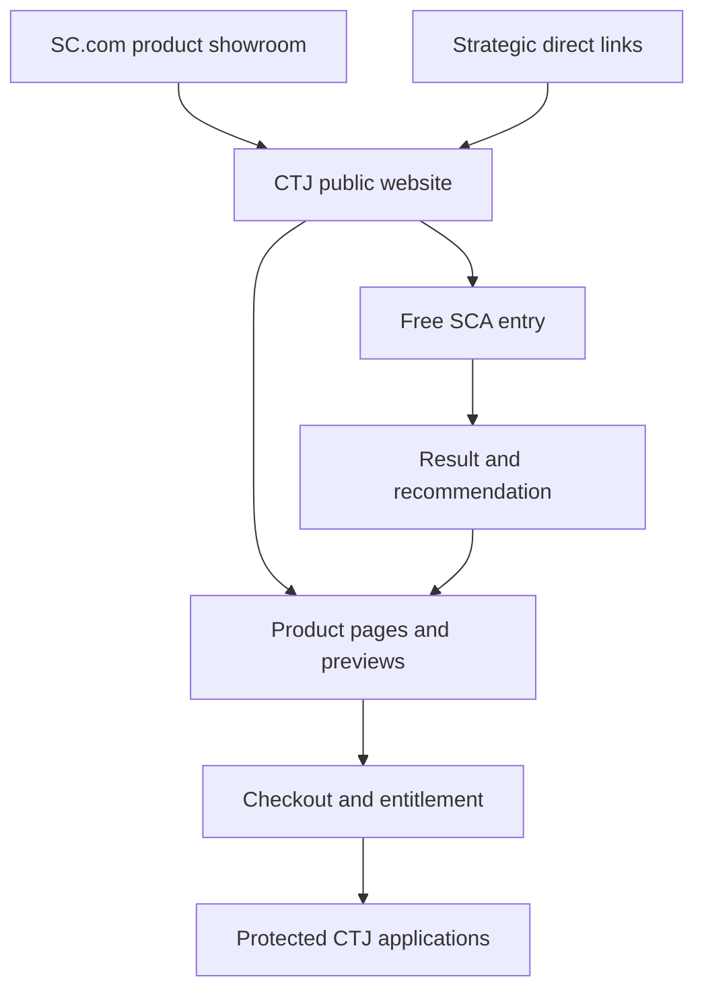

# The Critical Thinker's Journey: A Unified Path
## Governed Build Process v1.4

**Task ID:** SC-CTJ-UNIFIED-BUILD-20260923-01  
**Lane / Entity:** Sonly Consulting / CTJ product family  
**Product:** The Critical Thinker's Journey: A Unified Path  
**Destination:** Premium browser application and governed customer package  
**Status:** BUILD PROCESS APPROVED FOR EXECUTION; SCA reconciliation, exact Sonly Consulting attribution, and September 17 Stripe payment evidence incorporated; canonical mainline promotion pending  
**Governance baseline:** DCSE v7.3 operative baseline verified in `sonlyconsulting-ctrl/DCSE-Command-Post`  
**Synchronization state:** SAVED TO GOVERNED GITHUB REVIEW BRANCH; canonical mainline promotion pending  
**Handoff ID:** SC-CTJ-UNIFIED-BUILD-20260923-01-H01

## 1. Build decision

Build Unified as the premium, integrated CTJ application. Preserve its current executive-strength opening, make minimal changes to approved teaching, repair weak examples and flow breaks, and add the AI companion as a bounded capability rather than replacing the CTJ method.

"Capstone" describes Unified's internal portfolio role. It is not the required public name, an academic final exam, or a prerequisite model. Unified must stand on its own while providing deeper integration for customers who also own Parts 1 through 3.

## 2. Locked product decisions

1. **Public identity:** The Critical Thinker's Journey: A Unified Path.
2. **Portfolio role:** Integrated flagship and continuing practice environment.
3. **Standalone use:** Parts 1 through 3 are not prerequisites.
4. **Content policy:** Preserve approved material by default. Use Retain, Reposition, Condense, Repair, or Remove dispositions. Removal requires evidence and approval.
5. **Opening:** Retain the project or situation intake, known facts, missing facts, and assumptions.
6. **Continuing use:** Add CTJ Exchange and a repeatable Daily Thought Exercise.
7. **Perspective lens:** Traditional, Modern, and Tomorrow, presented as Then, Now, and Next when plain language is preferable.
8. **Clarity feature:** Add an optional Plain-Language Test or Teach It Back control. Do not label the customer experience "Explain it to a 10-year-old."
9. **AI role:** AI may personalize context, sequence prompts, explore scenarios, and synthesize options. It may not rewrite CTJ doctrine, make decisions for the user, or fabricate evidence.
10. **Technical posture:** Reusable family shell first; Unified-specific application second; bounded Part profiles later.
11. **Hosting posture:** Local and branch validation first. Vercel plus Supabase remains the accepted primary application direction. No deployment is authorized by this process document.
12. **Change posture:** No wholesale redesign, content purge, or automatic migration from the compiled customer ZIP.
13. **Experience posture:** Cinematic entry, calm reasoning workspace, visible progress, and deliberate transitions. The working environment must not resemble a generic chatbot, survey, or static workbook.
14. **Brand assets:** CTJ family identity and Unified product artwork are controlled build inputs. They must be included in the prototype and the Claude Design handoff package.
15. **Design finalization:** Claude Design may refine layout, hierarchy, motion, component treatment, and responsive behavior after a governed prototype exists. It may not redefine product logic, approved content, scoring, identity, or entitlement rules.
16. **Website relationship:** SC.com remains the parent Sonly Consulting showroom. CTJ receives a secondary branded website linked from SC.com and suitable for direct strategic distribution.
17. **Showcase model:** The CTJ website must be able to showcase the complete family, each product, and a bounded interactive preview without exposing paid content or confusing preview mode with the owned product.
18. **URL lifecycle:** Public route names and canonical-link rules are locked before implementation. Preview URLs are created during controlled testing. Custom-domain activation and redirects occur only at the release gate.
19. **Media posture:** Video is planned with the page and product experience, produced through the governed enterprise media workflow where it adds value, and delivered to Claude Design through an exact media manifest.
20. **Global chrome:** Public-site, protected-application, checkout-return, and customer-support surfaces use related but purpose-specific header and footer contracts.
21. **Attribution:** The exact public attribution is **Powered by Sonly Consulting**.
22. **SCA boundary:** The 31-question SCA uses deterministic questions, scoring, and official results. AI is optional after results and may not alter the official assessment outcome.

## 3. Preflight validation

### Verified from supplied artifacts

- The supplied Unified HTML contains a functioning 31-question SCA interface and weighted scoring code.
- The same HTML contains explicit placeholder comments where substantial Part 1, Part 2, and Part 3 content "would continue." It is not a complete canonical curriculum source.
- The customer ZIP contains a compiled application, guides, images, and customer-facing files. It is release evidence, not dependable authoring source.
- The current SCA calculation applies multipliers of 1.0, 1.2, and 1.5 to already normalized pillar percentages and caps values at 100. This scoring model remains blocked pending rule approval.
- Existing technical assets include local persistence, export behavior, accessibility work, and the SCA interface. These are preservation candidates, not automatic carryovers.

### Reported canonical sources requiring retrieval

- **SCA:** `sonlyconsulting-ctrl/CTJ-MVP-11252025`, canonical 31-question implementation and approved modernization branch.
- **Curriculum:** `sonlyconsulting-ctrl/SS-CTJ-Full`, verified 30-day curriculum baseline at commit `b620db24d64fef66e6229e24ef71efc51508c208`.
- **Governance:** `sonlyconsulting-ctrl/DCSE-Command-Post`, operative v7.3 controller and CTJ decision records.

No source is promoted merely because it appears in a ZIP, a deployed build, an AI-generated report, or a prior review.

### Commerce evidence reconciliation, September 24, 2026

The earlier Stripe test is preserved as verified payment-rail evidence rather than reset to untested.

**Verified**

- On September 17, 2026, live coupon `SCTEST1` reduced the $125 Sonly Consulting Payment Link transaction by $124, producing a $1 customer payment.
- Stripe recorded the Cash App Pay payment as succeeded at 11:56 PM on September 17, 2026.
- Stripe issued a $1 receipt for the Sonly Consulting purchase.
- The working Payment Link was `https://buy.stripe.com/9B628r9G83uS16c3BE1ck00`.
- A checkout return page existed at `https://ctj-unified-review-20260912.netlify.app/success` and accepted the Stripe Checkout Session reference.
- A `checkout.session.completed` webhook route had been enabled in the earlier implementation.

**Not yet verified as an integrated Unified customer journey**

- server-side reconciliation of the returned Checkout Session to a durable customer entitlement;
- automatic delivery of the approved customer package;
- secure return access for the purchasing customer without requiring an SC account at checkout;
- access recovery, failed-payment recovery, refund handling, and support escalation;
- execution of the same purchase-to-access sequence against the current Unified build and current approved package.

**Governing interpretation**

Payment initiation, Cash App Pay completion, and receipt delivery have passed once. Phase 6 must reuse that validated non-Wix Stripe path. It must not represent payment itself as never tested. The remaining release gate is the integrated chain from current product selection through payment reconciliation, entitlement, approved delivery, first use, and returning-customer access.

## 4. Target customer experience

Unified will support two valid entrances.

### Entrance A: I have something to think through

1. Situation or project
2. Known facts
3. Missing facts
4. Assumptions and interpretations
5. Then, Now, and Next perspectives
6. Options and tradeoffs
7. Next sound action
8. Return point and review trigger

### Entrance B: I want to exercise my thinking

1. CTJ Exchange offers a relevant thought exercise.
2. The user selects a context or accepts a surprise scenario.
3. The system asks before it explains.
4. Follow-up difficulty adapts to demonstrated reasoning.
5. The exercise ends with transfer to a different context or a practical observation.
6. The user may save a reflection, schedule a return point, or leave without manufacturing an action item.

The product promotes healthy mental activity and better reasoning. It does not promise therapy, intelligence gains, guaranteed outcomes, or automated life decisions.

## 5. Unified flow architecture

| Stage | Purpose | Required output |
| --- | --- | --- |
| Orientation | Explain the experience and let the user choose an entrance | Path selection |
| Decision Brief | Capture the situation without forcing premature conclusions | Situation statement |
| Evidence Table | Separate known, believed, inferred, and missing information | Evidence map |
| Perspective Shift | Apply Then, Now, and Next | Three-perspective comparison |
| CTJ Examination | Apply relevant CTJ concepts from Parts 1 through 3 | Reasoning record |
| Option Field | Explore alternatives, counterviews, risks, and tradeoffs | Option set |
| Path Forward | Select a next move or a deliberate pause | Action or observation plan |
| Return Point | Define what new evidence or time should trigger review | Review condition |
| Continuing Practice | Enter CTJ Exchange, Daily Thought Exercise, or Scenario Lab | Repeatable practice |

## 5A. UI/UX experience architecture

### Experience thesis

Unified should feel like entering a private strategic chamber and then working at a clear, modern reasoning desk. The opening may be cinematic, but the work surface must become quiet, legible, and focused. Gold and illumination indicate meaning, progress, or a decision point. They are not general decoration.

The visual progression is:

1. **Arrival:** premium identity, controlled motion, immediate confidence.
2. **Orientation:** two clear entrances without unnecessary explanation.
3. **Examination:** calm work surface, one reasoning task at a time.
4. **Perspective:** visual comparison across Then, Now, and Next.
5. **Synthesis:** structured evidence, counterviews, options, and uncertainty.
6. **Decision or pause:** the user may act, observe, or deliberately wait.
7. **Return:** saved trail, review point, and continuing practice.

### Controlled asset manifest

| Asset | SHA-256 | Build role | Treatment |
| --- | --- | --- | --- |
| `CTJ Parent Image.png` | `8bc497e5e2e1725962f96b70df762908084b69619192ab1f7e6a8ad481db3999` | CTJ family identity | Use on family-level arrival, identity panel, and approved family navigation. Derive compact mark only from an approved source asset. |
| `SC CTJ The Unified Path.png` | `d0900f4dfb553cd1b15048aab6a087b3b7c523280a347f4f4a5a2f5f437580cc` | Unified product lockup | Primary Unified welcome, loading, guide cover, and product identity reference. Preserve title relationship and do not crop the product name. |
| `CTJ Unified Stripe Image.png` | `f12ebdea7433e346a2396d33ffb02f68c968dfa2f5b11c30d21c8866c4ff40e2` | Commercial hero and storefront reference | Use for product cards, checkout imagery, campaign or widescreen commercial presentation. Do not use as persistent app chrome. |
| `ChatGPT Image Sep 12, 2026, 02_33_23 AM.png` | `dff02fa213bc491aa82d401685b225a51b9ae6bf783ed6cf4f31f7e6b056edd6` | Historical Unified Edition visual reference | Reference only unless separately approved. It carries older naming and must not override The Unified Path lockup. |

The asset manifest must later add approval status, source repository path, format variants, dimensions, permitted crops, minimum size, alt text, and retirement state. No model may regenerate an approximation when an exact approved binary exists.

### Visual system

- **Palette:** deep navy and charcoal foundations, platinum and silver structure, restrained gold for convergence, progress, selection, and completion.
- **Typography:** engraved or classical serif for display identity; highly readable serif or humanist sans for instructions and working text. Display typography must not be used for long responses.
- **Surfaces:** layered dark panels with restrained borders and generous spacing. Avoid glass effects that reduce contrast.
- **Iconography:** derive from path, convergence, orbit, horizon, evidence, perspective, and return. Avoid generic sparkle icons and unrelated AI imagery.
- **Imagery:** use full artwork at arrival and major transitions. The working interface uses the compact mark and design tokens rather than repeating the full poster.
- **Motion:** slow illumination, path reveal, or convergence only at meaningful transitions. Respect reduced-motion settings and never delay task completion for animation.
- **Density:** executive-level overview first, then progressive disclosure. Do not present the entire workbook as one long scrolling document.

### Persistent application frame

Every working screen must provide:

- compact CTJ and Unified identity;
- current stage and overall progress;
- Back, Home, Save state, Help, and Exit or Return controls;
- autosave confirmation and recovery state;
- keyboard-visible focus and accessible labels;
- access to voice or typed input without forcing either;
- clear distinction between user writing, CTJ teaching, and AI-generated material.

The full logo is not a substitute for navigation. Navigation may not be buried at the end of a long response or exercise.

### Core screen inventory

1. Arrival and returning-user state
2. Unified welcome and identity
3. Entrance selection: Think Through Something or Exercise My Thinking
4. Decision Brief
5. Known Facts, Missing Facts, Assumptions, and Interpretations
6. Then, Now, and Next perspective board
7. CTJ Examination workspace
8. Counterview and Option Field
9. Path Forward or Deliberate Pause
10. Return Point and review condition
11. CTJ Exchange home
12. Daily Thought Exercise
13. Scenario Lab
14. History, saved work, and authorized memory
15. Export and completion artifact
16. Settings, privacy, accessibility, and memory controls
17. Empty, loading, offline, AI-unavailable, validation, and recovery states
18. Entitlement, access recovery, and post-purchase entry

### Interaction model

- Ask before explaining. Do not reveal a model answer before the user has an opportunity to reason.
- Use one primary task per screen with optional contextual help.
- Allow users to revise earlier reasoning without destroying later work.
- Show AI activity as a bounded assistive step with cancel, retry, and rules-only fallback.
- Display sources, assumptions, and uncertainty separately from recommendations.
- Permit deliberate pause as a valid completion state.
- Preserve progress continuously while making reset deliberate and recoverable.

### Responsive and accessible behavior

- Desktop may use a narrow navigation rail plus a centered work canvas.
- Tablet collapses secondary guidance into drawers or expandable panels.
- Mobile uses a single-column task flow with persistent bottom navigation that does not obscure content.
- All critical controls remain usable at 200 percent zoom.
- Charts or visual comparisons require equivalent text.
- Color may reinforce state but may not be the only state indicator.
- Voice capture must expose listening, paused, processing, error, and stopped states and always retain typed fallback.

## 5B. One coordinated build, multiple controlled layers

Unified, the family shell, AI, customer package, commerce entry, guides, and support surfaces belong to one coordinated product build. They should share identity, components, content IDs, telemetry rules, accessibility behavior, and release evidence.

They must not be attempted as one undifferentiated construction pass. The controlled layers are:

1. source and governance baseline;
2. brand asset and design-token system;
3. UX flows and interactive prototype;
4. core rules-only product engine;
5. AI assistance and memory;
6. commercial and customer peripherals;
7. release validation and cutover.

After layers 1 through 3 are approved, core product and peripheral work may proceed in parallel against the same contracts. All layers reunite in one release candidate and one end-to-end customer journey.

## 5C. Claude Design finalization gate

Claude Design enters after the visual direction, representative flows, and working prototype are approved. It is not asked to invent the product from prose or reverse-engineer a ZIP without constraints.

### Required handoff package

1. product brief, audience, experience thesis, and non-negotiable decisions;
2. controlled asset manifest with exact logo and artwork binaries;
3. design tokens for color, typography, spacing, radius, elevation, focus, and motion;
4. runnable prototype with representative real content;
5. screen inventory and user-flow map;
6. component inventory and state matrix;
7. desktop, tablet, and mobile behavior specifications;
8. approved copy deck and content IDs;
9. interaction, autosave, voice, AI, error, and recovery rules;
10. accessibility acceptance contract;
11. do-not-change list for product logic, scoring, identity, and approved teaching;
12. known defects, open decisions, and excluded scope;
13. source setup, test commands, and target output structure;
14. annotated screenshots of the prototype and selected visual reference;
15. completion checklist requiring a change log and unresolved exceptions.

### Claude Design may

- improve hierarchy, balance, layout, component styling, responsiveness, and motion;
- create or refine production-ready components within the locked design language;
- expose usability conflicts and recommend alternatives;
- implement approved visual and interaction behavior.

### Claude Design may not

- replace the CTJ or Unified identity;
- regenerate logos when exact assets are supplied;
- rewrite questions, teaching, scoring, product scope, pricing, or legal content;
- collapse the two entrances into a generic chatbot;
- add deployment, analytics, third-party services, or new dependencies without approval;
- promote or deploy the result.

The returned build must pass a design QA comparison against both the approved prototype and the source artwork before it can enter product QA.

## 5D. Website ecosystem and distribution architecture

### Recommended relationship

SC.com remains the parent business and product showroom. It introduces CTJ as a Sonly Consulting product family, presents a concise value proposition, and sends interested visitors to the dedicated CTJ website.

The CTJ website becomes the complete public destination for the family. It presents the method, products, previews, comparison guidance, assessment entry, purchase paths, and customer access. Protected product experiences run within the same coordinated system but behind entitlement boundaries.



### Recommended route model

Use one CTJ domain or subdomain with explicit public, preview, purchase, and application routes. The exact domain remains a deployment decision. The working candidate is `ctj.sonly-consulting.com`.

| Route pattern | Purpose | Access |
| --- | --- | --- |
| `/` | CTJ family home and primary strategic link | Public |
| `/explore` | Interactive product showroom | Public |
| `/assessment` | Free Strategic Clarity Assessment entry | Public and privacy-preserving |
| `/part-1`, `/part-2`, `/part-3` | Individual product detail and bounded preview | Public |
| `/unified` | Unified Path detail and bounded preview | Public |
| `/collection` | Complete Keeper Collection comparison and purchase path | Public |
| `/membership` | Ongoing-access explanation and purchase path | Public |
| `/preview/{product}` | Demonstration mode using fixed or disposable sample content | Public, non-entitled |
| `/start` | Stable distributed link with guided family entry | Public |
| `/app/{product}` | Purchased or authorized product experience | Protected |
| `/account` | Entitlements, saved work, memory, exports, and access recovery | Protected |
| `/support`, `/privacy`, `/terms`, `/refunds` | Governed customer and legal destinations | Public unless policy requires restriction |

### Showing the website and products together

The CTJ website itself should demonstrate the quality of the products. Product pages may include a bounded Experience Preview built from the same components used by the product application, operating in a controlled demonstration mode.

Each product page should provide:

1. recognizable use condition and intended user;
2. product purpose and experience;
3. representative visual and short guided preview;
4. what is included and what is not;
5. relationship to SCA, other Parts, Unified, and the Collection;
6. verified price and purchase or access action.

The preview must use representative sample prompts, disposable state, and limited outputs. It must not reveal the complete paid curriculum, store sensitive responses, imply ownership, or silently activate AI costs.

### Product showroom behavior

The `/explore` route should allow visitors to compare the family without becoming a dense pricing table. Each product card opens into a focused product story and preview. Recommended controls include:

- who it is for;
- what thinking discipline it develops;
- time and use pattern;
- keeper, membership, or free access type;
- sample interaction;
- relationship to the rest of CTJ;
- purchase, try, or learn-more action.

The website therefore showcases both levels at once:

- **the CTJ family as a coherent destination;**
- **each product as a distinct experience within that destination.**

### Strategic link system

Use stable, readable first-party routes rather than distributing raw checkout URLs or temporary deployment addresses.

- Family campaigns use `/start` or `/explore`.
- Diagnostic campaigns use `/assessment`.
- Unified campaigns use `/unified`.
- Product-specific campaigns use the matching product route.
- Audience-specific campaign pages may be added later only when their claims, copy, and targeting are approved.

Campaign parameters may record source and campaign attribution, but the canonical page remains stable. Public links must produce correct social-preview title, description, and imagery. No raw customer identifier, entitlement token, or private response may appear in a distributed URL.

### One coordinated codebase, separated responsibilities

The initial implementation should use one CTJ web application and shared design system unless performance, security, or organizational evidence requires separation.

- Public routes render the family site, product pages, previews, and support content.
- Protected routes render owned product experiences and account capabilities.
- Shared components guarantee visual and behavioral continuity.
- Preview mode uses explicit capability restrictions and disposable or local-only state.
- Entitlement checks occur server-side before protected product access.
- SC.com remains separately governed and links into canonical CTJ routes.

This arrangement permits the public website and product experiences to evolve together while preventing marketing content, preview behavior, and customer application state from becoming indistinguishable.

## 5E. URL lifecycle and environment contract

URLs are not all created after the build. Their names and purposes must be defined before coding because navigation, canonical metadata, checkout returns, entitlement callbacks, analytics, and shared links depend on them.

### URL sequence

1. **Before build:** approve the route map, canonical slugs, reserved names, redirect rules, and environment conventions.
2. **During local build:** implement routes against local addresses without publishing them.
3. **During controlled review:** create one approved preview environment after the local prototype passes its gate.
4. **At release candidate:** bind the proposed custom domain or subdomain, configure TLS, canonical metadata, checkout returns, and protected callback URLs.
5. **At production promotion:** activate the public domain and verify every entry, purchase, account, and application route.
6. **After verified cutover:** apply redirects from any retired or legacy route and monitor for broken links.

The route contract is a design and engineering input. DNS publication is a release action. Git activity must not automatically create unnecessary public deployments.

### Environment naming

| Environment | Purpose | Public distribution |
| --- | --- | --- |
| Local | Daily implementation and automated checks | Never |
| Review | DCS and designated design or QA review | Controlled only |
| Release candidate | End-to-end domain, commerce, media, accessibility, and performance validation | Restricted until approved |
| Production | Approved CTJ public site and protected applications | Yes |

Preview and release-candidate addresses must not be used in product cards, customer guides, QR codes, videos, social posts, or permanent campaign material.

## 5F. Video and rich-media integration

Video belongs in the same product system but should be used selectively. It must support understanding, emotion, demonstration, or transition rather than fill space.

### Candidate media roles

| Media role | Likely placement | Purpose |
| --- | --- | --- |
| CTJ family film | Public home or Explore | Introduce the journey, family relationship, and emotional promise |
| Product ident | Product card, product page, or transition | Six to eight second identity moment for a specific product |
| Product explainer | Product detail page | Show who the product serves, how it works, and what the experience feels like |
| Guided preview | Product page or showcase | Demonstrate a bounded interaction without revealing paid content |
| Unified experience film | Unified detail page | Connect Decision Brief, CTJ Exchange, Daily Thought Exercise, and continuing use |
| Contextual micro-media | Inside an application only when justified | Clarify a difficult concept or introduce a major stage |

Not every page or lesson requires video. A product receives video when the communication objective cannot be met as clearly with text, image, interaction, or diagram.

### Media production and design sequence

1. Define entity, audience, purpose, placement, duration, CTA, and success criterion.
2. Write separate narration, visual direction, text-overlay, and interaction notes.
3. Approve storyboard and shot list before rendering.
4. Produce and validate master media through the enterprise video workflow.
5. Create web derivatives, poster images, captions, transcript, and fallback stills.
6. Add exact media records to the Claude Design handoff.
7. Verify performance, accessibility, responsive cropping, and content coordination in the final build.

### Claude Design media manifest

Every media item supplied to Claude Design must include:

- stable media ID and product association;
- filename, hash, version, approval state, and owner;
- narrative purpose and intended page or application stage;
- duration, aspect ratio, resolution, codec, and file size;
- approved poster and fallback still;
- caption file and transcript;
- autoplay, sound, loop, controls, and reduced-motion behavior;
- desktop, tablet, and mobile crop or replacement;
- CTA or next interaction;
- permitted and prohibited reuse.

If the finished video is unavailable, supply an approved poster, storyboard, intended duration, aspect ratio, and reserved component behavior. Claude Design may coordinate the layout around that contract but may not fabricate final claims, narration, or media content.

### Web media requirements

- No audible autoplay.
- Decorative motion is muted, brief, pausable when necessary, and suppressed for reduced-motion preference.
- Informational video includes controls, captions, transcript, and meaningful poster image.
- The page remains understandable and operable if media fails or is blocked.
- Mobile delivery uses an optimized derivative or fallback rather than forcing a large desktop master.
- Video loading must not delay access to the primary page purpose or application task.

## 5G. Header and footer system

The functional contracts are now locked. Claude Design will finalize visual composition, spacing, transitions, and responsive treatment against these requirements.

### Public CTJ header

- compact approved CTJ identity linked to the family home;
- primary navigation: Explore, Assessment, Products, Unified Path, and Support;
- visible customer access control;
- one contextual primary action, normally Start the Free Assessment or Explore the Journey;
- discreet **Powered by Sonly Consulting** attribution with a governed link back to SC.com;
- transparent or cinematic treatment at the top of an approved hero, transitioning to a high-contrast solid state for reading;
- accessible mobile menu with focus management, escape behavior, and no hidden critical action.

The header must not display every offer as a separate top-level item. Individual Parts, Collection, and Membership live under Products or within the showroom.

### Protected application header

- compact CTJ mark and current product name;
- current stage and overall progress;
- persistent Back and Home or Journey controls;
- save-state indicator;
- Help, Accessibility, and Account access;
- no sales navigation while the user is completing a thinking task;
- clear separation between CTJ teaching, user input, and AI assistance.

### Public CTJ footer

- compact CTJ family identity and concise product-family statement;
- exact **Powered by Sonly Consulting** relationship and SC.com link;
- product-family navigation;
- customer access and support;
- Privacy, Terms, Refunds, and Accessibility destinations when approved;
- copyright and trademark treatment;
- optional governed newsletter or social destinations only when operational.

Public pages must suppress internal lifecycle labels, candidate names, database references, build identifiers, and release metadata.

### Protected application footer

- minimal copyright and **Powered by Sonly Consulting** attribution;
- Support, Privacy, Terms, Accessibility, and Exit or Return links;
- customer-visible product version only when it assists support;
- no product upsell during active exercises;
- no internal build, database, environment, or candidate language.

### Context-specific variants

- Product pages may add a restrained sticky purchase or preview action outside the global header.
- Checkout-return and access-recovery pages use simplified navigation to reduce confusion.
- Legal and support pages retain the public identity but prioritize reading and search.
- Embedded previews show a compact preview banner and Exit Preview control so they cannot be mistaken for owned product access.

### Header and footer finalization gate

The prototype must show desktop, tablet, and mobile versions of the public header, public footer, application header, application footer, preview banner, and simplified checkout-return state. Claude Design may refine visual treatment but must preserve hierarchy, labels, accessibility, and surface-specific boundaries.

## 6. Content change-control method

Create a content inventory before editing. Every question, definition, example, prompt, bonus, checkpoint, and output receives a stable content ID and one disposition.

| Disposition | Use when | Approval requirement |
| --- | --- | --- |
| Retain | Accurate, useful, and well placed | Editorial verification |
| Reposition | Useful but disrupts the progression | Flow review |
| Condense | Repetitive without adding learning value | Before and after comparison |
| Repair | Weak logic, unsupported claim, dated framing, or unclear instruction | Subject and QA review |
| Remove | Duplicate, misleading, unusable, or outside product scope | DCS explicit approval |

### Marcus case rule

The Marcus example is a model for the audit, not an automatic deletion target. Convert unsupported certainty into an exercise:

- distinguish correlation from causation;
- identify selection bias and alternate explanations;
- remove or source the 95 percent claim;
- ask what additional evidence is needed;
- let the user improve the conclusion before showing a model analysis.

### Part-derived content rule

Do not delete Part-derived questions during the first implementation increment. Classify them first:

- **Anchor:** necessary to understand or operate Unified;
- **Calibration:** short standalone check for customers without the Parts;
- **Integration:** combines two or more CTJ disciplines;
- **Deep Dive:** belongs primarily in a Part and may be linked or recommended;
- **Duplicate:** contributes no new learning or application value.

This classification preserves minimal change while preventing Unified from becoming an unstructured copy of the Parts Collection.

## 7. Daily Thought Exercise system

Each daily exercise must contain:

1. a compact situation or idea;
2. a fixed CTJ learning objective;
3. a Then, Now, and Next comparison;
4. one evidence question;
5. one assumption or counterview question;
6. an optional Plain-Language Test;
7. a transfer question;
8. a return prompt that does not require a result or action.

Daily exercises may come from traditional reasoning, current work or life contexts, emerging technology, or future consequences. Random novelty is not sufficient. Every exercise must identify its CTJ objective and quality rubric.

## 8. AI integration contract

### Fixed

- CTJ definitions, teaching, sequence rules, safety boundaries, and approved prompts
- product identity, voice, and user controls
- output schema and quality rubric

### Parameterized

- fictional names and composite characters
- industry, life context, time horizon, scenario type, and difficulty
- user-selected preferences and authorized prior work

### Adaptive

- follow-up question selection
- exercise order within approved constraints
- review recommendations and challenge level

### Generative

- personalized synthesis
- alternative scenarios and counterviews
- action options, observation plans, and return questions

### Required structured output

- central signal
- known evidence
- assumptions and uncertainties
- credible counterview
- choice point
- options with tradeoffs
- next move or deliberate pause
- return question
- applicable CTJ source identifiers

### AI guardrails

- The model cannot silently change CTJ source content.
- Generated claims must be labeled as scenario material unless supported by an approved source.
- User memory is opt-in, editable, and removable.
- No cross-user retrieval is permitted.
- No diagnosis, therapy representation, legal conclusion, financial instruction, or autonomous external action is included at launch.
- A rules-only fallback must keep the core exercise usable when AI is unavailable.

## 8A. Strategic Clarity Assessment integration contract

The SCA is a standalone free entry product and a shared CTJ capability. It is not hidden inside Unified and it is not rebuilt independently in multiple products.

### Deterministic assessment core

- 31 fixed, versioned, approved questions;
- approved response scale for each question;
- explicit scoring direction and weight;
- deterministic scoring, classification, ties, checkpoints, and recommendation rules;
- Strategic Clarity Profile, Pattern Analysis, Immediate Blueprint, and approved action order;
- local save, resume, reset, export, and print;
- complete value without AI, account creation, or network dependency when local use is promised.

### Optional SCA AI companion

AI may explain results in plain language, explore a user-selected scenario, surface counterviews, and help translate the blueprint into options. AI may not change questions during the scored flow, calculate the official score, alter the classification, infer protected traits, or block delivery of the static result.

### Unified relationship

- Unified may consume an authorized SCA profile snapshot.
- Unified must not automatically repeat the 31 questions.
- A user without SCA results may choose the full free SCA or a short unscored Unified calibration.
- Unified may adapt follow-up prompts from the authorized profile while leaving the official SCA result unchanged.

### Supplied-version disposition

- The 31-question Wix implementation supplies candidate mechanics and content, not promotable production code.
- The newer CTJ SCA HTML supplies selected framing and styling concepts but is not an operational assessment.
- The current Welcome and Product Guide requires correction because it describes a purchased ZIP, completion features not present in the supplied CTJ HTML, and final-sale terms for a product currently defined as free.
- The rebuild must correct reverse scoring, scale mismatches, duplicated variants, tie behavior, wildcard response transmission, completion-only persistence, and external runtime dependencies before promotion.
- The exact module, export, guide, and footer attribution is **Powered by Sonly Consulting**.

## 9. Technical build shape

Use one maintainable application with internal modules rather than cloning large HTML files.

```text
ctj-unified/
  app/
    unified/
    api/ai/
  components/
    family-shell/
    exercises/
    assessment/
    results/
  content/
    canonical/
    unified/
    scenarios/
  lib/
    ai/
    persistence/
    entitlements/
    exports/
  schemas/
    content/
    ai-output/
    product-manifest/
  tests/
    content/
    rules/
    accessibility/
    journeys/
```

Initial implementation should remain a single repository and application unless evidence demonstrates a need for a monorepo. Modularity is required; infrastructure ceremony is not.

### Platform roles

- **GitHub:** canonical source, content packs, schemas, tests, and release metadata.
- **Vercel:** application delivery, protected server routes, review environment, and controlled production promotion.
- **Supabase:** authentication when required, user-authorized progress and memory, entitlements, structured history, and row-level security.
- **Stripe:** payment and entitlement events; no product logic in browser-visible price metadata.
- **Object storage:** signed customer packages and generated exports when durable binary storage is required.

No service-role key, model key, payment secret, or privileged database credential may be exposed in browser code.

## 10. Execution sequence

### Phase 0: Source reconciliation and freeze

**Deliverables**

- retrieve the canonical SCA, 30-day curriculum, current Unified application source, brand assets, and governed decisions;
- hash and preserve supplied release artifacts as evidence;
- create a source-of-truth manifest;
- identify content and code conflicts without resolving them silently.

**Exit gate**

- all 31 SCA questions identified;
- all 30 curriculum days, six checkpoints, and three final reflections accounted for;
- source repository and working branch approved;
- scoring state marked Approved, Blocked, or Rebuild Required.

### Phase 1A: Brand assets and design-system foundation

Create the controlled asset manifest, select the approved CTJ and Unified lockups, and define visual tokens, typography, spacing, component anatomy, header and footer variants, motion, media components, responsive rules, and accessibility states.

**Exit gate**

- exact CTJ and Unified assets appear in the working design system;
- permitted asset roles and crops are recorded;
- identity is legible from large arrival artwork through compact navigation treatment;
- public and application header and footer contracts are represented at desktop, tablet, and mobile sizes;
- no unapproved logo regeneration or naming variation is present.

### Phase 1B: CTJ website information architecture and showroom prototype

Build the public family destination that connects SC.com, strategic direct links, product discovery, bounded previews, SCA, checkout, and protected application access.

**Required public routes**

- family home;
- Explore product showroom;
- SCA entry;
- representative Part product page;
- Unified Path product page;
- bounded product preview;
- customer access and support entry.

**Exit gate**

- SC.com and strategic-link entrances have clear destinations;
- visitors can understand the product family and distinguish each offer;
- the website and product previews share the CTJ visual system;
- previews cannot expose paid content, persist sensitive data, or imply entitlement;
- canonical routes, environment naming, and pre-cutover URL behavior are recorded;
- canonical and campaign-link behavior is specified without deploying it.

### Phase 1C: UX flows and interactive family-shell prototype

Build the first visible artifact before migrating the full product. This is a real interactive prototype using representative content, not a static mock screen.

**Required screens**

- CTJ-branded arrival and returning-user state;
- Unified welcome and two-entrance choice;
- persistent navigation, progress, save state, accessibility, and help controls;
- one Decision Brief flow;
- one Then, Now, and Next Daily Thought Exercise;
- completion, return point, AI-unavailable, validation, and recovery states;
- responsive mobile, tablet, and desktop behavior.

**Exit gate**

- DCS approves the actual interaction, information hierarchy, visual direction, and brand treatment;
- keyboard, focus, zoom, contrast, reduced motion, and screen-reader basics pass;
- the prototype provides a faithful reference for final design work;
- no production deployment occurs.

### Phase 1D: Claude Design finalization

Package the approved public-site and application prototypes, exact image and media assets, design system, flows, state matrix, representative content, URL contract, header and footer variants, acceptance requirements, and do-not-change controls. Claude Design refines and implements the final presentation against those materials.

**Exit gate**

- returned implementation includes a change log and open-exception list;
- design QA confirms fidelity to the approved prototype and brand assets;
- media placement matches the approved purpose, storyboard, poster, captions, transcript, and fallback behavior;
- functionality, accessibility, and responsive behavior survive the design pass;
- DCS approves the finalized experience before full content migration.

### Phase 2: Content inventory and disposition

**Deliverables**

- complete content traceability matrix;
- Retain, Reposition, Condense, Repair, or Remove recommendation for every item;
- anchor, calibration, integration, deep-dive, or duplicate classification for Part-derived questions;
- Marcus-style claim audit across examples;
- tone and difficulty continuity review.

**Exit gate**

- no untracked deletion;
- every repaired claim has rationale and replacement text;
- executive-level flow remains consistent from opening through completion.

### Phase 2A: SCA engine and experience reconciliation

Rebuild the SCA as the first shared CTJ engine after canonical questions and scoring are designated.

**Deliverables**

- 31-question content and scoring manifest;
- deterministic engine with approved fixtures and boundary tests;
- private no-account flow with actual partial save and resume;
- CTJ visual treatment, checkpoints, profile, pattern analysis, blueprint, and export;
- exact Powered by Sonly Consulting attribution;
- optional post-result AI boundary and Unified profile-snapshot contract;
- corrected free-product Welcome and Guide content.

**Exit gate**

- all questions use valid scales and scoring direction;
- duplicate variants and tie rules are resolved;
- static results work without AI or network access when local use is claimed;
- no wildcard transmission or undisclosed response sharing remains;
- public claims match implemented persistence, export, and privacy behavior;
- standalone SCA and Unified import behavior pass deterministic replay tests.

### Phase 3: Rules-only Unified vertical slice

Build one complete journey without model dependency:

- orientation;
- project or no-project entrance;
- evidence and missing-facts exercise;
- Then, Now, and Next lens;
- option field;
- next move or deliberate pause;
- return point;
- export and resume.

**Exit gate**

- the product creates value with AI disabled;
- state survives refresh;
- reset, export, and recovery work;
- no blocked scoring rule is used.

### Phase 4: AI-assisted CTJ Exchange

Add AI to the approved vertical slice only.

**First use case:** A Daily Thought Exercise that can begin without a user problem and can naturally progress into a personal scenario if the user chooses.

**Exit gate**

- structured outputs validate against schema;
- CTJ source IDs are returned;
- prompt-injection, unsupported-claim, sensitive-context, and model-unavailable tests pass;
- user can reject, revise, or regenerate without losing original work;
- cost, latency, and failure behavior are observable.

### Phase 5: Full content integration

Migrate approved Unified anchors, calibration items, integration exercises, scenario packs, and review points. Add import or summary of prior Part work only after the data contract is approved.

**Exit gate**

- no content ID is missing;
- Part ownership improves the experience without being required;
- Unified does not become a hidden duplicate of the $99 Parts Collection;
- daily use remains distinct from curriculum completion.

### Phase 6: Public website, commerce, entitlement, and customer package

Integrate SC.com entry, CTJ public routes, product showroom, bounded previews, strategic-link routing, approved video and rich media, verified checkout return, entitlement, access recovery, signed delivery, product guide, support, privacy, terms, and refund destinations.

**Exit gate**

- the previously verified Stripe and Cash App Pay route is integrated without regressing successful payment and receipt behavior;
- a new controlled purchase against the current Unified release candidate works from product selection through payment, entitlement, approved delivery, first use, and returning-customer access;
- SC.com, direct-link, family-showroom, product-page, preview, checkout, and protected-product paths work end to end;
- canonical links and social-preview metadata resolve to the intended public pages;
- custom-domain, TLS, checkout-return, callback, redirect, and canonical settings pass in the release-candidate environment;
- video posters, captions, transcripts, responsive derivatives, fallbacks, and performance behavior pass;
- preview state remains isolated from customer product state;
- customer data is minimized;
- no internal table, candidate label, raw session token, or provider badge appears;
- package inventory matches its manifest and checksums.

### Phase 7: Release candidate and controlled cutover

Run functional, content, rules, accessibility, security, responsive, cross-browser, performance, AI-quality, cost, and recovery testing.

**Exit gate**

- all critical and heavy defects closed;
- screen-reader and 200 percent zoom review completed;
- rollback target and release evidence recorded;
- DCS separately authorizes production promotion;
- obsolete routes are redirected only after verified cutover.

## 11. Acceptance test matrix

| Area | Minimum acceptance |
| --- | --- |
| Source integrity | Every released item traces to an approved source and version |
| Content preservation | No approved item removed without recorded disposition and approval |
| Product coherence | Executive-level reasoning remains consistent across the journey |
| Brand identity | Exact approved CTJ and Unified assets appear in their permitted roles without regeneration or substitution |
| Visual experience | Cinematic arrival transitions into a calm, readable, task-focused workspace |
| Navigation | Back, Home, progress, save state, help, and exit or return remain visible and keyboard accessible |
| Interaction states | Empty, loading, saved, processing, validation, offline, AI-unavailable, error, recovery, and completion states are designed and tested |
| Design handoff | Claude Design receives the runnable prototype, source assets, tokens, flows, states, constraints, and acceptance tests |
| Design fidelity | Returned UI passes comparison against the approved prototype and selected source artwork |
| Website relationship | SC.com clearly introduces CTJ and links to the canonical CTJ destination |
| Product showroom | Visitors can compare the family and enter each distinct product story without confusion |
| Product preview | Demonstrations use bounded content, restricted capabilities, and disposable or local-only state |
| Strategic links | Family, SCA, Unified, and product-specific links remain readable, stable, attributable, and free of private identifiers |
| Route separation | Public, preview, checkout, account, and protected application routes enforce their intended boundaries |
| URL lifecycle | Route contracts are locked before build; preview distribution is controlled; custom-domain activation occurs only at release gate |
| Media purpose | Every video has an approved audience, purpose, placement, storyboard, CTA, and fallback |
| Media accessibility | Informational video includes controls, captions, transcript, poster, and non-video equivalent |
| Media performance | Mobile derivatives or fallbacks prevent large media from blocking the primary task |
| Public header | Identity, navigation, access, contextual CTA, SC relationship, focus behavior, and mobile menu pass |
| Application header | Product, stage, progress, Back, Home, save, help, accessibility, and account controls remain available |
| Public footer | Family relationship, products, support, legal destinations, and copyright appear without internal metadata |
| Application footer | Minimal support and legal access remain available without sales distraction or internal labels |
| Standalone value | A new customer can complete Unified without buying a Part |
| Portfolio value | Part owners gain depth, import, or accelerated calibration rather than repetition |
| SCA | All 31 questions, validation states, score boundaries, and result combinations tested against approved rules |
| Daily practice | Exercises vary by context while preserving the same CTJ objective and rubric |
| AI quality | Outputs are structured, bounded, challenge assumptions, and disclose uncertainty |
| AI resilience | Rules-only flow works when models fail, time out, or exceed budget |
| SCA determinism | Identical 31 responses always produce the same approved score, profile, analysis, and recommendation |
| SCA content validity | Every question has a distinct construct, compatible scale, scoring direction, and approved weight |
| SCA independence | Complete assessment and official result work without AI or account creation |
| SCA and Unified | Authorized profile import improves Unified without automatically repeating or recalculating the SCA |
| Privacy | Memory is consented, editable, deletable, and isolated by user |
| Accessibility | Keyboard, focus, labels, contrast, reduced motion, screen reader, and 200 percent zoom pass |
| Persistence | Save, resume, export, reset, conflict, and recovery paths pass |
| Commerce | Prior $1 Cash App Pay completion and receipt evidence remain preserved; the current release candidate must additionally pass payment reconciliation, entitlement, access recovery, and approved package delivery |
| Release | Review and production promotion remain separate authorized events |

## 12. First executable build packet

The next implementation task is deliberately bounded.

**Task ID:** SC-CTJ-UNIFIED-SHELL-20260923-01  
**Objective:** Produce the governed CTJ visual system, public family website prototype, and real interactive application shell with the Unified entrance and one Daily Thought Exercise, then assemble the Claude Design finalization package.  
**Inputs:** exact CTJ parent identity, Unified product lockup, commercial artwork, current Unified visual references, this build process, and reconciled product identity.  
**Not included:** full curriculum migration, final SCA scoring, Stripe production access, production deployment, or bulk AI scenario generation.  

**Deliverables**

1. runnable local application;
2. controlled visual-asset manifest with hashes and permitted roles;
3. design-token specification and component-state matrix;
4. public and application header and footer variants;
5. CTJ public home and SC.com entry treatment;
6. Explore product showroom with all approved family offers;
7. representative product detail page and bounded preview;
8. branded Unified arrival, welcome, and two-entrance selection;
9. Decision Brief sample;
10. Then, Now, and Next Daily Thought Exercise sample;
11. persistent navigation and save-state indicator;
12. completion, error, AI-unavailable, and recovery states;
13. route, environment, canonical-link, redirect, and strategic-link specification;
14. media-slot plan and media-manifest schema with one representative poster or storyboard;
15. responsive and accessibility evidence;
16. content and component manifests;
17. annotated screen captures and public-to-product flow map;
18. Claude Design brief, do-not-change list, and acceptance checklist;
19. DCS review checklist.

**Exit criteria**

- the shell looks and behaves like one CTJ family product;
- the exact CTJ family and Unified product assets are visibly and correctly used;
- the public website, product pages, previews, and protected application feel related without becoming indistinguishable;
- SC.com and strategically distributed links can enter the CTJ system through stable public routes;
- each approved product can be showcased individually and within the family showroom;
- global public and application headers and footers are visually represented and functionally approved;
- media positions are deliberate and usable even before final video production is complete;
- the two entrances are understandable without explanation;
- the Daily Thought Exercise demonstrates repeatable use;
- the working experience is calm and task-focused after its cinematic arrival;
- the Claude Design package is sufficient to finalize presentation without redefining the product;
- no canonical content has been deleted or silently rewritten;
- DCS approves the shell before broader migration.

## 13. Adversarial review

### Primary risks

1. **Capstone drift:** Treating Unified as a final exam would undermine standalone sales. Mitigation: use integration architecture without prerequisite messaging.
2. **Bundle duplication:** Copying all Part content unchanged would weaken the reason to buy both. Mitigation: preserve first, classify, then use anchors and integration selectively.
3. **AI novelty without method:** Random scenarios could feel entertaining but not credible. Mitigation: require a fixed CTJ objective, structured output, and source IDs.
4. **Over-rebuilding:** A new stack could consume effort without improving the product. Mitigation: shell-first vertical slice, minimal infrastructure, reuse validated technical behavior.
5. **Weak claims:** Examples like Marcus can teach false certainty. Mitigation: claim audit and interactive repair pattern.
6. **Scoring credibility:** Unapproved weighting can distort SCA results. Mitigation: block scoring promotion until rules and fixtures are approved.
7. **Deployment noise:** Documentation or branch activity could trigger unnecessary environments. Mitigation: local validation first and explicit deployment authorization.
8. **Design drift:** A downstream design pass could replace brand assets, alter product logic, or create a generic AI-chat experience. Mitigation: exact asset manifest, runnable prototype, do-not-change controls, and post-return design QA.
9. **Poster-as-interface:** Repeating full cinematic artwork throughout the application could reduce clarity and performance. Mitigation: full artwork at arrival and transitions; compact identity and quiet tokens in the working interface.
10. **Preview leakage:** A public demonstration could expose paid curriculum or retain personal responses. Mitigation: bounded sample content, restricted preview capabilities, and disposable or local-only state.
11. **Link fragmentation:** SC.com, campaign links, checkout links, and application routes could become competing entrances. Mitigation: one canonical CTJ route model, stable first-party links, and redirect governance.
12. **Website-product split:** A visually impressive public site could feel disconnected from the purchased product. Mitigation: shared assets, tokens, components, interaction language, and design QA across both surfaces.
13. **Premature URL publication:** Temporary or preview addresses could become embedded in campaigns and customer files. Mitigation: lock routes early, restrict previews, and publish the custom domain only at the release gate.
14. **Media-content mismatch:** Video may look impressive while contradicting the page or product experience. Mitigation: purpose-first media declaration, approved storyboard, media manifest, and Claude placement constraints.
15. **Chrome overload:** One global header could mix selling, account, progress, and product work. Mitigation: related but separate public, application, preview, and checkout-return variants.

## 14. Evidence closeout

**Verified:** uploaded HTML incompleteness, presence of SCA code and weighting, compiled customer ZIP structure, current technical preservation candidates.  
**Approved in conversation:** product alignment, minimal-change posture, AI integration framework, selective content repair, daily perspective concept, and internal capstone justification.  
**Unknown pending source synchronization:** final canonical branch, latest GitHub decisions after the reviewed records, approved SCA scoring rules, and final legal/support destinations.  

No repository, database, deployment, payment configuration, DNS, or production environment was changed while creating this process.

## 15. Revision record

- **v1.0:** Product, content, AI, technical, testing, and release process established.
- **v1.1:** Added controlled logo and artwork inputs, UI/UX experience architecture, screen and state inventory, responsive and accessibility behavior, coordinated build-layer model, Claude Design finalization gate, and design QA requirements.
- **v1.2:** Added SC.com relationship, CTJ secondary-site architecture, public product showroom, bounded previews, strategic-link routing, shared public and protected route model, and public-to-product acceptance gates.
- **v1.3:** Added URL lifecycle and environment rules, governed video and rich-media integration, Claude Design media manifest, and final functional contracts for public and application headers and footers.
- **v1.4:** Corrected the exact attribution to Powered by Sonly Consulting and added SCA version reconciliation, deterministic scoring boundary, optional post-result AI, free standalone positioning, and Unified profile-import contract.
