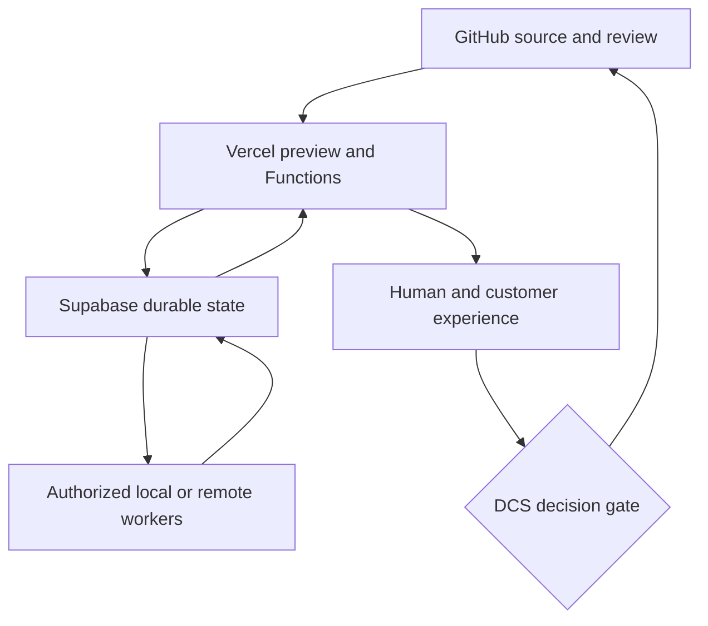

# DCSE Vercel Masterclass — Annotated Source File

**Task ID:** DCSE-TI-VERCEL-MASTERCLASS-SOURCE-20260915-001  
**Lane / Entity:** TI training artifact derived from DCSE architecture, Vercel account evidence, and current Vercel guidance  
**GitHub source repository:** `sonlyconsulting-ctrl/DCSE-Command-Post`  
**Pinned GitHub main commit:** `f76120307af680104e600c02742826baf844c531`  
**Vercel team:** `sonlyconsulting-ctrls-projects`  
**Verified plan at preparation:** Hobby  
**Prepared:** 2026-09-15  
**Status:** SOURCE MATERIAL — NOT OPERATIVE DOCTRINE  
**Audience:** DCS founder/operator, DCSE developers and reviewers, and governed AI agents  

> This file is an instructional synthesis. It does not replace current Vercel documentation, the Vercel dashboard, verified deployment evidence, DCSE operative doctrine, or DCS promotion authority. Vercel features, limits, and prices can change. Revalidate time-sensitive facts before implementation or spending.

---

## 1. Purpose

This source file supports a balanced tutorial from Vercel fundamentals through governed, agent-assisted product delivery. It is the Vercel companion to the DCSE GitHub masterclass source.

The tutorial should teach Vercel as:

1. a project and deployment platform;
2. a preview and collaboration surface;
3. a production delivery network;
4. a compute platform for frontend and backend workloads;
5. an observability and recovery surface;
6. a participant in DCSE’s GitHub–Vercel–Supabase architecture;
7. a controlled execution surface for agents rather than a source of governance authority;
8. part of the customer and operator experience.

The governing delivery chain is:

`source identity → project identity → configuration → build → preview → test → approve → promote → observe → reconcile → close`

---

## 2. Preflight Validation

### Verified

- The connected Vercel team is `sonlyconsulting-ctrls-projects`.
- The team currently reports the Hobby plan.
- Fourteen projects were visible during read-only inspection.
- Five visible projects are linked to the `DCSE-Command-Post` GitHub repository:
  - `smoove-spots`
  - `sc-command-post`
  - `sc-agent-os`
  - `b4l`
  - `mental-ingenuity-qa`
- `tedos-sports-lounge` is linked to `SC-TedoSportsLounge`.
- Eight other visible projects reported no Git link in the project listing.
- The Command Post repository contains root and application-level Vercel configuration.
- Recent PR evidence showed deployment attempts blocked by the account’s daily free-deployment limit.

### Likely

- Some unlinked projects are intentional review, design-import, static-build, or manually deployed surfaces.
- Multiple projects linked to one monorepo require strict root-directory and path controls to prevent irrelevant deployments.
- Project inventory and naming have accumulated duplication and experimental history.

### Unknown without further inspection

- Which projects are active, archival, duplicated, or safe to retire.
- Which custom domains currently map to each project.
- The exact production deployment SHA for every active domain.
- Whether preview and production environment variables are complete and consistent.
- Which projects have deployment protection, spend controls, alerts, drains, or rolling-release configuration.
- Whether all production runtime behavior matches the intended GitHub source.

### Non-actions

No project, deployment, domain, environment variable, integration, or production setting was changed.

---

## 3. Mental Model: Project, Deployment, Domain, and Runtime

### Project

A Vercel project is a configuration and deployment boundary. It connects source, build settings, environment variables, functions, domains, protection, and deployment history.

### Deployment

A deployment is an immutable build output associated with a unique URL and metadata. Preview and production are assignment states around deployments, not different kinds of source code.

### Domain

A domain or alias routes human traffic to a deployment. A successful build does not prove that the intended domain points to it.

### Runtime

Runtime behavior includes functions, routing, caching, middleware, environment variables, external service calls, and platform limits.

### DCSE interpretation

| Vercel object | DCSE meaning |
|---|---|
| Team | Administrative and billing boundary |
| Project | Bounded delivery surface |
| Git link | Source-integration relationship |
| Root directory | Monorepo ownership boundary |
| Preview deployment | Candidate runtime for testing |
| Production deployment | Live delivery candidate; not automatically DCS-promoted truth |
| Domain | Public/customer entry point |
| Environment variables | Runtime configuration and secret boundary |
| Function | Bounded compute unit |
| Logs/metrics | Runtime evidence, subject to retention and sampling limits |
| Rollback/promotion | Traffic reassignment and recovery mechanism |

---

## 4. Current Vercel Platform Corrections

The tutorial must avoid outdated assumptions.

### Current guidance to teach

- Vercel is a full compute platform, not merely static hosting.
- Fluid Compute is the default and preferred general runtime surface.
- Default Node.js with Fluid Compute supports streaming and Server-Sent Events.
- Middleware can use Node.js; Edge runtime should not be the automatic default.
- Python is a supported Vercel workload.
- Node.js 24 LTS is the current default according to the available 2026 platform guidance.
- Vercel no longer offers the former Vercel Postgres and Vercel KV products; data services are available through Marketplace integrations.
- Vercel Blob supports public and private storage.
- Functions use active-CPU-oriented pricing rather than the older mental model of wall-clock-only GB-seconds.
- `vercel.ts` is now the recommended project-configuration direction for new or deliberately migrated projects; existing `vercel.json` configurations remain real assets and should not be converted casually.
- Vercel offers capabilities such as AI Gateway, Queues, Sandbox, MCP, rolling releases, and Vercel Agent.

### Annotation: validate before adoption

New capability does not automatically justify migration. DCSE should evaluate objective, fit, cost, lock-in, operational maturity, recovery, and human experience.

---

## 5. DCSE’s Vercel Role

Vercel should serve delivery and bounded compute. It should not become DCSE constitutional authority or the durable orchestration core merely because it can run Functions.

### Good Vercel responsibilities

- serve web experiences and APIs;
- produce isolated previews;
- run bounded server-side functions;
- stream model responses;
- enforce routing, headers, redirects, and caching;
- connect to external services using server-side credentials;
- expose logs and deployment metadata;
- support controlled promotion and rollback.

### Better placed elsewhere

- canonical DCSE doctrine: GitHub;
- durable operational workflow state: Supabase or another governed datastore;
- local Ollama inference: authorized Windows/WSL worker;
- service-role secrets: server-side secret stores;
- DCS promotion authority: human/governance control plane;
- long-lived worker leases and authoritative orchestration events: durable state layer.

### Reference architecture



Vercel participates in the loop. It does not independently declare the work complete.

---

## 6. Project Identity and Monorepo Discipline

Five visible Vercel projects link to the same Command Post repository. This is valid only when each project has an explicit delivery boundary.

### Each project needs a record of

- Vercel project ID and name;
- owning DCSE entity/lane;
- Git repository;
- production branch;
- root directory;
- framework/build command;
- output directory;
- included and ignored paths;
- domains;
- required environment variables by environment;
- runtime and function settings;
- owner and recovery contact;
- cost/rate-limit expectations;
- lifecycle status: active, review, hold, superseded, archival candidate.

### Monorepo failure modes

- Every repository commit triggers unrelated projects.
- A project builds the repository root instead of its application folder.
- Two projects deploy the same product with different settings.
- a Vercel project is renamed while its default domain remains historical;
- a preview project becomes production by accident;
- manually deployed projects lose source provenance;
- changes to shared code break several projects at once.

### Recommended DCSE invariant

`one project identity → one declared product purpose → one controlled source root → known domains → known environments`

---

## 7. Linking a Local Repository Safely

### Inspect first

```bash
vercel whoami
vercel teams list
ls -la .vercel
```

### Single-project repository

```bash
vercel link
```

This creates `.vercel/project.json` locally.

### Monorepo

```bash
vercel link --repo
```

The repository-level linkage is more appropriate when multiple projects use non-root directories.

### DCSE control points

- Verify the team before linking.
- Verify the selected project ID; do not rely only on a similar name.
- Run commands from the intended project directory.
- Treat `.vercel/` as local linkage metadata; do not commit secrets.
- Avoid implicit auto-linking in a monorepo.
- Record the source root and project identity in the handoff.

---

## 8. Configuration: `vercel.json` and `vercel.ts`

### Existing DCSE reality

The Command Post repository uses `vercel.json` configurations. These are current working assets and must be inspected before any migration.

### `vercel.json`

Appropriate for declarative JSON configuration including rewrites, redirects, headers, builds, functions, and framework settings.

### `vercel.ts`

Current Vercel guidance recommends TypeScript configuration for new or deliberately migrated projects. It can provide typed helpers, dynamic logic, and environment-aware configuration.

### Migration decision gate

Do not convert merely because a newer format exists. First compare:

| Question | Why it matters |
|---|---|
| Does the existing configuration work? | Avoid unnecessary churn |
| Is typed configuration materially useful? | Establish benefit |
| Does CI understand the new format? | Prevent build failure |
| Are multiple projects sharing configuration? | Determine reuse value |
| Can preview and rollback be proven? | Preserve recovery |
| Will the migration trigger unrelated deployments? | Control Hobby-plan usage |

---

## 9. Environments and Environment Variables

Vercel distinguishes Development, Preview, and Production configuration.

### Environment principle

The same variable name can have different values by environment. Missing preview variables can make a PR appear broken even when production has the needed secret. Conversely, copying production secrets into preview can create unnecessary exposure.

### Typical workflow

```bash
vercel env ls
vercel env pull .env.local
vercel pull --yes --environment=preview
vercel pull --yes --environment=production
```

### Security rules

- Never place secrets in browser-exposed variables.
- Treat `NEXT_PUBLIC_*` and equivalent public prefixes as intentionally visible.
- Keep Supabase service-role and model-provider secrets server-side.
- Use separate credentials and privileges by environment when practical.
- Never print secret values in CI, logs, screenshots, or evidence packets.
- Rotate exposed credentials; deleting the source line does not revoke the credential.

### Evidence without disclosure

Record variable names, environments, presence/absence, ownership, and last verified time. Do not reproduce secret values.

---

## 10. Preview Deployments

Preview deployments give each candidate a unique runtime URL.

### Standard creation

```bash
vercel deploy
```

With Git integration, nonproduction branch pushes commonly create previews automatically.

### Preview acceptance should cover

- exact source SHA;
- build status;
- project/root identity;
- protected access;
- API and page smoke tests;
- desktop and mobile checks;
- authentication;
- server-side data access;
- browser console errors;
- runtime errors and logs;
- environment-variable completeness;
- no production mutation unless explicitly part of a safe test.
