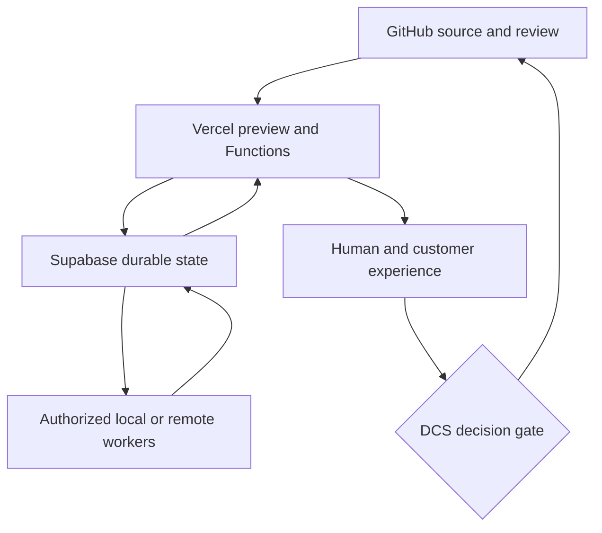

# DCSE Vercel Masterclass — Annotated Source File

**Task ID:** DCSE-TI-VERCEL-MASTERCLASS-SOURCE-20260915-001  
**Lane / Entity:** TI training artifact derived from DCSE architecture, Vercel account evidence, and current Vercel guidance  
**GitHub source repository:** `sonlyconsulting-ctrl/DCSE-Command-Post`  
**Pinned GitHub main commit:** `f76120307af680104e600c02742826baf844c531`  
**Vercel team:** `sonlyconsulting-ctrls-projects`  
**Verified plan at preparation:** Hobby  
**Prepared:** 2026-09-15  
**Status:** SOURCE MATERIAL — NOT OPERATIVE DOCTRINE  
**Audience:** DCS founder/operator, DCSE developers and reviewers, and governed AI agents  

> This file is an instructional synthesis. It does not replace current Vercel documentation, the Vercel dashboard, verified deployment evidence, DCSE operative doctrine, or DCS promotion authority. Vercel features, limits, and prices can change. Revalidate time-sensitive facts before implementation or spending.

---

## 1. Purpose

This source file supports a balanced tutorial from Vercel fundamentals through governed, agent-assisted product delivery. It is the Vercel companion to the DCSE GitHub masterclass source.

The tutorial should teach Vercel as:

1. a project and deployment platform;
2. a preview and collaboration surface;
3. a production delivery network;
4. a compute platform for frontend and backend workloads;
5. an observability and recovery surface;
6. a participant in DCSE’s GitHub–Vercel–Supabase architecture;
7. a controlled execution surface for agents rather than a source of governance authority;
8. part of the customer and operator experience.

The governing delivery chain is:

`source identity → project identity → configuration → build → preview → test → approve → promote → observe → reconcile → close`

---

## 2. Preflight Validation

### Verified

- The connected Vercel team is `sonlyconsulting-ctrls-projects`.
- The team currently reports the Hobby plan.
- Fourteen projects were visible during read-only inspection.
- Five visible projects are linked to the `DCSE-Command-Post` GitHub repository:
  - `smoove-spots`
  - `sc-command-post`
  - `sc-agent-os`
  - `b4l`
  - `mental-ingenuity-qa`
- `tedos-sports-lounge` is linked to `SC-TedoSportsLounge`.
- Eight other visible projects reported no Git link in the project listing.
- The Command Post repository contains root and application-level Vercel configuration.
- Recent PR evidence showed deployment attempts blocked by the account’s daily free-deployment limit.

### Likely

- Some unlinked projects are intentional review, design-import, static-build, or manually deployed surfaces.
- Multiple projects linked to one monorepo require strict root-directory and path controls to prevent irrelevant deployments.
- Project inventory and naming have accumulated duplication and experimental history.

### Unknown without further inspection

- Which projects are active, archival, duplicated, or safe to retire.
- Which custom domains currently map to each project.
- The exact production deployment SHA for every active domain.
- Whether preview and production environment variables are complete and consistent.
- Which projects have deployment protection, spend controls, alerts, drains, or rolling-release configuration.
- Whether all production runtime behavior matches the intended GitHub source.

### Non-actions

No project, deployment, domain, environment variable, integration, or production setting was changed.

---

## 3. Mental Model: Project, Deployment, Domain, and Runtime

### Project

A Vercel project is a configuration and deployment boundary. It connects source, build settings, environment variables, functions, domains, protection, and deployment history.

### Deployment

A deployment is an immutable build output associated with a unique URL and metadata. Preview and production are assignment states around deployments, not different kinds of source code.

### Domain

A domain or alias routes human traffic to a deployment. A successful build does not prove that the intended domain points to it.

### Runtime

Runtime behavior includes functions, routing, caching, middleware, environment variables, external service calls, and platform limits.

### DCSE interpretation

| Vercel object | DCSE meaning |
|---|---|
| Team | Administrative and billing boundary |
| Project | Bounded delivery surface |
| Git link | Source-integration relationship |
| Root directory | Monorepo ownership boundary |
| Preview deployment | Candidate runtime for testing |
| Production deployment | Live delivery candidate; not automatically DCS-promoted truth |
| Domain | Public/customer entry point |
| Environment variables | Runtime configuration and secret boundary |
| Function | Bounded compute unit |
| Logs/metrics | Runtime evidence, subject to retention and sampling limits |
| Rollback/promotion | Traffic reassignment and recovery mechanism |

---

## 4. Current Vercel Platform Corrections

The tutorial must avoid outdated assumptions.

### Current guidance to teach

- Vercel is a full compute platform, not merely static hosting.
- Fluid Compute is the default and preferred general runtime surface.
- Default Node.js with Fluid Compute supports streaming and Server-Sent Events.
- Middleware can use Node.js; Edge runtime should not be the automatic default.
- Python is a supported Vercel workload.
- Node.js 24 LTS is the current default according to the available 2026 platform guidance.
- Vercel no longer offers the former Vercel Postgres and Vercel KV products; data services are available through Marketplace integrations.
- Vercel Blob supports public and private storage.
- Functions use active-CPU-oriented pricing rather than the older mental model of wall-clock-only GB-seconds.
- `vercel.ts` is now the recommended project-configuration direction for new or deliberately migrated projects; existing `vercel.json` configurations remain real assets and should not be converted casually.
- Vercel offers capabilities such as AI Gateway, Queues, Sandbox, MCP, rolling releases, and Vercel Agent.

### Annotation: validate before adoption

New capability does not automatically justify migration. DCSE should evaluate objective, fit, cost, lock-in, operational maturity, recovery, and human experience.

---

## 5. DCSE’s Vercel Role

Vercel should serve delivery and bounded compute. It should not become DCSE constitutional authority or the durable orchestration core merely because it can run Functions.

### Good Vercel responsibilities

- serve web experiences and APIs;
- produce isolated previews;
- run bounded server-side functions;
- stream model responses;
- enforce routing, headers, redirects, and caching;
- connect to external services using server-side credentials;
- expose logs and deployment metadata;
- support controlled promotion and rollback.

### Better placed elsewhere

- canonical DCSE doctrine: GitHub;
- durable operational workflow state: Supabase or another governed datastore;
- local Ollama inference: authorized Windows/WSL worker;
- service-role secrets: server-side secret stores;
- DCS promotion authority: human/governance control plane;
- long-lived worker leases and authoritative orchestration events: durable state layer.

### Reference architecture



Vercel participates in the loop. It does not independently declare the work complete.

---

## 6. Project Identity and Monorepo Discipline

Five visible Vercel projects link to the same Command Post repository. This is valid only when each project has an explicit delivery boundary.

### Each project needs a record of

- Vercel project ID and name;
- owning DCSE entity/lane;
- Git repository;
- production branch;
- root directory;
- framework/build command;
- output directory;
- included and ignored paths;
- domains;
- required environment variables by environment;
- runtime and function settings;
- owner and recovery contact;
- cost/rate-limit expectations;
- lifecycle status: active, review, hold, superseded, archival candidate.

### Monorepo failure modes

- Every repository commit triggers unrelated projects.
- A project builds the repository root instead of its application folder.
- Two projects deploy the same product with different settings.
- a Vercel project is renamed while its default domain remains historical;
- a preview project becomes production by accident;
- manually deployed projects lose source provenance;
- changes to shared code break several projects at once.

### Recommended DCSE invariant

`one project identity → one declared product purpose → one controlled source root → known domains → known environments`

---

## 7. Linking a Local Repository Safely

### Inspect first

```bash
vercel whoami
vercel teams list
ls -la .vercel
```

### Single-project repository

```bash
vercel link
```

This creates `.vercel/project.json` locally.

### Monorepo

```bash
vercel link --repo
```

The repository-level linkage is more appropriate when multiple projects use non-root directories.

### DCSE control points

- Verify the team before linking.
- Verify the selected project ID; do not rely only on a similar name.
- Run commands from the intended project directory.
- Treat `.vercel/` as local linkage metadata; do not commit secrets.
- Avoid implicit auto-linking in a monorepo.
- Record the source root and project identity in the handoff.

---

## 8. Configuration: `vercel.json` and `vercel.ts`

### Existing DCSE reality

The Command Post repository uses `vercel.json` configurations. These are current working assets and must be inspected before any migration.

### `vercel.json`

Appropriate for declarative JSON configuration including rewrites, redirects, headers, builds, functions, and framework settings.

### `vercel.ts`

Current Vercel guidance recommends TypeScript configuration for new or deliberately migrated projects. It can provide typed helpers, dynamic logic, and environment-aware configuration.

### Migration decision gate

Do not convert merely because a newer format exists. First compare:

| Question | Why it matters |
|---|---|
| Does the existing configuration work? | Avoid unnecessary churn |
| Is typed configuration materially useful? | Establish benefit |
| Does CI understand the new format? | Prevent build failure |
| Are multiple projects sharing configuration? | Determine reuse value |
| Can preview and rollback be proven? | Preserve recovery |
| Will the migration trigger unrelated deployments? | Control Hobby-plan usage |

---

## 9. Environments and Environment Variables

Vercel distinguishes Development, Preview, and Production configuration.

### Environment principle

The same variable name can have different values by environment. Missing preview variables can make a PR appear broken even when production has the needed secret. Conversely, copying production secrets into preview can create unnecessary exposure.

### Typical workflow

```bash
vercel env ls
vercel env pull .env.local
vercel pull --yes --environment=preview
vercel pull --yes --environment=production
```

### Security rules

- Never place secrets in browser-exposed variables.
- Treat `NEXT_PUBLIC_*` and equivalent public prefixes as intentionally visible.
- Keep Supabase service-role and model-provider secrets server-side.
- Use separate credentials and privileges by environment when practical.
- Never print secret values in CI, logs, screenshots, or evidence packets.
- Rotate exposed credentials; deleting the source line does not revoke the credential.

### Evidence without disclosure

Record variable names, environments, presence/absence, ownership, and last verified time. Do not reproduce secret values.

---

## 10. Preview Deployments

Preview deployments give each candidate a unique runtime URL.

### Standard creation

```bash
vercel deploy
```

With Git integration, nonproduction branch pushes commonly create previews automatically.

### Preview acceptance should cover

- exact source SHA;
- build status;
- project/root identity;
- protected access;
- API and page smoke tests;
- desktop and mobile checks;
- authentication;
- server-side data access;
- browser console errors;
- runtime errors and logs;
- environment-variable completeness;
- no production mutation unless explicitly part of a safe test.

### Deployment protection

Do not disable protection merely to simplify agent access. Use authorized protected-preview access, such as `vercel curl` or a scoped share mechanism.

### Hobby-plan lesson

Preview abundance is not free operationally. Recent DCSE evidence showed the daily deployment ceiling could block PR validation. Path filters, ignored builds, consolidated projects, and controlled retry behavior are therefore governance and cost controls.

---

## 11. Production Deployment, Promotion, and Rollback

### Direct production deployment

```bash
vercel deploy --prod
```

This is a production-changing action and remains a DCS stop-gate unless previously authorized through a bounded procedure.

### Promote a validated deployment

```bash
vercel promote <deployment-url-or-id>
```

Promotion reassigns production traffic to an existing deployment without rebuilding. It is useful when the exact preview artifact has already been validated.

### Rollback

```bash
vercel rollback
vercel rollback <deployment-url-or-id>
```

Rollback must identify the target, scope, data compatibility, and expected user impact. Reverting application traffic does not automatically reverse database migrations or external side effects.

### DCSE deployment-state model

| State | Required meaning |
|---|---|
| BUILT | Build completed |
| PREVIEW_READY | Candidate URL is available |
| VALIDATED | Required preview tests passed |
| APPROVED | Human/governance gate passed |
| PROMOTED | Production traffic points to the accepted deployment |
| OBSERVED | Post-promotion runtime was inspected |
| RECONCILED | GitHub, Vercel, data, and evidence agree |
| COMPLETE | Requested human/product outcome is satisfied |

---

## 12. Vercel Functions and Fluid Compute

Vercel Functions can host server-side application logic in Node.js, Python, and other supported runtimes.

### Suitable DCSE work

- authenticated APIs;
- bounded AI-provider calls;
- webhook receivers;
- server-side metadata and file processing;
- database-backed product operations;
- payment callback handling;
- controlled orchestration entry points;
- response streaming.

### Unsuitable pattern

A Vercel Function should not attempt to call `localhost:11434` on DCS’s Windows computer. Vercel’s localhost belongs to the remote function environment, not the DCS workstation.

### Durable work

For operations that outlive a request or require recovery, use a durable queue/state architecture. Vercel Queues or an existing Supabase worker exchange may be evaluated. Do not silently split authority between both.

### Function design checklist

- validate input before external access;
- authenticate and authorize;
- set bounded timeouts;
- make retries idempotent;
- separate public and server-only configuration;
- avoid fabricated fallbacks;
- return honest failure states;
- record trace and evidence IDs;
- support cancellation when meaningful;
- account for concurrency and cost.

---

## 13. Routing, Middleware, and Caching

### Routing

Use rewrites, redirects, headers, and Routing Middleware only when their responsibility is explicit.

### Middleware

Current guidance does not require Edge runtime for middleware. Prefer the standard Node.js/Fluid Compute path unless a proven requirement dictates otherwise.

### Caching questions

- Is content user-specific?
- Is the response safe to share between users?
- What is the freshness requirement?
- Who invalidates the cache?
- Can a deployment serve stale governance or product content?
- Does rollback restore the expected cache behavior?

### DCSE warning

Caching can make source and runtime appear inconsistent. A verification packet should state whether cache was bypassed, revalidated, or expected to remain warm.

---

## 14. Domains and DNS

Projects, deployments, aliases, and domains must be distinguished.

### Domain verification checklist

- exact domain;
- owning entity/product;
- target Vercel project;
- current production deployment;
- DNS provider and records;
- redirect/canonical-host behavior;
- certificate status;
- both apex and `www` behavior where applicable;
- legacy aliases;
- rollback path.

### DCSE architecture note

SC.com uses a Netlify-primary architecture with selected Wix experiences. Vercel remains a valid surface for specific products, previews, applications, or services. A domain decision must respect the product’s approved architecture rather than defaulting every web experience to Vercel.

---

## 15. Observability and Runtime Evidence

### Useful CLI inspection

```bash
vercel ls
vercel inspect <deployment-url>
vercel logs <deployment-url>
vercel logs <deployment-url> --follow
```

### Evidence levels

| Evidence | What it supports |
|---|---|
| Build log | Build steps and build failure/success |
| Deployment status | Platform lifecycle state |
| Function/runtime logs | Observed request execution |
| Browser test | User-visible behavior |
| Network trace | API and asset behavior |
| Provider/database record | External side of an exchange |
| Deployment SHA | Source-to-deployment identity |
| Post-release monitoring | Early production health |

### What “READY” does not prove

It does not prove that every route works, authentication is correct, data is current, the customer flow completes, or the expected domain targets the deployment.

---

## 16. GitHub and Vercel Integration

### Normal flow

`branch push → Vercel preview → GitHub deployment/check status → tests/review → DCS decision → promotion`

### Controls needed for a monorepo

- explicit root directory per project;
- ignored-build rules or path-based deployment controls;
- predictable production branch;
- no accidental deployment from documentation-only commits;
- exact mapping from PR head SHA to preview deployment;
- preview comment/status that identifies project and URL;
- no production promotion solely because a PR merged.

### Dual-system evidence

GitHub proves the reviewed source and checks. Vercel proves the build/deployment object. The acceptance record must connect them using the exact commit SHA and deployment identity.

---

## 17. CI/CD Patterns

### Git-managed deployment

Use Vercel Git integration for routine automatic previews when project/root configuration is reliable.

### Controlled prebuilt deployment

```bash
vercel pull --yes --environment=preview
vercel build
# run tests against the build or preview as designed
vercel deploy --prebuilt
```

For production:

```bash
vercel pull --yes --environment=production
vercel build --prod
vercel deploy --prebuilt --prod
```

### CI credentials

CI commonly needs Vercel token, organization/team ID, and project ID. Store all credentials as secrets. Pin the CLI version rather than relying on `latest` in a governed pipeline.

### Promotion pattern

Build once, validate that exact deployment, then promote it. This reduces the risk that a production rebuild differs from the tested preview.

---

## 18. Agentic Vercel Operations

Agents can assist with:

- listing projects and deployments;
- identifying project/root mismatches;
- inspecting build logs;
- correlating PR SHAs and deployments;
- running protected-preview smoke tests;
- reviewing runtime errors;
- preparing environment-variable presence matrices;
- comparing configuration;
- recommending rollback;
- creating evidence packets.

### Agent contract

Every substantive Vercel assignment should include:

- Task ID;
- project ID and human-readable name;
- team;
- environment;
- source repository, branch, and SHA;
- authorized actions;
- prohibited production/destructive actions;
- expected URLs and routes;
- required environment-variable names;
- test matrix;
- cost/rate-limit boundary;
- rollback target;
- evidence and handoff requirements.

### No autonomous expansion

An agent authorized to inspect a failed preview is not authorized to redeploy production, add domains, change billing, expose a protected deployment, or rotate secrets.

---

## 19. Vercel AI Gateway, MCP, Queues, and Sandbox

### AI Gateway

Potential value:

- unified access to multiple AI providers;
- centralized model usage and observability;
- fallbacks and routing;
- reduced provider-specific application wiring.

DCSE must still capture the actual provider/model path and must never let fallback masquerade as the requested provider.

### Vercel MCP

Potential value:

- give authorized agents structured access to projects, deployments, and logs;
- reduce brittle screen automation;
- support read-only diagnostics and evidence collection.

Permissions remain bounded by the connected identity and tool authorization.

### Queues

Potential value:

- durable event delivery;
- decoupled background work;
- retryable processing.

At-least-once delivery requires idempotency and duplicate handling.

### Sandbox

Potential value:

- isolate generated or untrusted code;
- run bounded validation;
- separate experimentation from production.

Sandbox output is evidence of sandbox behavior, not automatic approval for production.

### Eve and durable agents

Eve may be evaluated for new agent systems. It should not replace existing ESCD orchestration merely because it offers durable sessions, tools, skills, subagents, schedules, and evals. First perform a build/buy/hybrid/defer assessment.

---

## 20. The Human Experience

### Founder/operator experience

The founder needs:

- which products are live;
- which deployment serves each domain;
- what failed and why;
- which failures affect revenue or customers;
- expected cost or plan-limit impact;
- which decision is required;
- whether rollback is safe.

The founder should not have to navigate fourteen project histories to answer one product question.

### Developer/reviewer experience

Developers and reviewers need:

- deterministic project linking;
- predictable previews;
- complete environment configuration;
- readable logs;
- exact source/deployment correlation;
- fast feedback without unnecessary builds;
- reproducible tests;
- clear promotion authority.

### Human-agent partnership

Agents should compress noisy platform detail into evidence-backed decisions while preserving direct links and exact identifiers. Humans retain authority for production, spending, security exceptions, material architecture changes, and public/customer consequences.

### Customer experience

The customer experiences availability, speed, correctness, continuity, privacy, purchase/fulfillment behavior, and recovery. A green build that fails checkout or loses session state is not production-ready.

---

## 21. Cost, Limits, and Scale

The current team is on the Hobby plan. Limits must be treated as design inputs.

### Recent DCSE example

Vercel reported more than 100 deployments in a day, blocking further preview attempts for a period. Several projects linked to one repository amplified the operational impact.

### Cost/limit controls
