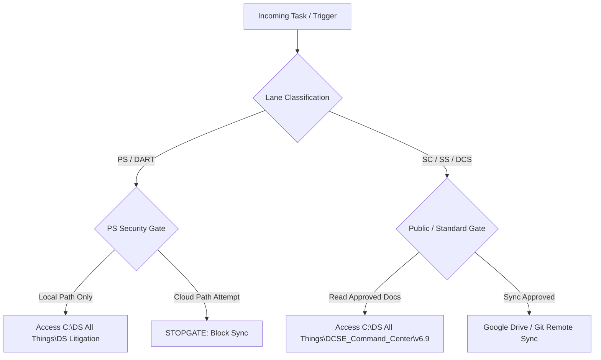

# DCSE Runtime Access Map v6.9

**Document ID:** DCSE-Runtime-Access-Map-v6.9  
**Version:** v6.9  
**Created Date/Time:** 2026-06-20T23:26:34-04:00  
**Last Doc Modified Date/Time:** 2026-06-21T15:22:37-04:00  
**Last Version/Release Date/Time:** 2026-06-21T15:22:37-04:00  
**Status:** CANDIDATE  
**Classification:** INTERNAL  
**Lane:** ALL  
**Canonical file:** DCSE_Runtime_Access_Map_v6.9.md  
**Doctrine Description:** The DCSE Runtime Access Map (v6.9) governs dynamic execution rules, command post routing pathways, and operational permissions. It defines the mapping of model roles to specific action directories and lists inbound and outbound communications bus paths. The map enforces stop-gate verification routines and controls real-time agent access to authorized lanes and directories.  
**Parent Document:** [DCSE_Master_Profile_v6.9_RC1.md](file:///C:/DS%20All%20Things/DCSE_Command_Center/v6.9/00_Authority/DCSE_Master_Profile_v6.9_RC1.md)  

---

## 1. Entity Routing & Access Gates

Access control is gated dynamically by verifying the active lane before any document retrieval or generation. Security gates block requests that attempt to bridge cross-lane firewalls without Level 0 signature validation.

### 1.1 Gate: PS Litigation Vault (Offline Spoke)
- **Controlled Path**: `C:\DS All Things\DS Litigation`
- **Permitted Files**: `D13_DART_Core.md`, `D14_DART_PS_Protected.md`, `case_graph.json`, exhibits, pleadings.
- **Rule**: Absolutely no file or directory residing in the litigation path may be copied, linked, or referenced within any cloud-synced folder of `DCSE_Command_Center`. 

### 1.2 Gate: Private Personal Research (PPR)
- **Controlled Path**: `C:\DS All Things\PPR` (or PPR specific sub-directories)
- **Rule**: Strictly local processing. Zero cloud sharing.

### 1.3 Gate: Public & Shared Portals
- **Controlled Path**: `C:\DS All Things\DCSE_Command_Center\v6.9`
- **Permitted Files**: All non-PS, non-PPR files.
- **Rule**: Approved for GitHub and Google Drive Desktop synchronization.

---

## 2. Model Duty & Routing Registry

AI models must be routed to tasks based on their optimized capabilities. The runtime system directs commands to the appropriate model based on this roster:

| Active Model | Authorized Lanes | Delegated Scope | Primary Operational Mode |
| :--- | :--- | :--- | :--- |
| **Qwen Coder** | DCSE, DCS, SC, SS | - Run `V6 CHECK` validation. - Check schema compliance. - Audit structural integrity of outputs. | `DCSE-Inventory` |
| **Claude (CTO/Code)**| DCSE, DCS, SC, SS, PS | - Final code reviews. - Core resume narrative building. - Constitutional alignment checks. | `DCS-Opportunity` / `PS-Rule` |
| **Gemini** | DCSE, DCS, SC, SS | - File layout checks. - Multi-modal assets (video layout, images). - Local drive state inspections. | `SC-Blueprint` |
| **ChatGPT** | DCSE, DCS, SC, SS | - File packaging and zip generation. - Run local daemon scripts. - Session log assembly. | `DCSE-Report` |
| **Codex (OpenAI)** | DCSE, DCS, SC | Agentic file editing, code execution, repo-level refactoring | `DCSE-Report`, `DCSE-Inventory`, `DCS-Opportunity` |
| **Gemini Gems** | SC, SS | Custom persona execution with uploaded doctrine sources; lane-restricted to source files only | `SC-Blueprint`, `SS-Story` |
| **GitHub Copilot** | DCSE, DCS, SC | Inline code suggestions (advisory only; never authoritative for governance decisions) | N/A (passive) |

---

## 3. Command Post (CP) Routing Channels

Interactive communication between agents utilizes the JSON message bus under the Command Post directory structure.

- **Inbound Path**: `C:\DS All Things\DCSE_Command_Center\v6.9\05_Tribunal_Inbox`
- **Outbound Path**: Local file systems.
- **State Check**: Before execution of any write operations, the agent must query `_Tribunal_Inbox` for active blocking files (e.g. `STOPGATE.txt`). If a blocking file exists, all write operations are immediately suspended.

---

## Error-Catch Protocol

If this registry file is missing, unreadable, or not found by an executing agent, follow the canonical error-catch protocol defined in [D03_AI_Orchestration.md](file:///C:/DS%20All%20Things/DCSE_Command_Center/v6.9/01_Doctrine/D03_AI_Orchestration.md) Section 5.3:
1. **HALT** execution immediately. Do not guess or infer rules from pre-training.
2. **LOG** `ERR_MISSING_DOCTRINE` to `05_Tribunal_Inbox`.
3. **TRIGGER** STOPGATE and alert the user.
